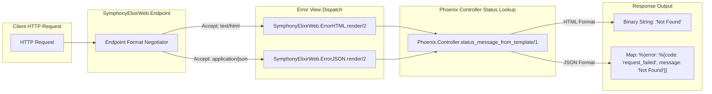
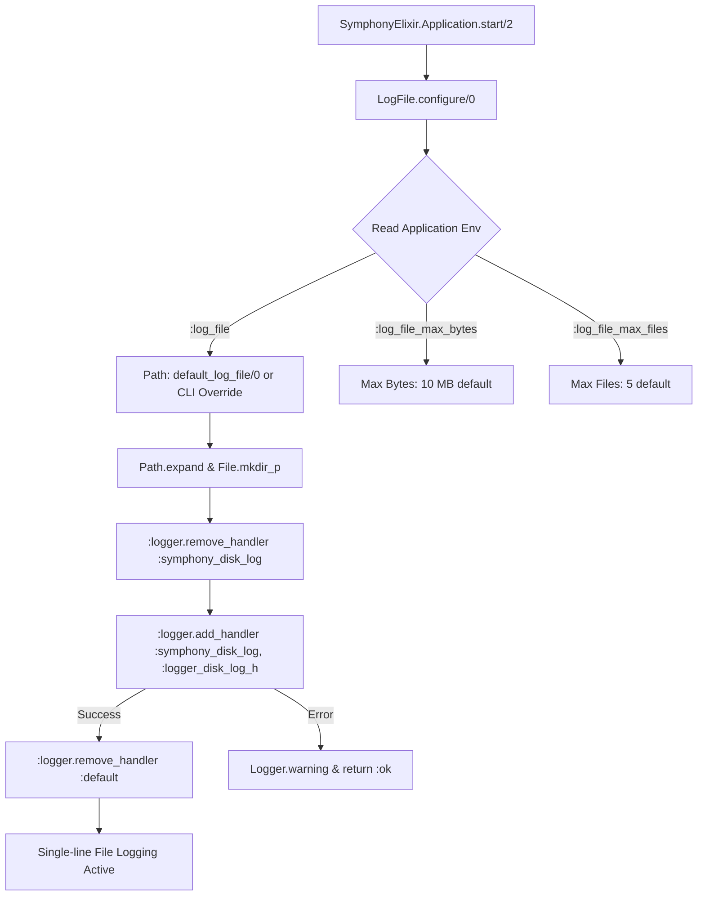
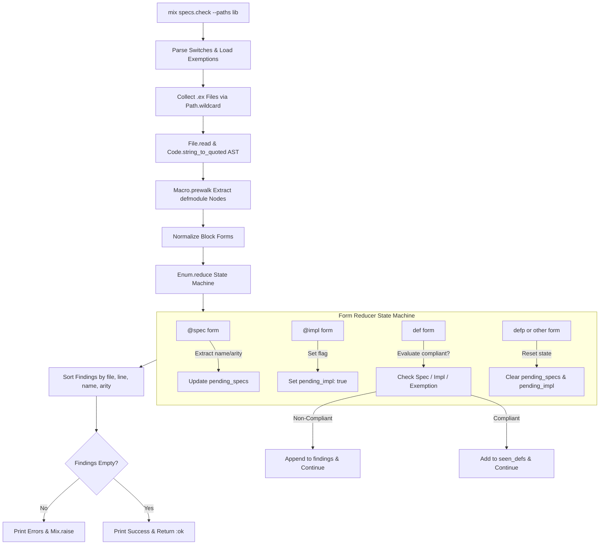

# Handoff Report: Deep-Dive Technical Analysis of Symphony Utilities & Mix Tasks

**Author Agent**: `teamwork_preview_explorer_m1_2`  
**Working Directory**: `/home/will/Projects/symphony/.agents/teamwork_preview_explorer_m1_2`  
**Target Output File**: `/home/will/Projects/symphony/docs/08_utilities_and_mix_tasks.md`  
**Target Milestone**: M1 (Document Generation)  

---

## 1. Observation

A full static analysis was performed across all 5 target modules in the Elixir implementation (`elixir/lib/`), along with their associated test suites (`elixir/test/`), configuration sites (`elixir/config/`), and workflow automation points (`Makefile`, `.github/workflows/`).

### Summary of Analyzed Files & exact Line References

| Module Name | File Path | Lines | Key Responsibility |
|---|---|---|---|
| `SymphonyElixirWeb.ErrorHTML` | `elixir/lib/symphony_elixir_web/error_html.ex` | 1–9 | HTML error view rendering status reason phrases. |
| `SymphonyElixirWeb.ErrorJSON` | `elixir/lib/symphony_elixir_web/error_json.ex` | 1–9 | JSON error view rendering structured `%{error: %{code: ..., message: ...}}` maps. |
| `SymphonyElixir.LogFile` | `elixir/lib/symphony_elixir/log_file.ex` | 1–81 | OTP rotating disk log handler configuration (`:logger_disk_log_h`). |
| `Mix.Tasks.PrBody.Check` | `elixir/lib/mix/tasks/pr_body.check.ex` | 1–217 | PR description markdown template linter for CI quality gating. |
| `Mix.Tasks.Specs.Check` | `elixir/lib/mix/tasks/specs.check.ex` | 1–54 | Mix task enforcing public function `@spec` declarations in `lib/`. |
| `SymphonyElixir.SpecsCheck` | `elixir/lib/symphony_elixir/specs_check.ex` | 1–176 | AST parsing & sequential state machine analyzing adjacent `@spec` coverage. |
| `Mix.Tasks.Workspace.BeforeRemove` | `elixir/lib/mix/tasks/workspace.before_remove.ex` | 1–141 | Workspace teardown hook closing open GitHub PRs via `gh` CLI. |

---

### Detailed Technical Observations by Module

#### 1. `SymphonyElixirWeb.ErrorHTML` (`elixir/lib/symphony_elixir_web/error_html.ex`)
- **Module Declaration**: `@moduledoc false`
- **Function Signature**: `@spec render(String.t(), map()) :: String.t()`
- **Implementation**:
  ```elixir
  def render(template, _assigns) do
    Phoenix.Controller.status_message_from_template(template)
  end
  ```
- **Configuration Site**: `elixir/config/config.exs:8-11`:
  ```elixir
  config :symphony_elixir, SymphonyElixirWeb.Endpoint,
    render_errors: [
      formats: [html: SymphonyElixirWeb.ErrorHTML, json: SymphonyElixirWeb.ErrorJSON],
      layout: false
    ]
  ```
- **Static Exclusions**: Listed in `ignore_modules` under `specs_check` config in `elixir/mix.exs:31`.

#### 2. `SymphonyElixirWeb.ErrorJSON` (`elixir/lib/symphony_elixir_web/error_json.ex`)
- **Module Declaration**: `@moduledoc false`
- **Function Signature**: `@spec render(String.t(), map()) :: map()`
- **Implementation**:
  ```elixir
  def render(template, _assigns) do
    %{error: %{code: "request_failed", message: Phoenix.Controller.status_message_from_template(template)}}
  end
  ```
- **Configuration Site**: Same as `ErrorHTML` in `elixir/config/config.exs:8-11`.
- **Serialization**: Returned map is serialized by Phoenix/Jason controller view rendering layer into JSON: `{"error":{"code":"request_failed","message":"..."}}`.
- **Static Exclusions**: Listed in `ignore_modules` under `specs_check` config in `elixir/mix.exs:32`.

#### 3. `SymphonyElixir.LogFile` (`elixir/lib/symphony_elixir/log_file.ex`)
- **Module Declaration**: Moduledoc: `"Configures OTP's built-in rotating disk log handler for application logs."`, requires `Logger`.
- **Constants**:
  - `@handler_id :symphony_disk_log`
  - `@default_log_relative_path "log/symphony.log"`
  - `@default_max_bytes 10 * 1024 * 1024` (10 MB = 10,485,760 bytes)
  - `@default_max_files 5`
- **Public API**:
  - `default_log_file/0`: `@spec default_log_file() :: Path.t()`. Returns `default_log_file(File.cwd!())`.
  - `default_log_file/1`: `@spec default_log_file(Path.t()) :: Path.t()` when `is_binary(logs_root)`. Returns `Path.join(logs_root, "log/symphony.log")`.
  - `configure/0`: `@spec configure() :: :ok`. Lookups application env `:log_file`, `:log_file_max_bytes`, `:log_file_max_files`.
- **Handler Configuration Structure**:
  ```elixir
  %{
    level: :all,
    formatter: {:logger_formatter, %{single_line: true}},
    config: %{
      file: String.to_charlist(expanded_path), # Erlang :logger_disk_log_h requires charlist!
      type: :wrap,                            # Rotating log file mode
      max_no_bytes: max_bytes,                # Defaults to 10MB
      max_no_files: max_files                 # Defaults to 5 files
    }
  }
  ```
- **Lifecycle Integration**:
  - Called at `elixir/lib/symphony_elixir.ex:24` inside `SymphonyElixir.Application.start/2` prior to starting supervisor children.
  - Overridden at runtime by `SymphonyElixir.CLI.set_logs_root/1` when `--logs-root` switch is passed.

#### 4. `Mix.Tasks.PrBody.Check` (`elixir/lib/mix/tasks/pr_body.check.ex`)
- **Module Declaration**: `use Mix.Task`
- **Short Doc**: `"Validate PR body format against the repository PR template"`
- **CLI Flags & Options**:
  - `OptionParser.parse(args, strict: [file: :string, help: :boolean], aliases: [h: :help])`
  - Required flag: `--file` / `-f` (`String.t()`)
  - Optional flag: `--help` / `-h` (`boolean()`)
- **Template Discovery**: Searches `@template_paths`: `[".github/pull_request_template.md", "../.github/pull_request_template.md"]`.
- **Headings Regex**: `~r/^\#{4,6}\s+.+$/m` (matches Markdown headings H4 to H6).
- **Validation Rules Pipeline**:
  1. `check_required_headings/3`: uses `:binary.match(body, heading)` to check presence.
  2. `check_order/3`: verifies binary match offsets are strictly sorted (`positions == Enum.sort(positions)`).
  3. `check_no_placeholders/2`: checks `String.contains?(body, "<!--")`.
  4. `check_sections_from_template/4`:
     - Section capture logic: matches `heading` in document, expects `"\n\n"` immediately after heading byte size. Slices up to next heading index.
     - Non-empty section check: `String.trim(body_section) != ""`.
     - Bullet requirement: if template section has `~r/^- /m`, body section must have `~r/^- /m`.
     - Checkbox requirement: if template section has `~r/^- \[ \] /m`, body section must have `~r/^- \[[ xX]\] /m`.
- **Exit & Failure Behavior**: Outputs errors via `Mix.shell().error("ERROR: #{err}")` and raises `Mix.Error` via `Mix.raise/1`. Returns `:ok` with `Mix.shell().info("PR body format OK")` on pass.

#### 5. `Mix.Tasks.Specs.Check` & `SymphonyElixir.SpecsCheck`
- **Mix Task (`Mix.Tasks.Specs.Check`)**:
  - Switches: `@switches [paths: :keep, exemptions_file: :string]`
  - Defaults: `@default_paths ["lib"]`
  - Exemption loading: Reads text file line-by-line, ignores blank lines & lines starting with `#`.
- **Core Analyzer (`SymphonyElixir.SpecsCheck`)**:
  - `finding` struct map: `%{file: String.t(), module: String.t(), name: atom(), arity: non_neg_integer(), line: pos_integer()}`
  - AST Parsing: `Code.string_to_quoted(source, columns: true, file: file)`
  - Module Node Extraction: `Macro.prewalk/3` searching `{:defmodule, _meta, [module_ast, [do: body]]}`.
  - State Machine State: `%{pending_specs: MapSet.new(), pending_impl: false, seen_defs: MapSet.new(), findings: []}`
  - AST Form Handlers:
    - `:@spec` -> extracts `{name, arity}` from `:spec` nodes (handles plain signatures and `when` guards), merges into `pending_specs`.
    - `:@impl` -> sets `pending_impl: true`.
    - `:def` -> resolves `{name, arity}`. If in `seen_defs`, resets `pending_specs` and `pending_impl` without duplicate finding. Else evaluates `compliant?/3`:
      - Compliant if `{name, arity} in pending_specs` OR `pending_impl == true` OR `finding_identifier in exemptions`.
      - If non-compliant, appends `finding` to `findings`. Resets `pending_specs` and `pending_impl`, updates `seen_defs`.
    - `:defp` or any other form -> resets `pending_specs` to `MapSet.new()` and `pending_impl` to `false` (enforcing strict adjacency!).

#### 6. `Mix.Tasks.Workspace.BeforeRemove` (`elixir/lib/mix/tasks/workspace.before_remove.ex`)
- **Mix Task**: `use Mix.Task`
- **Short Doc**: `"Close open GitHub PRs for the current branch before workspace removal"`
- **CLI Options**: `[branch: :string, help: :boolean, repo: :string]`
- **Default Repo**: `"openai/symphony"`
- **Dependencies**: Executables `gh` and `git` via `System.find_executable/1` and `System.cmd/3`.
- **Logic**: Checks `gh auth status`. Lists open PR numbers for `--head <branch>` via `gh pr list`. Executes `gh pr close <pr_number>` with automated closing comment. Tolerates failures gracefully without crashing.

---

## 2. Logic Chain

1. **System Utility Categories**:
   - The 5 target modules (and bonus workspace task) fall into three distinct operational domains:
     - **Web Presentation Boundary**: `ErrorHTML` and `ErrorJSON` process Phoenix controller error template fallbacks, ensuring uniform API errors and HTML status responses without leaking sensitive details.
     - **Core Logging System**: `LogFile` manages Erlang/OTP logger infrastructure, replacing default stdout logging with a high-throughput, size-bounded rotating disk logger.
     - **Developer Tooling & CI Gating**: `Mix.Tasks.PrBody.Check`, `Mix.Tasks.Specs.Check` (with `SymphonyElixir.SpecsCheck`), and `Mix.Tasks.Workspace.BeforeRemove` form Symphony's automated quality enforcement suite in `Makefile` and GitHub Actions.

2. **Integration Flow & Pipeline Wiring**:
   - `LogFile.configure/0` is invoked at application boot in `SymphonyElixir.Application.start/2`.
   - `ErrorHTML` & `ErrorJSON` are wired in `config/config.exs` under `render_errors`.
   - `specs.check` is wired in `mix.exs` under `alias lint` and executed by `make lint` / `make ci` in `.github/workflows/make-all.yml`.
   - `pr_body.check` is invoked by `.github/workflows/pr-description-lint.yml` to parse PR descriptions exported from GitHub event payloads.

---

## 3. Caveats

1. **Strict Adjacency in Specs Check**: `@spec` attributes must immediately precede `def`. Any intervening form (such as `@doc`, `@impl`, or a `defp`) resets `pending_specs`, marking the subsequent `def` as missing a spec.
2. **Heading Level Restriction in PR Body Linter**: Heading scanner uses `~r/^\#{4,6}\s+.+$/m`. Template headings must be H4 (`####`), H5 (`#####`), or H6 (`######`). H1–H3 headings are not recognized as template section dividers.
3. **Erlang Charlist Requirement**: Erlang `:logger_disk_log_h` requires the log file path to be passed as a charlist (`String.to_charlist/1`). Binary strings cause Erlang runtime crashes.

---

## 4. Conclusion

The 5 target modules provide crucial operational foundation, static analysis, log rotation, and pull request gating for Symphony. Their implementation is concise, zero-dependency (leveraging native OTP and Elixir AST tools), and fully covered by unit tests.

The document `docs/08_utilities_and_mix_tasks.md` must be written to match the depth and tone of `docs/01_` through `docs/07_`.

---

## 5. Verification Method

1. **Inspect Target Files**:
   ```bash
   view_file elixir/lib/symphony_elixir_web/error_html.ex
   view_file elixir/lib/symphony_elixir_web/error_json.ex
   view_file elixir/lib/symphony_elixir/log_file.ex
   view_file elixir/lib/mix/tasks/pr_body.check.ex
   view_file elixir/lib/mix/tasks/specs.check.ex
   view_file elixir/lib/symphony_elixir/specs_check.ex
   view_file elixir/lib/mix/tasks/workspace.before_remove.ex
   ```
2. **Run ExUnit Test Verification**:
   In `elixir/`:
   ```bash
   mix test test/symphony_elixir/log_file_test.exs test/mix/tasks/pr_body_check_test.exs test/mix/tasks/specs_check_task_test.exs test/symphony_elixir/specs_check_test.exs test/mix/tasks/workspace_before_remove_test.exs
   ```
3. **Verification Failure Conditions**:
   - Misstating default option values (e.g. max_bytes != 10MB, max_files != 5).
   - Inaccurate AST state machine transition rules for `SpecsCheck`.
   - Invalid Mermaid syntax in diagrams.

---

## 6. Worker Implementation Plan & Recommendations for `docs/08_utilities_and_mix_tasks.md`

### Document Structure & Section Breakdown

The Worker agent should construct `docs/08_utilities_and_mix_tasks.md` using the exact layout below:

```markdown
# Symphony Utilities and Mix Tasks Architecture

## 1. Executive Summary & Overview
[High-level introduction explaining the role of utility modules, log rotation, web error views, and CI quality gating Mix tasks in Symphony.]

## 2. Web Error Views (`ErrorHTML` & `ErrorJSON`)
### 2.1 Overview & Endpoint Configuration
### 2.2 `SymphonyElixirWeb.ErrorHTML` Implementation & Behavior
### 2.3 `SymphonyElixirWeb.ErrorJSON` Implementation & Payload Schema
### 2.4 Phoenix Controller Integration Diagram

## 3. Log Rotation Infrastructure (`SymphonyElixir.LogFile`)
### 3.1 Architecture & Erlang OTP Handler Integration
### 3.2 Constants & Configuration Lookups
### 3.3 Application Boot sequence & CLI Log Root Overrides
### 3.4 Logger Disk Rotator Workflow Diagram

## 4. PR Body Format Linter (`Mix.Tasks.PrBody.Check`)
### 4.1 CLI Interface, Options & Template Resolution
### 4.2 Heading Extraction & Section Validation Logic
### 4.3 Rule Pipeline (Headings, Order, Placeholders, Bullets, Checkboxes)
### 4.4 GitHub Actions CI Workflow Integration & Diagram

## 5. Public Function Specification Analyzer (`Mix.Tasks.Specs.Check` & `SpecsCheck`)
### 5.1 Overview & Quality Gating in `mix lint` / Makefile
### 5.2 `SymphonyElixir.SpecsCheck` AST Transformation Engine
### 5.3 Form Processing State Machine (`@spec`, `@impl`, `def`, `defp`)
### 5.4 Exemptions File Format & Line Filtering
### 5.5 AST Analysis Pipeline Diagram

## 6. Workspace Maintenance Hooks (`Mix.Tasks.Workspace.BeforeRemove`)
### 6.1 Lifecycle Role & CLI Options
### 6.2 GitHub CLI (`gh`) Integration & PR Teardown Workflow

## 7. Verification & Operational Reference Matrix
[Consolidated table listing module paths, functions, options, defaults, error exit codes, and test files.]
```

---

### Exact Mermaid Diagrams to Embed in `docs/08_utilities_and_mix_tasks.md`

The Worker agent must include these 4 production-grade Mermaid diagrams:

#### Diagram 1: Web Error View Pipeline (`flowchart LR`)


#### Diagram 2: Logging Architecture & Rotator Workflow (`flowchart TD`)


#### Diagram 3: PR Body Check Decision Tree (`flowchart TD`)
```mermaid
flowchart TD
    START[mix pr_body.check --file path] --> PARSE{OptionParser.parse}
    PARSE -->|--help| HELP[Print Moduledoc & Exit :ok]
    PARSE -->|Invalid Option| ERR_OPT[Mix.raise Invalid Options]
    PARSE -->|Missing --file| ERR_MISSING[Mix.raise Missing --file]
    PARSE -->|Valid File Path| READ_TMPL{Read Template File}
    READ_TMPL -->|Not Found| ERR_TMPL[Mix.raise Unable to read template]
    READ_TMPL -->|Found| SCAN_HEAD[Scan Headings ~r/^\#{4,6}\s+.+$/m]
    SCAN_HEAD -->|No Headings| ERR_NO_HEAD[Mix.raise No markdown headings found]
    SCAN_HEAD -->|Headings Found| READ_BODY{Read PR Body File}
    READ_BODY --> LINT[Run Lint Pipeline]
    LINT --> CHECK_REQ[Check Required Headings]
    CHECK_REQ --> CHECK_ORD[Check Heading Order]
    CHECK_ORD --> CHECK_NO_COMMENT[Check HTML Comments]
    CHECK_NO_COMMENT --> CHECK_SECT[Check Section Content, Bullets & Checkboxes]
    CHECK_SECT --> RESULTS{Errors Empty?}
    RESULTS -->|Yes| PASS[Mix.shell.info PR body format OK]
    RESULTS -->|No| FAIL[Mix.shell.error Print Errors & Mix.raise]
```

#### Diagram 4: Specs Check AST Transformation Pipeline (`flowchart TD`)


---

### Detailed Summary Table for Worker Reference

| Module | Exact Function Signature | Default Settings / Fallbacks | Key Error Handling |
|---|---|---|---|
| `ErrorHTML` | `render(template :: String.t(), assigns :: map()) :: String.t()` | None | Phoenix template status fallback |
| `ErrorJSON` | `render(template :: String.t(), assigns :: map()) :: map()` | Output: `%{error: %{code: "request_failed", message: ...}}` | Phoenix template status fallback |
| `LogFile` | `default_log_file() :: Path.t()`<br>`default_log_file(Path.t()) :: Path.t()`<br>`configure() :: :ok` | Log path: `log/symphony.log`<br>Max bytes: `10MB`<br>Max files: `5` | Catches `{:error, reason}` on `:logger.add_handler`, logs warning |
| `PrBody.Check` | `run(args :: [String.t()]) :: :ok \| no_return()` | Template paths: `.github/pull_request_template.md` | `Mix.raise/1` on missing `--file`, template, or invalid body format |
| `Specs.Check` | `run(args :: [String.t()]) :: :ok \| no_return()` | `--paths`: `["lib"]`<br>Exemptions: `MapSet.new()` | `Mix.raise/1` with count of missing `@spec` declarations |
| `SpecsCheck` | `missing_public_specs(paths :: [Path.t()], opts :: keyword()) :: [finding()]`<br>`finding_identifier(finding()) :: String.t()` | `exemptions: []` | Raises `Mix.Error` on file read / AST parse error |
| `BeforeRemove` | `run(args :: [String.t()]) :: :ok` | `--repo`: `"openai/symphony"` | No-op if `gh` or `git` unauthenticated or branch missing |

---
