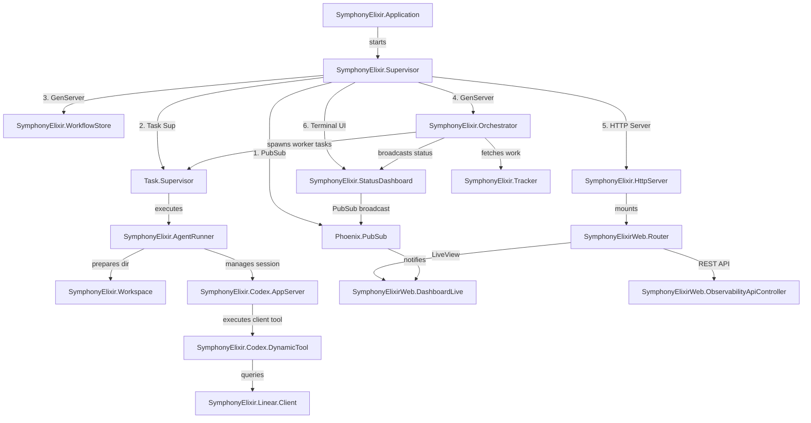
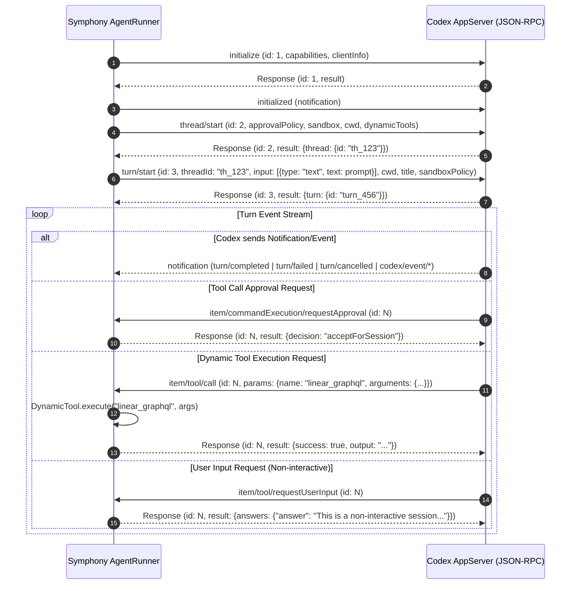
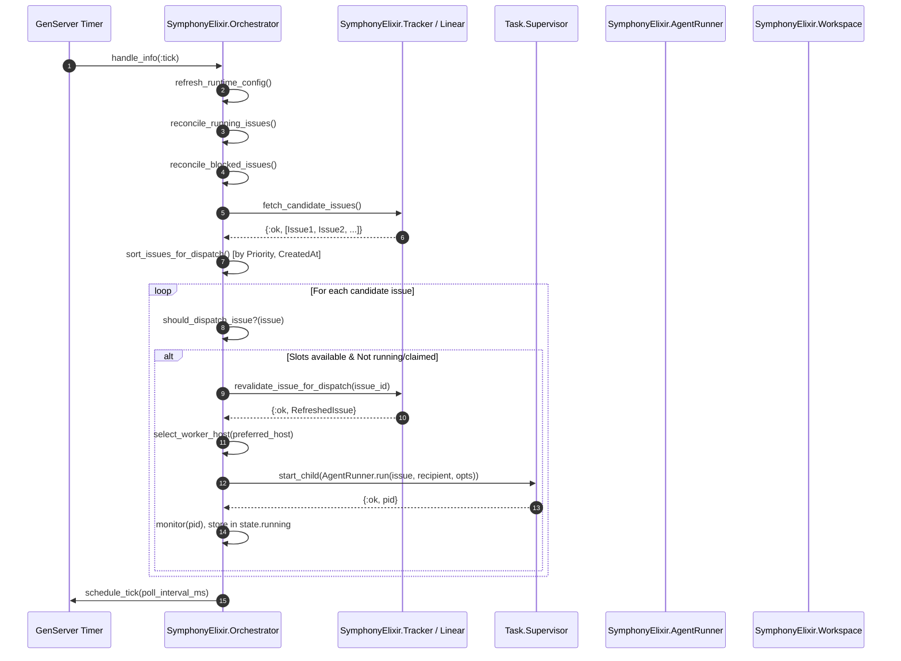
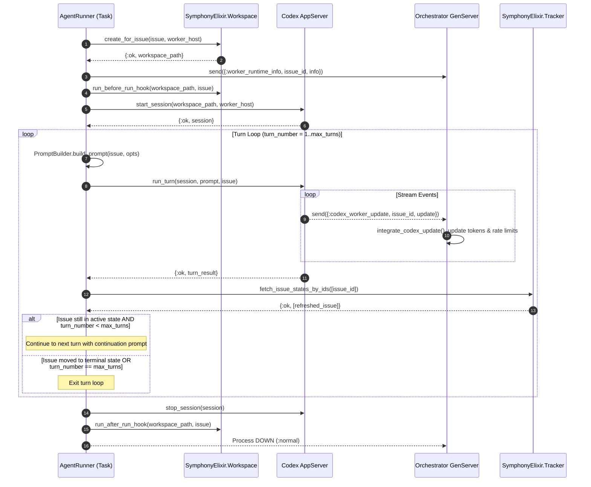
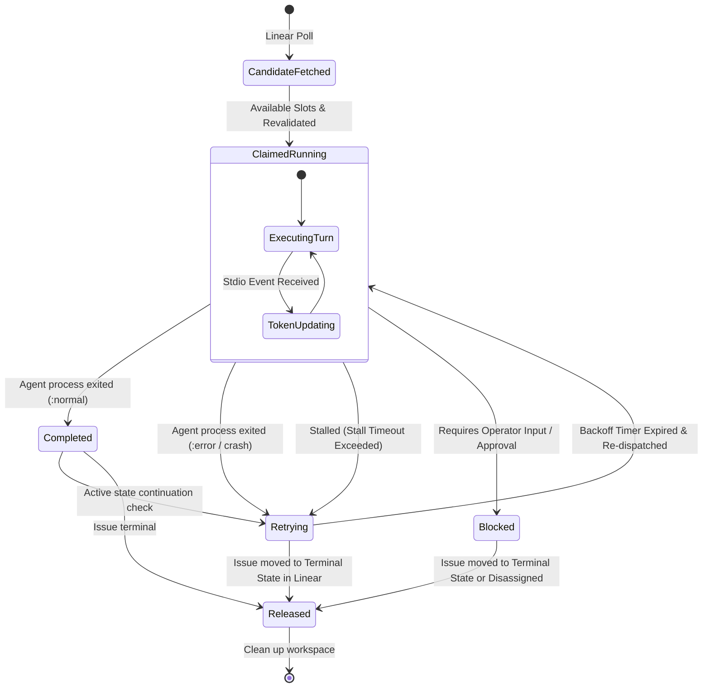
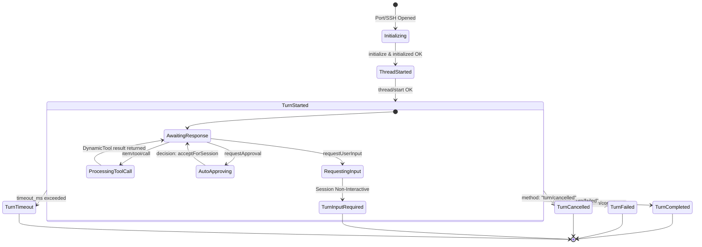

# Comprehensive Analysis: APIs, Interfaces & Module Dependencies (Symphony Elixir)

**Target System**: Symphony (Elixir Orchestrator for Codex Autonomous Agents)  
**Location**: `/home/will/Projects/symphony/elixir`  
**Explorer**: Explorer 3 (APIs, Interfaces & Module Dependencies)  
**Date**: 2026-07-31  

---

## Executive Summary

Symphony is an Elixir/OTP-based orchestration platform that automates software engineering workflows. It polls issue trackers (such as Linear), maintains worker concurrency, creates isolated workspace environments (locally or over SSH), constructs issue prompts using Solid templates, and runs Codex agents over JSON-RPC 2.0 stdio/SSH sessions.

This document maps out the system's inter-module dependencies, external API interfaces, HTTP/REST endpoints, CLI arguments, event messaging flows, state machines, and sequence diagrams designed for Mermaid visualization.

---

## 1. Module Architecture & Inter-Module Dependencies

### 1.1 Supervision Tree & Application Architecture

Symphony is structured as an Elixir OTP Application (`SymphonyElixir.Application`). The supervisor hierarchy follows a `:one_for_one` strategy:

```
SymphonyElixir.Supervisor (Supervisor)
├── Phoenix.PubSub (name: SymphonyElixir.PubSub)
├── Task.Supervisor (name: SymphonyElixir.TaskSupervisor)
├── SymphonyElixir.WorkflowStore (GenServer)
├── SymphonyElixir.Orchestrator (GenServer)
├── SymphonyElixir.HttpServer (Bandit / Phoenix Endpoint)
└── SymphonyElixir.StatusDashboard (GenServer)
```



### 1.2 Subsystem Categorization & Classifications

| Subsystem / Module | Module Path | Purpose & Responsibilities |
|---|---|---|
| **Entry Point & CLI** | `SymphonyElixir.CLI` | Escript entry point (`bin/symphony`). Option parsing (`--port`, `--logs-root`, guardrails switch), application bootstrapping, supervisor process monitoring. |
| **Orchestration Core** | `SymphonyElixir.Orchestrator` | Central GenServer loop. Issue polling, priority sorting, worker concurrency control, host selection (local vs SSH), active agent reconciliation, stall detection, backoff retries, state machine tracking. |
| **Agent Execution Engine** | `SymphonyElixir.AgentRunner` | Runs individual issue tasks in background processes (`Task.Supervisor`). Manages workspace preparation, turn iterations, continuation prompts, and reports runtime info to Orchestrator. |
| **Codex Protocol Client** | `SymphonyElixir.Codex.AppServer` | Minimal JSON-RPC 2.0 client over stdio (Port/SSH). Manages `initialize`, `thread/start`, `turn/start`, handles approvals, input requests, dynamic tool dispatching, and turn timeouts. |
| **Dynamic Tool Handler** | `SymphonyElixir.Codex.DynamicTool` | Handles client-side tool execution requested by Codex during turns (e.g. `linear_graphql`). |
| **Issue Tracker Layer** | `SymphonyElixir.Tracker`<br>`SymphonyElixir.Linear.Adapter`<br>`SymphonyElixir.Linear.Client`<br>`SymphonyElixir.Tracker.Memory` | Behaviour abstraction for issue tracking. `Linear.Adapter` wraps GraphQL queries (`Linear.Client`) for polling, state updating, issue fetching, and comment posting. |
| **Workspace & Isolation** | `SymphonyElixir.Workspace`<br>`SymphonyElixir.PathSafety` | Creates and cleans up isolated directory copies for issues. Handles lifecycle hooks (`after_create`, `before_run`, `after_run`, `before_remove`) both locally and on remote SSH hosts. |
| **SSH Worker Execution** | `SymphonyElixir.SSH` | Shell escaping, target parsing (`host:port`), SSH process execution (`ssh -T`), port opening for remote Codex stdio streams. |
| **Config & Workflow** | `SymphonyElixir.Config`<br>`SymphonyElixir.Config.Schema`<br>`SymphonyElixir.Workflow`<br>`SymphonyElixir.WorkflowStore` | Reads `WORKFLOW.md` front-matter (YAML) and Liquid prompt templates. Dynamically reloads settings and validates semantics. |
| **Prompt Builder** | `SymphonyElixir.PromptBuilder` | Renders issue data into Solid templates for Codex turn prompts. |
| **Observability & Web** | `SymphonyElixirWeb.*`<br>`SymphonyElixir.StatusDashboard`<br>`SymphonyElixir.HttpServer` | Terminal UI dashboard rendering (`StatusDashboard`), Phoenix HTTP web server (`Bandit`), REST API (`ObservabilityApiController`), Phoenix LiveView real-time dashboard (`DashboardLive`), and PubSub notifier (`ObservabilityPubSub`). |

---

## 2. External APIs & Interfaces

### 2.1 Linear GraphQL API Interface

- **Transport**: HTTPS POST to `https://api.linear.app/graphql` (default)
- **Authentication**: Header `Authorization: <api_key>`
- **Client Implementation**: `SymphonyElixir.Linear.Client` & `SymphonyElixir.Linear.Adapter`
- **Operations Map**:

| Operation Name | GraphQL Type | Purpose | Key Inputs | Output Data |
|---|---|---|---|---|
| `SymphonyLinearPoll` | Query | Polling candidate issues in active states | `projectSlug`, `stateNames`, `first`, `relationFirst`, `after` | Issue list (`id`, `identifier`, `title`, `description`, `priority`, `state`, `branchName`, `url`, `assignee`, `labels`, `inverseRelations`, timestamps), pageInfo |
| `SymphonyLinearIssuesById` | Query | Bulk state refresh for active/blocked issues | `ids`, `first`, `relationFirst` | Filtered list of issue states and inverse relations |
| `SymphonyLinearViewer` | Query | Resolve `assignee: "me"` to Linear user ID | None | `viewer.id` |
| `SymphonyCreateComment` | Mutation | Post progress/workpad comment | `issueId`, `body` | `commentCreate.success` |
| `SymphonyUpdateIssueState` | Mutation | Update Linear issue status | `issueId`, `stateId` | `issueUpdate.success` |
| `SymphonyResolveStateId` | Query | Resolve state name string to team state ID | `issueId`, `stateName` | `team.states.nodes[].id` |

### 2.2 Codex App-Server Protocol (JSON-RPC 2.0 over Stdio/SSH)

- **Transport**: Stdio Port (`Port.open`) for local workers; `SSH.start_port` for remote worker hosts.
- **Protocol**: JSON-RPC 2.0 line-delimited JSON.
- **Handshake & Session Lifecycle**:



### 2.3 SSH Worker Execution Interface

- **Transport**: OpenSSH binary (`ssh -T`)
- **Config Flags**: Supports `-F <path>` via `SYMPHONY_SSH_CONFIG` environment variable.
- **Target Specification**: Host format can be `hostname` or `hostname:port` (e.g. `devbox-01:2222`).
- **Remote Operations**:
  - `SSH.run/3`: Executes command string wrapped in `bash -lc '<command>'`.
  - `SSH.start_port/3`: Spawns standard I/O port for interactive Codex app-server processes on remote worker host (`cd <workspace> && exec codex app-server`).

---

## 3. Web & Observability API Specifications

### 3.1 HTTP Endpoint Routing Map (`SymphonyElixirWeb.Router`)

| HTTP Method | Route Path | Controller / LiveView | Action / Purpose | Response Format |
|---|---|---|---|---|
| `GET` | `/` | `SymphonyElixirWeb.DashboardLive` | Phoenix LiveView real-time observability dashboard | `text/html` |
| `GET` | `/api/v1/state` | `SymphonyElixirWeb.ObservabilityApiController` | Snapshot of orchestrator runtime state | `application/json` |
| `POST` | `/api/v1/refresh` | `SymphonyElixirWeb.ObservabilityApiController` | Triggers immediate Orchestrator poll cycle | `application/json` (Status 202) |
| `GET` | `/api/v1/:issue_identifier` | `SymphonyElixirWeb.ObservabilityApiController` | Query state for specific issue identifier | `application/json` |
| `GET` | `/dashboard.css` | `SymphonyElixirWeb.StaticAssetController` | Embedded dashboard styling | `text/css` |
| `GET` | `/vendor/*` | `SymphonyElixirWeb.StaticAssetController` | Vendor JS assets (`phoenix_html`, `phoenix`, `live_view`) | `application/javascript` |

### 3.2 REST API Response Schemas

#### `GET /api/v1/state`
```json
{
  "generated_at": "2026-07-31T21:30:00Z",
  "counts": {
    "running": 2,
    "retrying": 1,
    "blocked": 0
  },
  "running": [
    {
      "issue_id": "issue_123",
      "identifier": "SYM-42",
      "state": "In Progress",
      "worker_host": "devbox-01",
      "workspace_path": "/workspaces/SYM-42",
      "session_id": "th_123-turn_456",
      "codex_app_server_pid": "9842",
      "tokens": {
        "input": 14200,
        "output": 1800,
        "total": 16000
      },
      "turn_count": 3,
      "started_at": "2026-07-31T21:15:00Z",
      "last_activity_at": "2026-07-31T21:29:45Z"
    }
  ],
  "retrying": [
    {
      "issue_id": "issue_124",
      "identifier": "SYM-43",
      "attempt": 2,
      "due_in_ms": 4500,
      "error": "agent exited: :turn_timeout"
    }
  ],
  "blocked": [],
  "codex_totals": {
    "input_tokens": 150000,
    "output_tokens": 25000,
    "total_tokens": 175000,
    "seconds_running": 1240
  },
  "polling": {
    "checking": false,
    "next_poll_in_ms": 3200,
    "poll_interval_ms": 5000
  }
}
```

### 3.3 Real-time PubSub Event Architecture

- **PubSub Server**: `SymphonyElixir.PubSub`
- **Topic**: `"observability:dashboard"`
- **Message**: `:observability_updated`
- **Trigger**: `Orchestrator` tick/reconcile events -> calls `StatusDashboard.notify_update()` -> calls `ObservabilityPubSub.broadcast_update()`.
- **Subscriber**: `DashboardLive` receives `:observability_updated` and re-fetches Orchestrator snapshot to update LiveView DOM.

---

## 4. CLI & Configuration Interfaces

### 4.1 Escript CLI Command (`bin/symphony`)

- **Main Module**: `SymphonyElixir.CLI.main/1`
- **Command Line Syntax**:
  ```bash
  symphony [--logs-root <path>] [--port <port>] [--i-understand-that-this-will-be-running-without-the-usual-guardrails] [path-to-WORKFLOW.md]
  ```
- **CLI Options**:
  - `--i-understand-that-this-will-be-running-without-the-usual-guardrails`: Required safety flag. If omitted, prints ASCII warning banner and exits with code 1.
  - `--logs-root <path>`: Overrides log directory root (`Application.put_env(:symphony_elixir, :log_file, ...)`).
  - `--port <port>`: Overrides HTTP server listener port (`Application.put_env(:symphony_elixir, :server_port_override, port)`).
  - `path-to-WORKFLOW.md`: Path to workflow spec (defaults to `./WORKFLOW.md`).

### 4.2 Configuration Schema (`WORKFLOW.md`)

`WORKFLOW.md` contains YAML front-matter delimited by `---`, followed by a Liquid prompt template:

```yaml
---
tracker:
  kind: linear                # "linear" | "memory"
  endpoint: https://api.linear.app/graphql
  api_key: "$LINEAR_API_KEY"
  project_slug: "symphony-0c79b11b75ea"
  assignee: "me"               # "me" | user ID | null
  active_states:
    - Todo
    - In Progress
    - Merging
    - Rework
  terminal_states:
    - Closed
    - Cancelled
    - Done
polling:
  interval_ms: 5000
workspace:
  root: ~/code/symphony-workspaces
hooks:
  after_create: "git clone ..."
  before_run: "mix deps.get"
  after_run: "..."
  before_remove: "..."
  timeout_ms: 60000
agent:
  max_concurrent_agents: 10
  max_turns: 20
  max_retry_backoff_ms: 300000
  max_concurrent_agents_by_state:
    in progress: 5
worker:
  ssh_hosts:
    - devbox-01:2222
    - devbox-02:2222
  max_concurrent_agents_per_host: 3
codex:
  command: "codex app-server"
  approval_policy: "never"
  thread_sandbox: "workspace-write"
  turn_sandbox_policy:
    type: "workspaceWrite"
  stall_timeout_ms: 300000
---

Issue Context: {{ issue.identifier }} - {{ issue.title }}
...
```

---

## 5. End-to-End Sequence Diagrams

### 5.1 Orchestrator Polling & Dispatch Sequence



### 5.2 Agent Execution & Codex Turn Loop Sequence



---

## 6. State Machine Diagrams

### 6.1 Orchestrator Issue Lifecycle State Machine



### 6.2 Codex Turn Execution State Machine



---

## 7. Evidence Chain & Summary Table

| Finding Category | Exact Source Location | Key Verification Point |
|---|---|---|
| OTP Application Supervision | `elixir/lib/symphony_elixir.ex:26-39` | Standard `:one_for_one` supervision tree containing PubSub, TaskSupervisor, WorkflowStore, Orchestrator, HttpServer, StatusDashboard. |
| CLI Entrypoint & Switches | `elixir/lib/symphony_elixir/cli.ex:8-49` | `--i-understand-that-this-will-be-running-without-the-usual-guardrails`, `--logs-root`, `--port`. |
| Linear GraphQL Operations | `elixir/lib/symphony_elixir/linear/client.ex:12-104` | GraphQL queries: `SymphonyLinearPoll`, `SymphonyLinearIssuesById`, `SymphonyLinearViewer`. |
| Linear Mutations | `elixir/lib/symphony_elixir/linear/adapter.ex:10-38` | Mutations: `commentCreate`, `issueUpdate`, `resolveStateId`. |
| Codex JSON-RPC Protocol | `elixir/lib/symphony_elixir/codex/app_server.ex:241-326` | Methods: `initialize`, `thread/start`, `turn/start`, approval handlers, dynamic tool handling. |
| Dynamic Tool Dispatch | `elixir/lib/symphony_elixir/codex/dynamic_tool.ex:8-43` | Dynamic tool: `linear_graphql` executing queries via `Linear.Client.graphql/3`. |
| SSH Remote Execution | `elixir/lib/symphony_elixir/ssh.ex:5-48` | Executes remote commands via `ssh -T` or opens interactive stdio port with `SSH.start_port/3`. |
| Workspace Hooks | `elixir/lib/symphony_elixir/workspace.ex:210-289` | Hooks: `after_create`, `before_run`, `after_run`, `before_remove`. |
| Observability API Routes | `elixir/lib/symphony_elixir_web/router.ex:17-40` | Routes: `GET /`, `GET /api/v1/state`, `POST /api/v1/refresh`, `GET /api/v1/:issue_identifier`. |
| Real-time Dashboard PubSub | `elixir/lib/symphony_elixir_web/observability_pubsub.ex:6-24` | PubSub topic `"observability:dashboard"`, message `:observability_updated`. |

