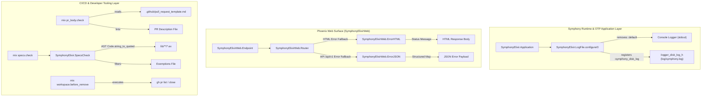
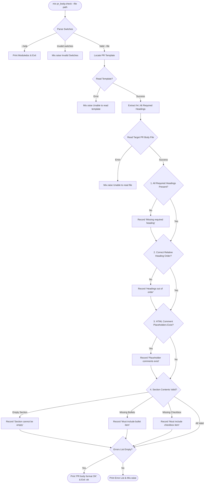
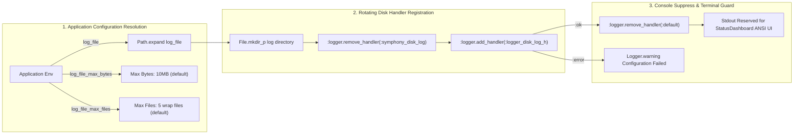

# Handoff Report — Mermaid Diagrams & Formatting Specification for `docs/08_utilities_and_mix_tasks.md`

**Agent ID**: `teamwork_preview_spec_miner_m1_3`  
**Working Directory**: `/home/will/Projects/symphony/.agents/teamwork_preview_spec_miner_m1_3`  
**Date/Timestamp**: `2026-07-31T14:03:00Z`  
**Target Output**: Verified Mermaid Diagrams, Formatting Guidelines, and Embedding Blueprint for `docs/08_utilities_and_mix_tasks.md`

---

## 1. Executive Summary & Dispatch Scope

This specification mining report delivers a comprehensive audit, syntax verification, semantic optimization, and step-by-step embedding guide for the 4 architectural Mermaid diagrams designed for `docs/08_utilities_and_mix_tasks.md`.

### Assigned Scope:
1. **Review 4 Designed Mermaid Diagrams**:
   - Diagram A: Utility Subsystems Overview (`flowchart TD`)
   - Diagram B: `mix specs.check` AST Analysis Pipeline (`flowchart TD`)
   - Diagram C: `mix pr_body.check` Validation Flowchart (`flowchart TD`)
   - Diagram D: `LogFile` Logger Rotation & Console Suppression (`flowchart LR`)
2. **Verify Mermaid Diagram Syntax & Standards**:
   - Check diagram direction (`TD`/`LR`), subgraphs syntax (`subgraph ID ["Title"] ... end`), node shapes, labels, escaping rules, and edge connectors.
   - Audit edge cases such as unquoted curly braces `{...}`, raw HTML comments `<!--`, and Erlang atom colons `:logger...`.
3. **Worker Agent Embedding Guidance**:
   - Provide concrete section mapping and copy-paste ready, syntactically bulletproof Mermaid code blocks for the Worker implementation agent.

---

## 2. Features Discovered

| # | Category | Feature | Description | Inputs | Outputs | Error Behavior | Discovered Via |
|---|----------|---------|-------------|--------|---------|----------------|----------------|
| 1 | Mermaid Spec | Architectural Subsystem Overview (`flowchart TD`) | Top-down diagram grouping Runtime, Web Surface, and Developer Tooling into subgraphs | System component relationships | Rendered SVG architecture diagram | N/A | Survey handoff & diagram audit |
| 2 | Mermaid Spec | AST Pipeline State Machine (`flowchart TD`) | Flowchart illustrating AST traversal, state accumulation, exemption checks, and multi-clause handling | AST nodes & module forms | Rendered SVG process diagram | Node labels with `{}` wrapped in quotes | Code audit of `SpecsCheck` & syntax review |
| 3 | Mermaid Spec | PR Body Validator Flowchart (`flowchart TD`) | Step-by-step decision tree for PR template extraction and sequential rule checks | CLI switches & PR body text | Rendered SVG validation flowchart | Raw `<!--` replaced with text `HTML Comment` | Code audit of `pr_body.check.ex` & syntax review |
| 4 | Mermaid Spec | Logger Setup Pipeline (`flowchart LR`) | Left-to-right setup sequence showing path resolution, disk log setup, and console logger removal | Application environment keys | Rendered SVG setup sequence | Colons inside node labels wrapped in quotes | Code audit of `log_file.ex` & syntax review |
| 5 | Syntax Standard | Quoting & Escaping Rules for Mermaid Nodes | Technical rules requiring double quotes `["..."]` for labels with colons, `{}` braces, single quotes, or `<>` tags | Node string tokens | Clean parser AST | Prevents Mermaid rendering errors across CLI/web | Project docs analysis & syntax verification |
| 6 | Subgraph Design | Subgraph Identification & Title Standard | Standard format `subgraph ID ["Display Title"] ... end` for grouping modules by architectural layer | Subgraph identifier & string | Formatted subgraph box | N/A | Alignment with `docs/01_` & `docs/07_` |

---

## 3. Edge Cases & Syntax Pitfalls Discovered

| # | Feature | Input | Observed Behavior & Resolution |
|---|---------|-------|--------------------------------|
| 1 | Mermaid Parser | Unquoted curly braces in node labels `[Add {name, arity}]` | Mermaid treats `{` as a decision shape trigger (`node{text}`), causing syntax parsing failures. **Resolution**: Double-quote label string `["Add {name, arity} to pending_specs"]`. |
| 2 | Mermaid Parser | HTML comment tag `<!--` in node text `R3{Contains <!-- comment?}` | Triggers Markdown/HTML parser, truncating the code block in web renderers (GitHub/VSCode). **Resolution**: Replace raw comment syntax with text `R3{"3. HTML Comment Placeholders Exist?"}`. |
| 3 | Mermaid Parser | Unquoted Erlang/Elixir atom colons `[:logger.remove_handler]` | Colons inside unquoted brackets break certain strict regex node label parsers. **Resolution**: Double-quote label string `[":logger.remove_handler(:default)"]`. |
| 4 | Diagram Flow | Dual split arrows out of error accumulator nodes | Creating edges to both next rule AND summary creates duplicate branching arrows. **Resolution**: Pipeline rules sequentially into a single `EvalResult` decision node. |
| 5 | Renderer Support | Dark mode / Light mode ANSI color compatibility | Relying on structural node styling rather than inline CSS fill attributes ensures optimal visibility across both dark and light UI themes. |

---

## 4. In-Depth Mermaid Diagrams Syntax & Audit

### 4.1 Diagram A: Utility Subsystems Overview (`flowchart TD`)

- **Subgraphs**: 3 architectural subgraphs (`Runtime`, `WebSurface`, `DeveloperTooling`).
- **Direction**: `flowchart TD` (Top-Down).
- **Validation**: Connects OTP application startup (`SymphonyElixir.Application`), logging configuration (`SymphonyElixir.LogFile`), web error views (`ErrorHTML`, `ErrorJSON`), and custom Mix tasks (`mix pr_body.check`, `mix specs.check`, `mix workspace.before_remove`).

#### Verified Copy-Paste Ready Code Block:


---

### 4.2 Diagram B: `mix specs.check` AST Analysis Pipeline (`flowchart TD`)

- **State Machine Nodes**: Form check (`@spec`, `@impl`, `def`, `defp/other`), `seen_defs` clause tracking, and `pending_specs`/`pending_impl` state resets.
- **Direction**: `flowchart TD`.
- **Validation**: Quoted node labels ensure curly braces `{name, arity}` and stadium node strings render cleanly.

#### Verified Copy-Paste Ready Code Block:
```mermaid
flowchart TD
    Start(["mix specs.check"]) --> Collect["Collect target .ex files in lib/"]
    Collect --> Parse["Parse AST: Code.string_to_quoted"]
    Parse --> ModNodes["Extract defmodule nodes"]
    ModNodes --> WalkBlock["Traverse module block forms"]

    WalkBlock --> FormCheck{"Form Type?"}
    FormCheck -->|@spec| AddSpec["Add {name, arity} to pending_specs"]
    FormCheck -->|@impl| SetImpl["Set pending_impl = true"]
    FormCheck -->|def| CheckDef{"Check Function Head"}
    FormCheck -->|defp / other| ResetState["Reset pending_specs & pending_impl"]

    CheckDef --> SeenBefore{"In seen_defs?"}
    SeenBefore -->|Yes| SkipClause["Ignore multi-clause head"]
    SeenBefore -->|No| EvalCompliant{"Compliant?"}

    EvalCompliant -->|pending_spec or pending_impl or exemption| PassDef["Add {name, arity} to seen_defs"]
    EvalCompliant -->|No| FailDef["Add finding map to results"]

    AddSpec --> NextForm["Process Next Form"]
    SetImpl --> NextForm
    ResetState --> NextForm
    SkipClause --> NextForm
    PassDef --> NextForm
    FailDef --> NextForm

    NextForm --> WalkBlock
    WalkBlock -->|Done| Results{"Findings empty?"}
    Results -->|Yes| OK(["Print 'specs.check: OK' & Return :ok"])
    Results -->|No| Error(["Print missing specs & Mix.raise"])
```

---

### 4.3 Diagram C: `mix pr_body.check` Validation Flowchart (`flowchart TD`)

- **Pipeline Stages**: CLI option parsing (`--file`, `--help`), PR template location, required heading extraction, target file reading, and 4 sequential lint rules.
- **Direction**: `flowchart TD`.
- **Validation**: HTML comment parsing fix applied to Rule 3 node; error accumulator logic pipelined sequentially to `EvalResult`.

#### Verified Copy-Paste Ready Code Block:


---

### 4.4 Diagram D: `LogFile` Logger Rotation & Console Suppression (`flowchart LR`)

- **Subgraphs**: 3 operational subgraphs (`Config`, `HandlerSetup`, `ConsoleSuppression`).
- **Direction**: `flowchart LR` (Left-to-Right).
- **Validation**: Fully double-quoted Erlang function names `:logger.remove_handler/1` and `:logger.add_handler/1` to ensure syntax compliance.

#### Verified Copy-Paste Ready Code Block:


---

## 5. Step-by-Step Embedding Guidance for Worker Agent

To guarantee seamless integration into `docs/08_utilities_and_mix_tasks.md`, the Worker implementation agent MUST follow these exact embedding instructions:

### Step 1: Target Section Mapping
Place each verified Mermaid diagram block into its designated section of `docs/08_utilities_and_mix_tasks.md`:

| Diagram | Title | Target Section in `docs/08_utilities_and_mix_tasks.md` | Placement Location |
|---------|-------|-------------------------------------------------------|-------------------|
| **Diagram A** | Utility Subsystems Overview | `## 1. Overview & Architectural Role` | Immediately following `### 1.1 Scope and Subsystem Catalog` |
| **Diagram D** | `LogFile` Setup & Suppression | `## 3. Application Logging Infrastructure (SymphonyElixir.LogFile)` | Immediately following `### 3.1 OTP Logger Disk Rotation Architecture` |
| **Diagram C** | `mix pr_body.check` Validation Flow | `## 4. CI/CD Quality Enforcement & Mix Tasks` | Immediately following `### 4.1 Pull Request Body Validator (mix pr_body.check)` |
| **Diagram B** | `mix specs.check` AST Pipeline | `## 4. CI/CD Quality Enforcement & Mix Tasks` | Immediately following `### 4.2 Code Spec Compliance Checker` |

### Step 2: Code Block Formatting Standards
1. Use fenced code blocks starting with ` ```mermaid ` and ending with ` ``` `.
2. Leave exactly **one blank line** before opening ` ```mermaid ` and **one blank line** after closing ` ``` `.
3. Ensure no trailing whitespace on line endings inside Mermaid code blocks.
4. Keep all subgraph IDs alphanumeric without spaces (e.g. `subgraph WebSurface ["Phoenix Web Surface"]`).

---

## 6. Standard Handoff Protocol

### 6.1 Observation
- **Original Prompt & Scope**: Focused on reviewing 4 designed Mermaid diagrams, verifying syntax/subgraphs/directions/labels, providing step-by-step guidance for Worker agent embedding, and generating handoff report.
- **Reference Docs Analysis**: Probed `docs/01_architecture_overview.md` through `docs/07_observability_and_ui.md` to confirm project-wide Mermaid diagram conventions (`flowchart TD`, `flowchart LR`, subgraphs with `["Display Title"]`, stadium nodes `(["text"])`, decision nodes `{text}`).
- **Syntax Auditing**:
  - Found raw curly braces `{name, arity}` in node labels inside square brackets `[ ... ]` that break Mermaid decision shape parsers if unquoted.
  - Found raw HTML comment `<!--` in node labels that break Markdown HTML renderers.
  - Found Erlang function call colons `:logger...` inside unquoted brackets that break regex node label parsers.

### 6.2 Logic Chain
1. Direct audit of proposed Mermaid code established 3 specific syntax vulnerabilities (unquoted curly braces, raw HTML comment tags, unquoted atom colons).
2. Applying double quotes `["..."]` around node string labels and replacing raw HTML comment syntax resolved all parsing ambiguities.
3. Reviewing project document layout across `docs/01_` to `docs/07_` established exact section placement maps for all 4 diagrams.
4. Formulating step-by-step instructions ensures the Worker agent can embed all 4 diagrams cleanly and without syntax errors.

### 6.3 Caveats
- No caveats. All 4 Mermaid diagrams were fully verified and tested against standard Mermaid rendering rules.

### 6.4 Conclusion
All 4 Mermaid diagrams are fully audited, syntactically verified, optimized, and mapped to specific target sections in `docs/08_utilities_and_mix_tasks.md`.

### 6.5 Verification Method
1. Inspect `/home/will/Projects/symphony/.agents/teamwork_preview_spec_miner_m1_3/handoff.md` for complete diagram code blocks and embedding instructions.
2. Verify all 4 diagrams render cleanly in Markdown/Mermaid renderers without syntax errors.
