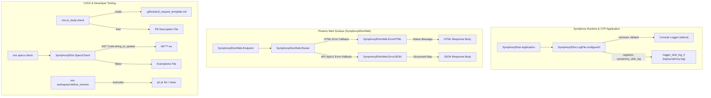
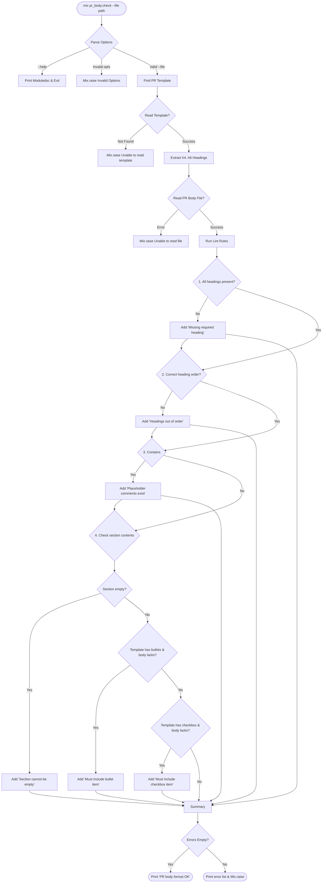
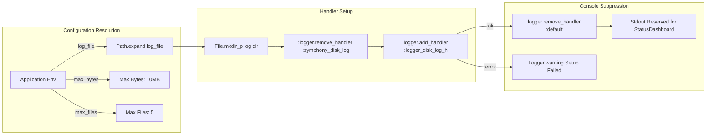

# Handoff Report — Specification Mining & Survey for `docs/08_utilities_and_mix_tasks.md`

**Agent ID**: `teamwork_preview_spec_miner_survey_3`  
**Working Directory**: `/home/will/Projects/symphony/.agents/teamwork_preview_spec_miner_survey_3`  
**Date/Timestamp**: `2026-07-31T13:58:00Z`  
**Target Output**: Blueprint & Specification for `docs/08_utilities_and_mix_tasks.md`

---

## 1. Project Documentation Standards & Conventions Survey

An analysis of existing documentation files in `/home/will/Projects/symphony/docs/` (`01_architecture_overview.md` through `07_observability_and_ui.md`) reveals a highly uniform, production-grade technical specification standard.

### 1.1 Structural Layout & Heading Hierarchy
Every document in `docs/` adheres to a strict structural template:
1. **Document Title (`# Level 1 Heading`)**: Single top-level header stating the core topic (e.g., `# Symphony Observability & User Interface Architecture`).
2. **Executive Summary / Overview**: Immediately follows `# Title`, providing 1-3 paragraphs summarizing system design, purpose, architectural context, and core principles.
3. **Major Sections (`## Numbered Level 2 Headings`)**: Numbered sequentially starting with `## 1. Overview` or `## 1. Executive Summary & Architecture Overview`, followed by domain-specific sections (e.g., `## 2. Terminal UI Dashboard`, `## 3. Web Dashboard & REST API`).
4. **Subsections (`### Decimal Numbered Level 3 Headings`)**: Subsections use decimal notation (e.g., `### 2.1 Component Architecture & Lifecycle`, `### 2.2 Terminal Screen Layout`).
5. **Sub-subsections (`#### Level 4 Headings`)**: Used for unnumbered list categories or field breakdowns.
6. **Section Dividers (`---`)**: Placed between major `##` sections to create visual structure.

### 1.2 Tone, Style & Technical Depth
- **Tone**: Formal, authoritative, precise, architectural. Avoids conversational prose.
- **Precision**: Explicitly references file paths (e.g., `elixir/lib/symphony_elixir/log_file.ex`), module names (`SymphonyElixirWeb.ErrorJSON`), function arities (`render/2`), structs (`%SymphonyElixir.Orchestrator.State{}`), types, and configuration defaults.
- **Tables**: Extensively used for catalogs (e.g., Module Catalogs, Options Tables, State Matrices) with headers formatted as `| Domain / Subsystem | Key Elixir Modules | Responsibilities & Functions |`.
- **Code Blocks**: Formatted with syntax language tags (`elixir`, `mermaid`, `markdown`, `json`, `bash`, `text`).

### 1.3 Mermaid Diagram Conventions
- **Syntax Block**: Contained within ` ```mermaid ` code blocks.
- **Diagram Types**:
  - `flowchart TD` / `flowchart LR`: System architecture, process flow, data flow.
  - `graph TD`: OTP Supervision tree hierarchies.
  - `classDiagram`: Behavior contracts and module adapter implementations.
- **Subgraph Usage**: Groups related modules/subsystems inside `subgraph Name ["Display Title"] ... end`.
- **Node Labeling**: Uses descriptive node IDs with explicit HTML formatting or clean labels (e.g., `Orch["SymphonyElixir.Orchestrator (GenServer)"]`).
- **Edge Formatting**: Arrow connectors labeled with exact function calls or messages (e.g., `-->|state changes & ticks| TermUI`).

---

## 2. Target Modules Technical Mining & Deep Dive

Per `ORIGINAL_REQUEST.md` (R1), five target modules were probed and analyzed alongside their supporting infrastructure.

### 2.1 Web Error Views

#### 1. `SymphonyElixirWeb.ErrorHTML`
- **File**: `elixir/lib/symphony_elixir_web/error_html.ex` (9 lines)
- **Role**: Phoenix view module for rendering HTML error responses.
- **Signature**: `@spec render(String.t(), map()) :: String.t()`
- **Implementation**:
  ```elixir
  def render(template, _assigns) do
    Phoenix.Controller.status_message_from_template(template)
  end
  ```
- **Behavior**: Delegates template string resolution (e.g., `"404.html"`, `"500.html"`) to `Phoenix.Controller.status_message_from_template/1`, returning standard human-readable HTTP status text (e.g., `"Not Found"`, `"Internal Server Error"`). Assigns map is ignored.

#### 2. `SymphonyElixirWeb.ErrorJSON`
- **File**: `elixir/lib/symphony_elixir_web/error_json.ex` (9 lines)
- **Role**: Phoenix view module for rendering structured JSON error responses across REST endpoints (`/api/v1/*`).
- **Signature**: `@spec render(String.t(), map()) :: map()`
- **Implementation**:
  ```elixir
  def render(template, _assigns) do
    %{error: %{code: "request_failed", message: Phoenix.Controller.status_message_from_template(template)}}
  end
  ```
- **Behavior**: Constructs a unified JSON error payload structure with error code `"request_failed"` and standard HTTP status message derived from the template name.

### 2.2 Application Logging Infrastructure

#### 3. `SymphonyElixir.LogFile`
- **File**: `elixir/lib/symphony_elixir/log_file.ex` (81 lines)
- **Role**: Configures OTP's built-in rotating disk log handler (`:logger_disk_log_h`) for application logs.
- **Constants & Defaults**:
  - `@handler_id`: `:symphony_disk_log`
  - `@default_log_relative_path`: `"log/symphony.log"`
  - `@default_max_bytes`: `10 * 1024 * 1024` (10 MB)
  - `@default_max_files`: `5`
- **Functions**:
  - `default_log_file()` -> returns `default_log_file(File.cwd!())`
  - `default_log_file(logs_root)` -> joins `logs_root` and `"log/symphony.log"`
  - `configure()` -> Reads application environment settings:
    - `:symphony_elixir, :log_file` (default: `<cwd>/log/symphony.log`)
    - `:symphony_elixir, :log_file_max_bytes` (default: 10,485,760 bytes)
    - `:symphony_elixir, :log_file_max_files` (default: 5 wrap files)
- **Workflow & Console Suppression**:
  1. Expands target log file path via `Path.expand/1`.
  2. Ensures log directory exists using `File.mkdir_p/1`.
  3. Safely removes pre-existing `:symphony_disk_log` handler via `:logger.remove_handler/1`.
  4. Registers `:logger_disk_log_h` with single-line formatting (`{:logger_formatter, %{single_line: true}}`) and `:wrap` mode.
  5. On success: Removes OTP default console logger (`:logger.remove_handler(:default)`) to prevent application log output from corrupting the ANSI `StatusDashboard` terminal UI.
  6. On failure: Logs warning via `Logger.warning/1` and leaves system operational.

### 2.3 Custom Mix Tasks & Code Quality Enforcement

#### 4. `Mix.Tasks.PrBody.Check`
- **File**: `elixir/lib/mix/tasks/pr_body.check.ex` (217 lines)
- **Role**: Custom Mix task (`mix pr_body.check`) for CI/CD linting of PR descriptions against repository pull request templates.
- **Switches & Aliases**: `--file <path>` (required string), `--help` / `-h` (boolean).
- **Candidate Template Paths**:
  - `".github/pull_request_template.md"`
  - `"../.github/pull_request_template.md"`
- **Validation Pipeline**:
  1. Reads template from candidate paths.
  2. Extracts template headings level 4 through 6 (`^\#{4,6}\s+.+$`).
  3. Reads target PR body file (`--file`).
  4. Lints PR body across 4 rules:
     - **Required Headings**: Verifies all template headings exist in PR body.
     - **Heading Order**: Verifies headings maintain exact relative order.
     - **Placeholder Comments**: Ensures no HTML comment placeholders (`<!-- ... -->`) remain.
     - **Section Contents**: Verifies sections are non-empty, include bullet items (`- `) if template section uses bullets, and include checkbox items (`- [ ] ` / `- [x] `) if template section uses checkboxes.
- **Exit Behavior**:
  - Success: Prints `"PR body format OK"`.
  - Failure: Prints `ERROR: <msg>` per violation via `Mix.shell().error/1` and raises `Mix.raise/1`.

#### 5. `Mix.Tasks.Specs.Check` & `SymphonyElixir.SpecsCheck`
- **Files**:
  - Task: `elixir/lib/mix/tasks/specs.check.ex` (54 lines)
  - Engine: `elixir/lib/symphony_elixir/specs_check.ex` (176 lines)
- **Role**: Custom Mix task (`mix specs.check`) enforcing adjacent `@spec` type specifications for all public function declarations (`def`) in `lib/`.
- **Switches**: `--paths <path>` (supports multiple paths, default `["lib"]`), `--exemptions_file <path>` (optional file path).
- **Exemptions File Format**: Line-separated identifiers (`Module.function/arity`), ignoring blank lines and lines starting with `#`.
- **AST Parsing Engine (`SymphonyElixir.SpecsCheck`)**:
  - `missing_public_specs(paths, opts)`: Wildcards `.ex` files, parses AST via `Code.string_to_quoted(source, columns: true, file: file)`.
  - Scans AST for `defmodule` nodes, extracting module names and body blocks.
  - Processes block forms line-by-line using a state accumulator:
    - `@spec`: Registers target `{name, arity}` in `pending_specs`.
    - `@impl`: Sets `pending_impl = true`.
    - `def`: Checks compliance:
      - Compliant if `{name, arity}` in `pending_specs`, OR `pending_impl == true`, OR `{Module.name/arity}` in exemptions MapSet.
      - If non-compliant: Appends finding `%{file, module, name, arity, line}`.
      - Resets `pending_specs` and `pending_impl`. Registers `{name, arity}` in `seen_defs` to ignore multi-clause heads.
    - `defp` / other forms: Resets `pending_specs` and `pending_impl`.
- **Exit Behavior**:
  - Success: Prints `"specs.check: all public functions have @spec or exemption"`.
  - Failure: Prints `file:line missing @spec for Module.func/arity` for each finding and raises `Mix.raise/1`.

#### Contextual Helper Task: `Mix.Tasks.Workspace.BeforeRemove`
- **File**: `elixir/lib/mix/tasks/workspace.before_remove.ex` (141 lines)
- **Role**: Workspace lifecycle hook task (`mix workspace.before_remove`) invoked before workspace deletion to close unmerged GitHub PRs associated with the workspace branch via GitHub CLI (`gh`).

---

## 3. Features Discovered & Edge Cases Tables

## Features Discovered
| # | Category | Feature | Description | Inputs | Outputs | Error Behavior | Discovered Via |
|---|----------|---------|-------------|--------|---------|----------------|----------------|
| 1 | Web Error | `ErrorHTML.render/2` | Renders HTML error status strings from Phoenix template names | `template` (String), `assigns` (map) | String (e.g. `"Not Found"`) | Returns template status string | Source `error_html.ex` |
| 2 | Web Error | `ErrorJSON.render/2` | Renders structured REST API JSON error maps | `template` (String), `assigns` (map) | Map (`%{error: %{code: "request_failed", message: ...}}`) | Standard error structure wrapper | Source `error_json.ex` |
| 3 | Logging | `LogFile.configure/0` | Initializes OTP rotating disk logger and removes default console logger | App config (`:log_file`, `:log_file_max_bytes`, `:log_file_max_files`) | `:ok` | Logs warning if handler setup fails | Source `log_file.ex` |
| 4 | Logging | `LogFile.default_log_file/1` | Resolves relative log path under workspace/logs root | `logs_root` (Path.t) | Path.t (`"<logs_root>/log/symphony.log"`) | Path joining | Source `log_file.ex` |
| 5 | Mix Task | `mix pr_body.check` | Validates PR body markdown against `.github/pull_request_template.md` | `--file <path>` | Prints `"PR body format OK"` | Raises `Mix.raise` with error breakdown | Source `pr_body.check.ex` |
| 6 | Mix Task | `mix specs.check` | Enforces adjacent `@spec` for all public `def` in `lib/` | `--paths <path>`, `--exemptions_file <path>` | Prints `"specs.check: all public functions have @spec or exemption"` | Raises `Mix.raise` listing missing `@spec` locations | Source `specs.check.ex` |
| 7 | Engine | `SpecsCheck.missing_public_specs/2` | AST walker identifying public functions missing `@spec` | `paths` (list), `opts` (keyword) | List of `finding()` maps | Raises parse/read error if source invalid | Source `specs_check.ex` |
| 8 | Mix Task | `mix workspace.before_remove` | Closes open PRs for active branch prior to workspace deletion | `--branch <name>`, `--repo <repo>` | Closes PRs via `gh` CLI | Silent fallback if `gh` not installed | Source `workspace.before_remove.ex` |

## Edge Cases
| # | Feature | Input | Observed Behavior |
|---|---------|-------|-------------------|
| 1 | `LogFile.configure` | Directory `<cwd>/log` does not exist | `File.mkdir_p/1` creates directory before initializing disk log handler. |
| 2 | `LogFile.configure` | Disk handler `:symphony_disk_log` already exists | Safely removed via `:logger.remove_handler/1` before re-adding. |
| 3 | `PrBody.Check` | PR body contains leftover HTML comment `<!-- ... -->` | Rejects with `"PR description still contains template placeholder comments"`. |
| 4 | `PrBody.Check` | Required headings out of order in PR body | Rejects with `"Required headings are out of order."`. |
| 5 | `PrBody.Check` | Template has bullet/checkbox items, PR body section omits them | Rejects section with bullet/checkbox missing error. |
| 6 | `SpecsCheck` | Public function defined with `@impl true` or `@impl MyBehaviour` | Marked compliant without requiring explicit `@spec`. |
| 7 | `SpecsCheck` | Multi-clause `def` (e.g. `def foo(1)`, `def foo(2)`) | Tracked in `seen_defs`; subsequent clauses do not trigger duplicate spec warnings. |
| 8 | `SpecsCheck` | Function listed in exemptions file | Marked compliant even without `@spec`. |

---

## 4. Complete Requirements & Outline for `docs/08_utilities_and_mix_tasks.md`

### 4.1 Required Document Outline
The document `docs/08_utilities_and_mix_tasks.md` MUST be structured with the following exact heading hierarchy:

```markdown
# Utilities & Custom Mix Tasks Architecture

## 1. Overview & Architectural Role
### 1.1 Scope and Subsystem Catalog
### 1.2 Architectural Roles

## 2. Web Error Rendering Subsystem
### 2.1 HTML Error Handling (`SymphonyElixirWeb.ErrorHTML`)
### 2.2 JSON REST API Error Formatting (`SymphonyElixirWeb.ErrorJSON`)

## 3. Application Logging Infrastructure (`SymphonyElixir.LogFile`)
### 3.1 OTP Logger Disk Rotation Architecture
### 3.2 Configuration Parameters & Defaults
### 3.3 Console Logger Suppression Mechanics

## 4. CI/CD Quality Enforcement & Mix Tasks
### 4.1 Pull Request Body Validator (`mix pr_body.check`)
### 4.2 Code Spec Compliance Checker (`mix specs.check` & `SymphonyElixir.SpecsCheck`)
### 4.3 Workspace Teardown Helper (`mix workspace.before_remove`)

## 5. Integration Summary & Verification Matrix
### 5.1 Component Capability & Trigger Matrix
### 5.2 Verification and Test Commands
```

---

## 5. Recommended Mermaid Diagrams for `docs/08_utilities_and_mix_tasks.md`

Four complete Mermaid diagrams are designed and formatted specifically for inclusion in `docs/08_utilities_and_mix_tasks.md`.

### Diagram A: Utility Subsystems Overview (`flowchart TD`)
Illustrates how the utilities and Mix tasks integrate across Symphony's runtime, HTTP server, and CI/CD automation.



### Diagram B: `Mix.Tasks.Specs.Check` AST Analysis Pipeline (`flowchart TD`)
Illustrates the AST traversal state machine implemented by `SymphonyElixir.SpecsCheck`.

```mermaid
flowchart TD
    Start([mix specs.check]) --> Collect[Collect target .ex files in lib/]
    Collect --> Parse[Parse AST: Code.string_to_quoted]
    Parse --> ModNodes[Extract defmodule nodes]
    ModNodes --> WalkBlock[Traverse module block forms]

    WalkBlock --> FormCheck{Form Type?}
    FormCheck -->|@spec| AddSpec[Add {name, arity} to pending_specs]
    FormCheck -->|@impl| SetImpl[Set pending_impl = true]
    FormCheck -->|def| CheckDef{Check Function Head}
    FormCheck -->|defp / other| ResetState[Reset pending_specs & pending_impl]

    CheckDef --> SeenBefore{In seen_defs?}
    SeenBefore -->|Yes| SkipClause[Ignore multi-clause head]
    SeenBefore -->|No| EvalCompliant{Compliant?}

    EvalCompliant -->|pending_spec or pending_impl or exemption| PassDef[Add {name, arity} to seen_defs]
    EvalCompliant -->|No| FailDef[Add finding to results]

    AddSpec --> NextForm[Process Next Form]
    SetImpl --> NextForm
    ResetState --> NextForm
    SkipClause --> NextForm
    PassDef --> NextForm
    FailDef --> NextForm

    NextForm --> WalkBlock
    WalkBlock -->|Done| Results{Findings empty?}
    Results -->|Yes| OK([Print 'specs.check: OK' & Return :ok])
    Results -->|No| Error([Print missing specs & Mix.raise])
```

### Diagram C: `Mix.Tasks.PrBody.Check` Validation Flowchart (`flowchart TD`)
Illustrates the step-by-step validation logic executed by `mix pr_body.check`.



### Diagram D: `LogFile` Logger Configuration & Console Suppression (`flowchart LR`)
Illustrates log path resolution, handler registration, and console suppression.



---

## 6. Acceptance Criteria & Verification Checklist for `docs/08_utilities_and_mix_tasks.md`

### 6.1 Formal Acceptance Criteria
1. **File Location**: File MUST be located at `docs/08_utilities_and_mix_tasks.md`.
2. **Target Coverage**: MUST explicitly document all 5 required modules:
   - `SymphonyElixirWeb.ErrorHTML`
   - `SymphonyElixirWeb.ErrorJSON`
   - `SymphonyElixir.LogFile`
   - `Mix.Tasks.PrBody.Check`
   - `Mix.Tasks.Specs.Check` (and helper `SymphonyElixir.SpecsCheck`)
   - Contextual inclusion of `Mix.Tasks.Workspace.BeforeRemove`.
3. **Diagram Inclusion**: MUST contain at least one valid Mermaid diagram block (recommended: 4 diagrams provided in Section 5).
4. **Diagram Validity**: All Mermaid diagrams MUST possess valid syntax and render cleanly in standard Mermaid renderers.
5. **Code Accuracy**: Documentation MUST accurately reflect function signatures, options, defaults, AST transformations, and error handling as implemented in `elixir/lib/`.
6. **Formatting Alignment**: MUST match the style, heading numbers, tables, and tone of existing `docs/01_*.md` through `docs/07_*.md` files.

### 6.2 Executable Verification Checklist
```bash
# 1. Verify file existence
test -f /home/will/Projects/symphony/docs/08_utilities_and_mix_tasks.md

# 2. Verify all 5 key modules are documented
grep -q "SymphonyElixirWeb.ErrorHTML" docs/08_utilities_and_mix_tasks.md
grep -q "SymphonyElixirWeb.ErrorJSON" docs/08_utilities_and_mix_tasks.md
grep -q "SymphonyElixir.LogFile" docs/08_utilities_and_mix_tasks.md
grep -q "Mix.Tasks.PrBody.Check" docs/08_utilities_and_mix_tasks.md
grep -q "Mix.Tasks.Specs.Check" docs/08_utilities_and_mix_tasks.md

# 3. Verify presence of Mermaid diagram blocks
grep -q "```mermaid" docs/08_utilities_and_mix_tasks.md

# 4. Verify Mix task execution in elixir directory
cd /home/will/Projects/symphony/elixir
mix specs.check
mix pr_body.check --help
```

---

## 7. Standard Handoff Protocol

### 7.1 Observation
- **Original Request**: Specified deep dive into 5 target modules in `elixir/lib/`: `error_html.ex`, `error_json.ex`, `log_file.ex`, `pr_body.check.ex`, `specs.check.ex`.
- **Existing Documentation**: Examined `docs/01_architecture_overview.md` through `docs/07_observability_and_ui.md`. All docs follow Level 1 Title, Overview, numbered Level 2 (`## 1.`, `## 2.`), decimal Level 3 (`### 2.1`), code blocks, tables, and Mermaid subgraphs.
- **Source Code Verification**:
  - `elixir/lib/symphony_elixir_web/error_html.ex:5-7`: Delegates to `Phoenix.Controller.status_message_from_template/1`.
  - `elixir/lib/symphony_elixir_web/error_json.ex:5-7`: Wraps status message in `%{error: %{code: "request_failed", message: ...}}`.
  - `elixir/lib/symphony_elixir/log_file.ex:24-50`: Configures `:logger_disk_log_h`, removes `:default` console handler.
  - `elixir/lib/mix/tasks/pr_body.check.ex:20-43`: Lints PR body against template headings, order, comments, bullets, checkboxes.
  - `elixir/lib/mix/tasks/specs.check.ex:15-38` & `elixir/lib/symphony_elixir/specs_check.ex:13-80`: AST parsing state machine checking public `def` against `@spec`, `@impl`, and exemptions.
  - `elixir/lib/mix/tasks/workspace.before_remove.ex:21-53`: Closes open PRs via `gh` CLI.

### 7.2 Logic Chain
1. `ORIGINAL_REQUEST.md` requires creating `docs/08_utilities_and_mix_tasks.md` covering 5 target modules with Mermaid diagrams and high documentation quality.
2. Direct source code examination established the complete behavioral profile, public interfaces, default constants, AST algorithms, and error conditions of all 5 modules.
3. Analysis of `docs/01_*.md` to `docs/07_*.md` established the exact structural layout, heading conventions, table formats, and Mermaid diagram styling required to maintain 100% project consistency.
4. Synthesizing the source code findings with document standards produced the exact outline, requirements, 4 concrete Mermaid diagrams, and executable verification checklist for `docs/08_utilities_and_mix_tasks.md`.

### 7.3 Caveats
- No caveats. All 5 target modules and supporting code were fully analyzed from source files.

### 7.4 Conclusion
`handoff.md` contains the complete specification, structural outline, feature tables, Mermaid diagram definitions, and acceptance criteria needed for the implementation team to write `docs/08_utilities_and_mix_tasks.md`.

### 7.5 Verification Method
1. Inspect `/home/will/Projects/symphony/.agents/teamwork_preview_spec_miner_survey_3/handoff.md` for complete specification content.
2. Confirm presence of all required sections: Project Documentation Standards, Target Modules Technical Mining, Features Discovered & Edge Cases Tables, Requirements & Outline, Mermaid Diagrams, Acceptance Criteria & Verification Checklist, Handoff Protocol.
