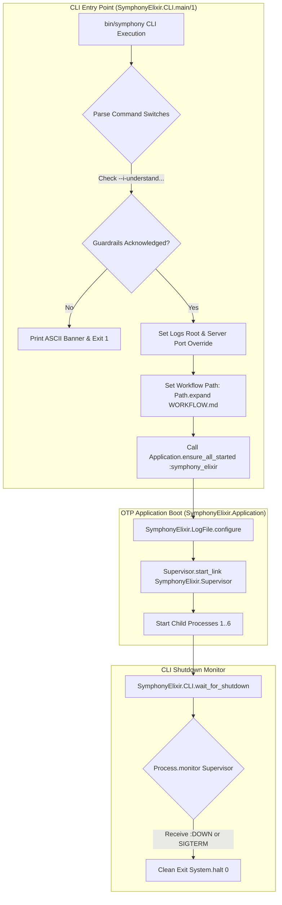
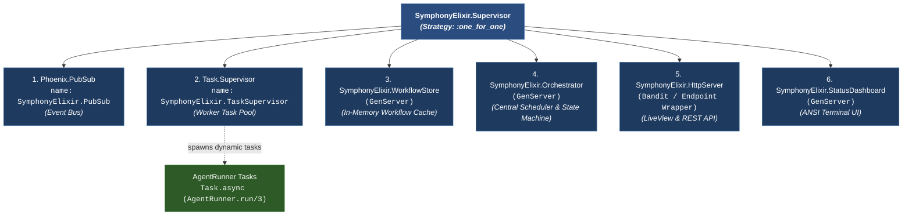
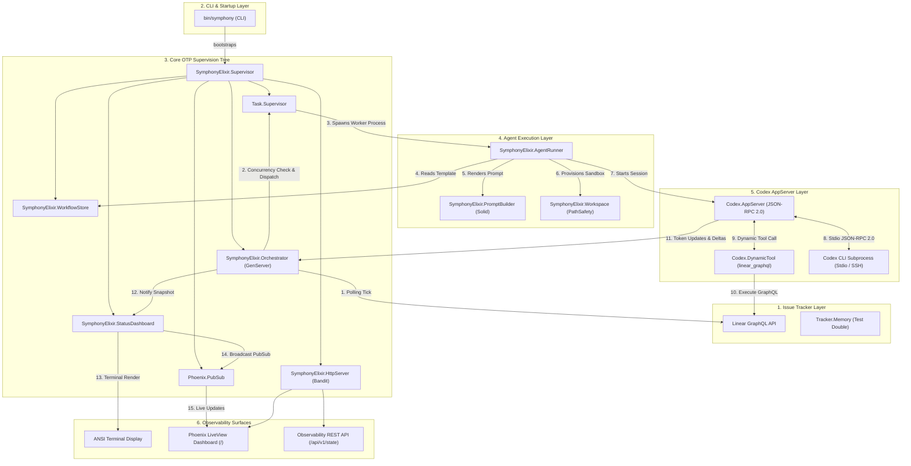
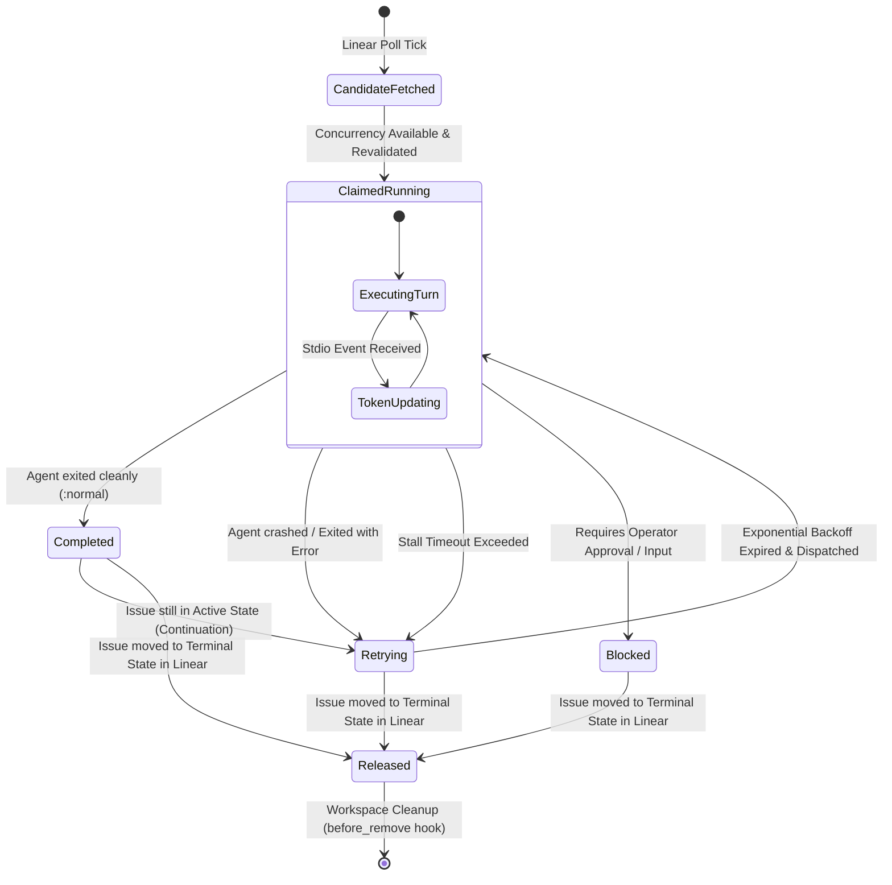

# Symphony Architecture Overview

## 1. System Overview & Symphony Philosophy

**Symphony** is an autonomous coding agent orchestration service developed to convert project issue tracker work items (primarily from **Linear**) into isolated, unattended implementation runs by spawning and managing coding agent sessions (such as **Codex**).

### 1.1 Core System Philosophy

Symphony addresses four fundamental operational challenges in AI-assisted software development:

1. **Daemonized Automation vs. Manual Scripting**: Converts issue execution into a continuous, deterministic daemon workflow rather than requiring human engineers to invoke ad-hoc agent scripts manually.
2. **Strict Workspace Isolation**: Ensures coding agent execution and host shell commands operate exclusively inside per-issue workspace sandboxes, eliminating cross-issue side effects.
3. **Repository-Driven Policy Contract (`WORKFLOW.md`)**: Decouples prompt engineering, scheduling policies, approval thresholds, dynamic tools, and lifecycle hooks from application binary logic. Policies live directly inside the project repository in a single version-controlled `WORKFLOW.md` file (YAML front matter + Liquid prompt body).
4. **Resilient & Database-Free Architecture**: Operates without a persistent database. Scheduler state is maintained in-memory inside Erlang/OTP GenServers. On restart, Symphony naturally recovers by querying the issue tracker API and inspecting existing filesystem workspaces.

### 1.2 Language-Agnostic Specification (`SPEC.md`) vs. Elixir Implementation (`elixir/`)

Symphony is designed around a clear separation between specification and implementation:

- **Language-Agnostic Specification (`SPEC.md`)**: Draft v1 specification defining normative rules (RFC 2119), problem statements, trust/safety posture, protocol boundaries, and **8 Core Functional Components**:
  1. **Workflow Loader**: Parses `WORKFLOW.md` into front matter config and prompt template.
  2. **Config Layer**: Provides typed accessors, default fallbacks, and secret/path resolutions.
  3. **Issue Tracker Client**: Normalizes issue tracker queries, candidate fetching, and reconciliation.
  4. **Orchestrator**: Owns the poll tick, in-memory runtime state, concurrency pools, retry exponential backoff, and active session monitoring.
  5. **Workspace Manager**: Provisions per-issue directory sandboxes, manages path safety, and executes lifecycle hooks (`after_create`, `before_run`, `after_run`, `before_remove`).
  6. **Agent Runner**: Coordinates prompt rendering, launching Codex app-server sessions over JSON-RPC 2.0 stdio/SSH, turn loops, and updates streaming.
  7. **Status Surface**: Operator-facing observability (terminal ANSI dashboard & Phoenix LiveView web UI).
  8. **Logging**: Emits structured session logs to configured file sinks.

- **Elixir Reference Implementation (`elixir/`)**: A production-grade implementation leveraging Elixir 1.19 and Erlang/OTP, utilizing **Phoenix 1.8**, **Phoenix LiveView 1.1**, **Bandit**, **Ecto** schema validation, **Solid** Liquid template rendering, **Req** HTTP client, and JSON-RPC 2.0 stdio integration with the Codex app-server.

---

## 2. Repository Structure & Module Layout

### 2.1 Repository Directory Tree

```
symphony/
├── .agents/                 # Multi-agent metadata and coordination artifacts
├── .codex/                  # Codex agent rules and default settings
├── .github/                 # GitHub Actions CI/CD workflows and media assets
├── blog/                    # Promotional and release announcements
├── docs/                    # System architecture & domain documentation
│   ├── 01_architecture_overview.md  # This document
│   ├── 02_workflow_and_config.md
│   ├── 03_issue_tracker_integration.md
│   ├── 04_orchestration_engine.md
│   ├── 05_workspace_management.md
│   ├── 06_agent_execution_and_codex.md
│   ├── 07_observability_and_ui.md
│   ├── 08_utilities_and_mix_tasks.md
│   ├── symphony-smoke-board-review.md
│   └── symphony-smoke-test-one.md
├── elixir/                  # Elixir Reference Implementation
│   ├── bin/                 # Target directory for built escript executable (`bin/symphony`)
│   ├── config/              # Application environment configs (config.exs, dev.exs, prod.exs, test.exs, runtime.exs)
│   ├── docs/                # Internal developer guides (logging.md, token_accounting.md)
│   ├── lib/                 # Core Elixir source code
│   │   ├── mix/tasks/       # Custom Mix tasks (specs.check, pr_body.check, workspace.before_remove)
│   │   ├── symphony_elixir/ # Core business logic, OTP GenServers, Codex protocol & tracker integrations
│   │   └── symphony_elixir_web/ # Phoenix web server, LiveView real-time dashboard & REST API
│   ├── priv/                # Static web assets (dashboard.css, vendor JS scripts)
│   ├── test/                # ExUnit test suite (unit, integration, snapshot, Docker E2E)
│   ├── Makefile             # Build and test automation commands
│   ├── mix.exs              # Mix project configuration & dependencies
│   └── WORKFLOW.md          # Reference workflow specification file
├── LICENSE                  # Apache License 2.0
├── NOTICE                   # Third-party attribution notices
├── README.md                # Top-level repository overview
└── SPEC.md                  # Language-agnostic specification (v1)
```

### 2.2 Core Module Catalog

| Domain / Subsystem | Key Elixir Modules | Responsibilities & Functions |
| --- | --- | --- |
| **CLI & Entry Point** | `SymphonyElixir.CLI`<br>`SymphonyElixir.Application` | CLI switch parsing, safety guardrails verification, application bootstrapping, supervisor process lifecycle. |
| **Workflow & Config** | `SymphonyElixir.Workflow`<br>`SymphonyElixir.WorkflowStore`<br>`SymphonyElixir.Config`<br>`SymphonyElixir.Config.Schema` | Parses `WORKFLOW.md` YAML front matter & Liquid template body, maintains in-memory config GenServer, validates settings with Ecto schemas. |
| **Tracker Integration** | `SymphonyElixir.Tracker`<br>`SymphonyElixir.Linear.Client`<br>`SymphonyElixir.Linear.Adapter`<br>`SymphonyElixir.Linear.Issue`<br>`SymphonyElixir.Tracker.Memory` | Behaviour specification for issue trackers, GraphQL client for Linear API, issue normalization, state mutation, in-memory test double. |
| **Orchestration Core** | `SymphonyElixir.Orchestrator` | Central GenServer polling tick loop, issue queue sorting, global & per-state concurrency bounding, worker dispatching, backoff retries, session token tracking. |
| **Workspace & Isolation** | `SymphonyElixir.Workspace`<br>`SymphonyElixir.PathSafety`<br>`SymphonyElixir.SSH` | Per-issue sandbox creation, canonical realpath evaluation for path safety, lifecycle hooks execution (`after_create`, `before_run`, etc.), remote SSH execution. |
| **Agent Execution & Codex** | `SymphonyElixir.AgentRunner`<br>`SymphonyElixir.PromptBuilder`<br>`SymphonyElixir.Codex.AppServer`<br>`SymphonyElixir.Codex.DynamicTool` | Solid prompt templating, `Task.Supervisor` worker execution, JSON-RPC 2.0 stdio protocol driver (`initialize`, `thread/start`, `turn/start`), client dynamic tools (`linear_graphql`). |
| **Observability & Web** | `SymphonyElixir.StatusDashboard`<br>`SymphonyElixir.HttpServer`<br>`SymphonyElixirWeb.Endpoint`<br>`SymphonyElixirWeb.Router`<br>`SymphonyElixirWeb.DashboardLive`<br>`SymphonyElixirWeb.ObservabilityApiController`<br>`SymphonyElixirWeb.ObservabilityPubSub` | Real-time ANSI terminal UI rendering, Bandit HTTP server, Phoenix LiveView dashboard (`/`), REST API snapshot (`/api/v1/state`), PubSub broadcast. |

---

## 3. Entry Points & System Lifecycle

Symphony supports two primary entry points: the **Escript CLI executable** (`bin/symphony`) for production daemon execution, and standard **OTP Application startup** (`mix run` / `iex -S mix`).



### 3.1 CLI Executable (`bin/symphony` / `SymphonyElixir.CLI`)

- **Location**: `elixir/lib/symphony_elixir/cli.ex`
- **Primary Function**: `SymphonyElixir.CLI.main/1`
- **Supported Switches**:
  - `--i-understand-that-this-will-be-running-without-the-usual-guardrails`: **Mandatory safety acknowledgement flag**. If missing, Symphony prints a warning banner and halts with exit code `1`.
  - `--logs-root <path>`: Overrides the structured log directory root.
  - `--port <port>`: Overrides the HTTP observability server port.
  - `[path-to-WORKFLOW.md]`: Positional argument for the workflow specification file (defaults to `./WORKFLOW.md`).
- **Execution Pipeline**:
  1. Validates CLI switches and mandatory guardrails acknowledgement.
  2. Sets the active workflow file path via `SymphonyElixir.Workflow.set_workflow_file_path/1`.
  3. Boots the `:symphony_elixir` OTP application via `Application.ensure_all_started/1`.
  4. Enters `wait_for_shutdown/0`, monitoring the top-level supervisor process PID and trapping exit signals.

### 3.2 OTP Application Callback (`SymphonyElixir.Application`)

- **Location**: `elixir/lib/symphony_elixir.ex`
- **Callbacks**:
  - `start/2`: Executes `SymphonyElixir.LogFile.configure/0` to initialize logging sinks, then starts `SymphonyElixir.Supervisor` using a `:one_for_one` supervision strategy.
  - `stop/1`: Called during node shutdown. Invokes `SymphonyElixir.StatusDashboard.render_offline_status/0` to gracefully update the terminal UI before termination.

---

## 4. Core OTP Supervision Tree

Symphony organizes its processes into a robust OTP supervision hierarchy under `SymphonyElixir.Supervisor`. Faults in individual worker tasks or HTTP handlers are strictly contained without cascading to the core orchestrator or other active worker threads.



### 4.1 Supervision Child Specifications & Responsibilities

1. **`Phoenix.PubSub` (`name: SymphonyElixir.PubSub`)**:
   - **Type**: Library Worker Process (`Phoenix.PubSub`)
   - **Role**: High-performance, in-process publish/subscribe message bus.
   - **Responsibility**: Broadcasts real-time state updates on topic `"observability:dashboard"` to connected Phoenix LiveView client processes (`DashboardLive`).

2. **`Task.Supervisor` (`name: SymphonyElixir.TaskSupervisor`)**:
   - **Type**: Dynamic Task Supervisor (`Task.Supervisor`)
   - **Role**: Manages dynamically spawned asynchronous worker tasks.
   - **Responsibility**: Supervises `AgentRunner` worker tasks executing issue runs (`Task.Supervisor.async_nolink/4`). Ensures agent process crashes or timeouts do not crash the orchestrator.

3. **`SymphonyElixir.WorkflowStore`**:
   - **Type**: GenServer (`use GenServer`)
   - **Role**: In-memory workflow state container and file watcher.
   - **Responsibility**: Loads and caches the active parsed `WORKFLOW.md`. Monitors file modification timestamps every `1,000ms` and reloads workflow settings seamlessly without restarting the application.

4. **`SymphonyElixir.Orchestrator`**:
   - **Type**: GenServer (`use GenServer`)
   - **Role**: Core scheduler engine and state machine manager.
   - **Responsibility**: Executes scheduled polling ticks, fetches and filters candidate issues from Linear, checks concurrency limits, dispatches work to `Task.Supervisor`, tracks active running issues, calculates exponential retries, handles reconciliation, and accumulates Codex token metrics.

5. **`SymphonyElixir.HttpServer`**:
   - **Type**: Endpoint Wrapper Process
   - **Role**: Hosts the Phoenix Web interface using Bandit web server.
   - **Responsibility**: Mounts `SymphonyElixirWeb.Endpoint` on configured HTTP port. Serves interactive LiveView dashboard (`/`), REST observability state snapshot API (`/api/v1/state`), manual refresh trigger (`/api/v1/refresh`), and static CSS/JS vendor assets.

6. **`SymphonyElixir.StatusDashboard`**:
   - **Type**: GenServer (`use GenServer`)
   - **Role**: Terminal UI renderer and observability publisher.
   - **Responsibility**: Renders an ANSI-formatted terminal dashboard showing active issue stages, worker nodes, token consumption, and throughput sparklines (`▁▂▃▄▅▆▇█`). Triggers PubSub broadcasts to Phoenix LiveView.

---

## 5. Core Component Interactions & Data Flow

### 5.1 End-to-End Orchestration Architecture

The following diagram illustrates how components across all system layers interact during an issue execution cycle:



### 5.2 Step-by-Step Data Flow & Execution Sequence

1. **Poll Tick & Issue Retrieval**:
   - `Orchestrator` fires periodic timer ticks based on `polling.interval_ms` configuration.
   - Queries `SymphonyElixir.Tracker` (which delegates to `Linear.Adapter` or `Tracker.Memory`) to retrieve candidate issues in configured `active_states`.

2. **Candidate Selection & Concurrency Bounding**:
   - `Orchestrator` sorts candidates by priority (ascending) and creation timestamp (ascending).
   - Validates available execution slots against global `agent.max_concurrent_agents` and per-state limits `agent.max_concurrent_agents_by_state`.

3. **Worker Dispatch**:
   - For each eligible candidate, `Orchestrator` claims the issue ID, selects a worker host (local or SSH), and calls `Task.Supervisor.async_nolink/4` to spawn an `AgentRunner.run/3` process.

4. **Workspace Provisioning & Lifecycle Hooks**:
   - `AgentRunner` validates the target path via `PathSafety` and creates the issue workspace directory (`Workspace.create_for_issue/2`).
   - Runs workspace lifecycle hooks:
     - `after_create`: Executed when a workspace is created for the first time (e.g., repository cloning).
     - `before_run`: Executed before launching each agent turn.

5. **Prompt Rendering & Codex JSON-RPC Session**:
   - `PromptBuilder` parses Liquid template tags in `WORKFLOW.md` using `Solid`, populating issue fields (`identifier`, `title`, `description`, `attempt`).
   - `AgentRunner` initializes a JSON-RPC 2.0 stdio (or SSH) port connection to `codex app-server` via `Codex.AppServer.start_session/2`.
   - Sends RPC methods: `initialize`, `thread/start`, and `turn/start`.

6. **Dynamic Tool Execution & Event Streaming**:
   - As Codex executes turns, token counts, reasoning deltas, and tool requests stream back over stdio.
   - If Codex requests `item/tool/call` for `linear_graphql`, `Codex.DynamicTool` executes the query directly against Linear's API and returns the JSON output.
   - `AppServer` sends update notifications (`:codex_worker_update`) to `Orchestrator` to update real-time token metrics.

7. **Completion & Observability Broadcast**:
   - Upon turn completion, `AgentRunner` checks issue state continuation. If terminal or max turns reached, `AgentRunner` runs the `after_run` hook and terminates.
   - `Orchestrator` updates internal state and notifies `StatusDashboard`.
   - `StatusDashboard` updates terminal ANSI counters and broadcasts `:observability_updated` via `Phoenix.PubSub` to update connected `DashboardLive` web browsers.

---

## 6. Key System Protocols & Boundaries

### 6.1 State Machine Transition Matrix

`SymphonyElixir.Orchestrator` maintains an in-memory state machine for all active issues:



### 6.2 Protocol & Boundary Summary

- **Issue Tracker Interface (`SymphonyElixir.Tracker`)**: Elixir Behaviour specifying `fetch_candidate_issues/0`, `fetch_issues_by_states/1`, `fetch_issue_states_by_ids/1`, `create_comment/2`, and `update_issue_state/2`.
- **Codex App-Server Protocol (`SymphonyElixir.Codex.AppServer`)**: JSON-RPC 2.0 over stdio pipes or OpenSSH (`ssh -T`) remote streams.
- **Observability Interface (`SymphonyElixirWeb.Router`)**: HTTP REST API (`/api/v1/state`) and WebSocket-powered Phoenix LiveView (`/`).
