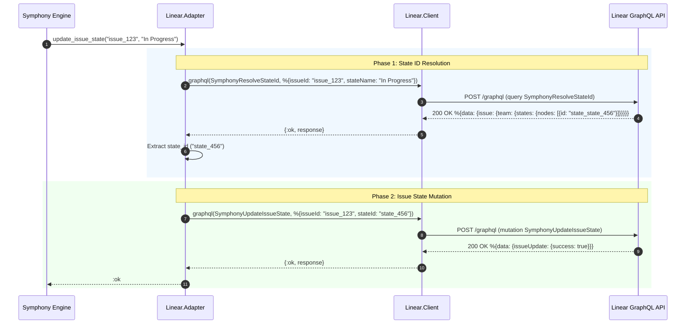

# Symphony Issue Tracker Integration Subsystem

## 1. Executive Summary & Architecture Overview

The **Issue Tracker Integration Subsystem** provides the data boundary between the **Symphony Orchestrator** and external issue tracking platforms (primarily [Linear](https://linear.app/)). In Symphony's autonomous architecture, the issue tracker acts as the single source of truth for work scheduling, state transitions, human intervention requests, and task completion.

To maintain clean architectural boundaries and support deterministic offline testing, Symphony abstracts tracker operations behind an Elixir `@behaviour` contract: `SymphonyElixir.Tracker`.

```mermaid
classDiagram
    class Tracker {
        <<behaviour>>
        +fetch_candidate_issues() {:ok, list} | {:error, term}
        +fetch_issues_by_states(states) {:ok, list} | {:error, term}
        +fetch_issue_states_by_ids(ids) {:ok, list} | {:error, term}
        +create_comment(issue_id, body) :ok | {:error, term}
        +update_issue_state(issue_id, state_name) :ok | {:error, term}
        +adapter() module
    }

    class LinearAdapter {
        <<module>>
        +fetch_candidate_issues()
        +fetch_issues_by_states(states)
        +fetch_issue_states_by_ids(issue_ids)
        +create_comment(issue_id, body)
        +update_issue_state(issue_id, state_name)
    }

    class MemoryTracker {
        <<module>>
        +fetch_candidate_issues()
        +fetch_issues_by_states(state_names)
        +fetch_issue_states_by_ids(issue_ids)
        +create_comment(issue_id, body)
        +update_issue_state(issue_id, state_name)
    }

    class LinearClient {
        <<module>>
        +fetch_candidate_issues()
        +fetch_issues_by_states(state_names)
        +fetch_issue_states_by_ids(issue_ids)
        +graphql(query, variables, opts)
    }

    class Issue {
        <<struct>>
        +String id
        +String identifier
        +String title
        +String description
        +integer priority
        +String state
        +String branch_name
        +String url
        +String assignee_id
        +list blocked_by
        +list labels
        +boolean assigned_to_worker
        +DateTime created_at
        +DateTime updated_at
    }

    Tracker <|.. LinearAdapter : implements
    Tracker <|.. MemoryTracker : implements
    LinearAdapter --> LinearClient : delegates HTTP/GraphQL
    LinearClient --> Issue : normalizes payloads into
    MemoryTracker --> Issue : operates on
```

---

## 2. Issue Tracker Abstraction (`SymphonyElixir.Tracker`)

The `SymphonyElixir.Tracker` module (`elixir/lib/symphony_elixir/tracker.ex`) defines the behaviour interface for all issue tracker operations required by the orchestrator.

### 2.1 Behaviour Callbacks

```elixir
defmodule SymphonyElixir.Tracker do
  @callback fetch_candidate_issues() :: {:ok, [term()]} | {:error, term()}
  @callback fetch_issues_by_states([String.t()]) :: {:ok, [term()]} | {:error, term()}
  @callback fetch_issue_states_by_ids([String.t()]) :: {:ok, [term()]} | {:error, term()}
  @callback create_comment(String.t(), String.t()) :: :ok | {:error, term()}
  @callback update_issue_state(String.t(), String.t()) :: :ok | {:error, term()}
end
```

| Callback Signature | Description | Typical Callers |
| --- | --- | --- |
| `fetch_candidate_issues/0` | Fetches active candidate issues matching configured project slug, active state names, and assignee filters. | `Orchestrator` main polling tick (`handle_info(:tick, state)`). |
| `fetch_issues_by_states/1` | Queries candidate issues belonging to specific state names (e.g. `["In Progress"]`). | Targeted state queries or reconciliation loops. |
| `fetch_issue_states_by_ids/1` | Bulk queries the current state, labels, and blockers for a list of specific issue IDs. | `Orchestrator` reconciliation loops (`reconcile_running_issues/1`, `reconcile_blocked_issues/1`) and `AgentRunner` multi-turn continuation checks. |
| `create_comment/2` | Posts a Markdown comment body to a target issue ticket. | `Linear.Adapter`, `DynamicTool` execution in agent workspace turns. |
| `update_issue_state/2` | Transitions an issue ticket to a target state by state name string (e.g. `"In Progress"` -> `"Done"`). | `Linear.Adapter`, state transition triggers. |

### 2.2 Dynamic Adapter Resolution

The dispatch module `SymphonyElixir.Tracker` inspects the active runtime configuration via `Config.settings!().tracker.kind` to choose the underlying implementation:

```elixir
@spec adapter() :: module()
def adapter do
  case Config.settings!().tracker.kind do
    "memory" -> SymphonyElixir.Tracker.Memory
    _ -> SymphonyElixir.Linear.Adapter
  end
end
```

This polymorphism allows Symphony to run against live Linear GraphQL endpoints in production or against an in-memory fixture set during test execution and local CLI simulation without code changes.

---

## 3. Core Data Model (`SymphonyElixir.Linear.Issue`)

All issue tracker responses are converted into a unified domain struct: `SymphonyElixir.Linear.Issue` (`elixir/lib/symphony_elixir/linear/issue.ex`).

### 3.1 Struct Definition & Field Specification

```elixir
defmodule SymphonyElixir.Linear.Issue do
  defstruct [
    :id,
    :identifier,
    :title,
    :description,
    :priority,
    :state,
    :branch_name,
    :url,
    :assignee_id,
    blocked_by: [],
    labels: [],
    assigned_to_worker: true,
    created_at: nil,
    updated_at: nil
  ]
end
```

| Field Name | Type | Description |
| --- | --- | --- |
| `id` | `String.t() \| nil` | Internal stable UUID assigned by the issue tracker (e.g. `"e4a8b79f-..."`). Used for GraphQL mutations and Orchestrator state tracking keys. |
| `identifier` | `String.t() \| nil` | Human-readable issue key (e.g. `"SYM-42"`). Used in workspace folder names, prompt templates, terminal UI, and logging. |
| `title` | `String.t() \| nil` | High-level summary of the issue. Included in Liquid prompt variables. |
| `description` | `String.t() \| nil` | Detailed issue description body in Markdown. |
| `priority` | `integer() \| nil` | Numeric priority score. In Linear, priority scale: `1` (Urgent), `2` (High), `3` (Normal), `4` (Low), `0` (No Priority). Lower numbers indicate higher scheduling priority. |
| `state` | `String.t() \| nil` | State name string (e.g. `"Todo"`, `"In Progress"`, `"Blocked"`, `"Done"`). |
| `branch_name` | `String.t() \| nil` | Git branch name linked in Linear (e.g. `"feat/sym-42-auth"`). |
| `url` | `String.t() \| nil` | Web URL pointing to the issue ticket on Linear. |
| `assignee_id` | `String.t() \| nil` | Tracker user ID of the assigned team member. |
| `blocked_by` | `[map()]` | List of maps representing blocker issues: `[%{id: "...", identifier: "...", state: "..."}]`. Extracted from Linear `inverseRelations`. |
| `labels` | `[String.t()]` | List of lowercased label strings attached to the issue (e.g. `["bug", "backend"]`). |
| `assigned_to_worker` | `boolean()` | Evaluation flag indicating whether the issue matches the configured worker assignee filter (`true` by default). |
| `created_at` | `DateTime.t() \| nil` | ISO-8601 timestamp when the ticket was created. Used as secondary sort key for issue dispatching. |
| `updated_at` | `DateTime.t() \| nil` | ISO-8601 timestamp when the ticket was last updated. |

---

## 4. Linear Integration Layer

The Linear integration is split across two core modules:
1. `SymphonyElixir.Linear.Adapter`: High-level adapter implementing `SymphonyElixir.Tracker` behaviour and translating state names to Linear internal state IDs.
2. `SymphonyElixir.Linear.Client`: Low-level HTTP transport driver, GraphQL query builder, pagination engine, and payload normalizer.

### 4.1 Linear Adapter (`SymphonyElixir.Linear.Adapter`)

`SymphonyElixir.Linear.Adapter` (`elixir/lib/symphony_elixir/linear/adapter.ex`) bridges the generic `SymphonyElixir.Tracker` contract to Linear-specific GraphQL mutations and queries.

#### 4.1.1 State ID Resolution Architecture

In Linear's GraphQL schema, updating an issue's state (`issueUpdate`) requires a `stateId` (a internal UUID attached to a specific Team), rather than a human-readable state string like `"In Progress"`. 

`Adapter` performs state lookup via `@state_lookup_query` (`SymphonyResolveStateId`) prior to executing the mutation:



#### 4.1.2 Mutation Catalog

- **Comment Creation Mutation (`SymphonyCreateComment`)**:
  ```graphql
  mutation SymphonyCreateComment($issueId: String!, $body: String!) {
    commentCreate(input: {issueId: $issueId, body: $body}) {
      success
    }
  }
  ```
- **Issue State Update Mutation (`SymphonyUpdateIssueState`)**:
  ```graphql
  mutation SymphonyUpdateIssueState($issueId: String!, $stateId: String!) {
    issueUpdate(id: $issueId, input: {stateId: $stateId}) {
      success
    }
  }
  ```

---

### 4.2 Linear Client (`SymphonyElixir.Linear.Client`)

`SymphonyElixir.Linear.Client` (`elixir/lib/symphony_elixir/linear/client.ex`) handles network transport, query formulation, authorization headers, response pagination, and data normalization.

#### 4.2.1 GraphQL Operations Catalog

##### 1. Candidate Issue Polling Query (`SymphonyLinearPoll`)

Fetches issues filtered by project slug and state names, requesting nested labels and inverse blocker relations:

```graphql
query SymphonyLinearPoll($projectSlug: String!, $stateNames: [String!]!, $first: Int!, $relationFirst: Int!, $after: String) {
  issues(filter: {project: {slugId: {eq: $projectSlug}}, state: {name: {in: $stateNames}}}, first: $first, after: $after) {
    nodes {
      id
      identifier
      title
      description
      priority
      state {
        name
      }
      branchName
      url
      assignee {
        id
      }
      labels {
        nodes {
          name
        }
      }
      inverseRelations(first: $relationFirst) {
        nodes {
          type
          issue {
            id
            identifier
            state {
              name
            }
          }
        }
      }
      createdAt
      updatedAt
    }
    pageInfo {
      hasNextPage
      endCursor
    }
  }
}
```

##### 2. Bulk State Refresh Query (`SymphonyLinearIssuesById`)

Refreshes status, labels, and blockers for a specific set of issue IDs during orchestrator reconciliation:

```graphql
query SymphonyLinearIssuesById($ids: [ID!]!, $first: Int!, $relationFirst: Int!) {
  issues(filter: {id: {in: $ids}}, first: $first) {
    nodes {
      id
      identifier
      title
      description
      priority
      state {
        name
      }
      branchName
      url
      assignee {
        id
      }
      labels {
        nodes {
          name
        }
      }
      inverseRelations(first: $relationFirst) {
        nodes {
          type
          issue {
            id
            identifier
            state {
              name
            }
          }
        }
      }
      createdAt
      updatedAt
    }
  }
}
```

##### 3. Viewer Identity Resolution Query (`SymphonyLinearViewer`)

Used when `tracker.assignee` is set to `"me"` in configuration to resolve the Linear User ID associated with the API key:

```graphql
query SymphonyLinearViewer {
  viewer {
    id
  }
}
```

---

#### 4.2.2 Pagination Architecture

Linear returns up to `@issue_page_size 50` nodes per page. `SymphonyElixir.Linear.Client` implements robust cursor-based pagination in `do_fetch_by_states_page/5`:

```mermaid
flowchart TD
    Start[do_fetch_by_states_page] --> ExecQuery[Execute GraphQL SymphonyLinearPoll Query]
    ExecQuery --> CheckResponse{HTTP 200 & Valid Payload?}
    CheckResponse -- No --> ReturnError[Return {:error, reason}]
    CheckResponse -- Yes --> Decode[decode_linear_page_response]
    Decode --> Prepend[Prepend Normalized Issues to Accumulator]
    Prepend --> CheckNext{pageInfo.hasNextPage == true?}
    CheckNext -- Yes --> NextCursor[Extract endCursor]
    NextCursor --> Recurse[Call do_fetch_by_states_page with endCursor]
    Recurse --> ExecQuery
    CheckNext -- No --> Finalize[finalize_paginated_issues: Reverse Accumulator List]
    Finalize --> ReturnOk[Return {:ok, NormalizedIssues}]
```

#### 4.2.3 Data Normalization Rules

When converting raw JSON responses into `%SymphonyElixir.Linear.Issue{}` structs, `Linear.Client` applies the following rules:

1. **Labels**: Extracted from `labels.nodes`, filtered for non-null names, and converted to lowercase string values.
2. **Blockers**: Extracted from `inverseRelations.nodes`. Only relations where `type` (case-insensitive, trimmed) equals `"blocks"` are retained as blocker entries:
   ```elixir
   %{
     id: blocker_issue["id"],
     identifier: blocker_issue["identifier"],
     state: get_in(blocker_issue, ["state", "name"])
   }
   ```
3. **Assignee Matching**: If `tracker.assignee` is configured (e.g. `"me"` or a explicit user ID), `assigned_to_worker` evaluates to `true` only if the issue's assignee ID matches the configured Set of allowed user IDs. If `tracker.assignee` is `nil`, all issues are marked `assigned_to_worker: true`.
4. **Timestamps**: `createdAt` and `updatedAt` strings are parsed into Elixir `DateTime` structs via `DateTime.from_iso8601/1`.

#### 4.2.4 Error Logging & Body Truncation

When Linear responds with an unexpected HTTP status code or GraphQL errors, `Client.graphql/3` logs structured error context while safeguarding memory by truncating large response bodies to a maximum of 1,000 bytes (`@max_error_body_log_bytes 1_000`).

---

## 5. In-Memory Tracker Mock (`SymphonyElixir.Tracker.Memory`)

The `SymphonyElixir.Tracker.Memory` module (`elixir/lib/symphony_elixir/tracker/memory.ex`) implements `@behaviour SymphonyElixir.Tracker` to support unit tests, LiveView dashboard previews, and offline development.

```elixir
defmodule SymphonyElixir.Tracker.Memory do
  @behaviour SymphonyElixir.Tracker
  alias SymphonyElixir.Linear.Issue

  def fetch_candidate_issues do
    {:ok, issue_entries()}
  end

  def fetch_issues_by_states(state_names) do
    normalized_states =
      state_names
      |> Enum.map(&normalize_state/1)
      |> MapSet.new()

    {:ok,
     Enum.filter(issue_entries(), fn %Issue{state: state} ->
       MapSet.member?(normalized_states, normalize_state(state))
     end)}
  end

  def fetch_issue_states_by_ids(issue_ids) do
    wanted_ids = MapSet.new(issue_ids)

    {:ok,
     Enum.filter(issue_entries(), fn %Issue{id: id} ->
       MapSet.member?(wanted_ids, id)
     end)}
  end

  def create_comment(issue_id, body) do
    send_event({:memory_tracker_comment, issue_id, body})
    :ok
  end

  def update_issue_state(issue_id, state_name) do
    send_event({:memory_tracker_state_update, issue_id, state_name})
    :ok
  end
end
```

### 5.1 Test Assertion & Event Messaging

When `create_comment/2` or `update_issue_state/2` are invoked on `Tracker.Memory`, it dispatches test event tuples to a designated test process recipient configured via `Application.get_env(:symphony_elixir, :memory_tracker_recipient)`:

- `:memory_tracker_comment`: `{:memory_tracker_comment, issue_id, body}`
- `:memory_tracker_state_update`: `{:memory_tracker_state_update, issue_id, state_name}`

This enables test suites (such as `test/symphony_elixir/orchestrator_status_test.exs`) to assert that state updates or workpad comments were generated without performing HTTP mocks.

---

## 6. Configuration Reference

The Issue Tracker subsystem is configured via the `tracker` block within `WORKFLOW.md` front-matter:

```yaml
---
tracker:
  kind: linear                                # "linear" | "memory"
  endpoint: https://api.linear.app/graphql     # Linear GraphQL endpoint URL
  api_key: "$LINEAR_API_KEY"                  # API token (environment variable substitution supported)
  project_slug: "symphony-core"               # Target Linear project slug
  assignee: "me"                              # "me" | "<linear_user_id>" | null
  active_states:                              # States polled for active worker execution
    - Todo
    - In Progress
    - Merging
    - Rework
  terminal_states:                            # States representing completed/cancelled work
    - Closed
    - Cancelled
    - Done
---
```

### 6.1 Configuration Validation Schema

Config values are validated using Ecto in `SymphonyElixir.Config.Schema`:
- `kind`: String, defaults to `"linear"`.
- `endpoint`: Valid URL string, defaults to `"https://api.linear.app/graphql"`.
- `api_key`: Secret string, resolved dynamically from `$LINEAR_API_KEY`.
- `active_states`: List of non-empty strings.
- `terminal_states`: List of non-empty strings.
