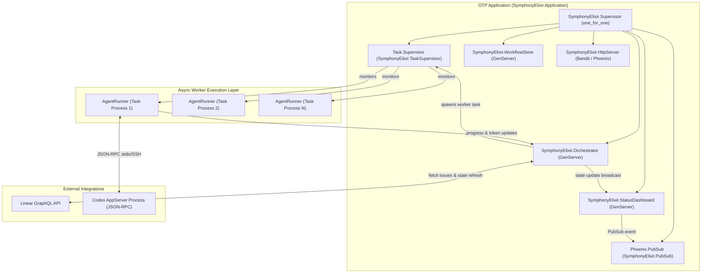
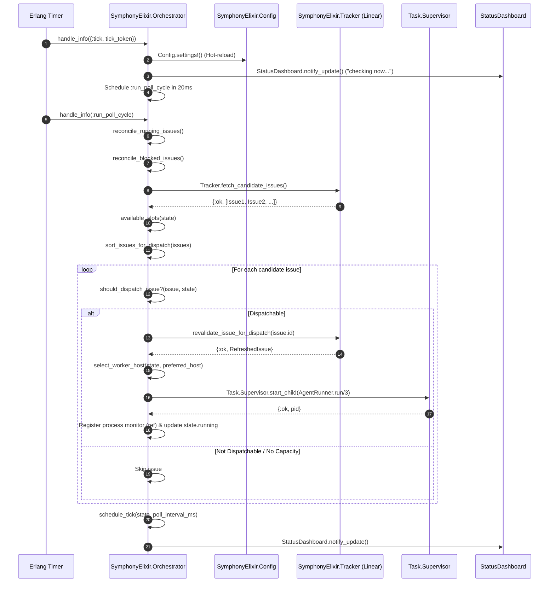
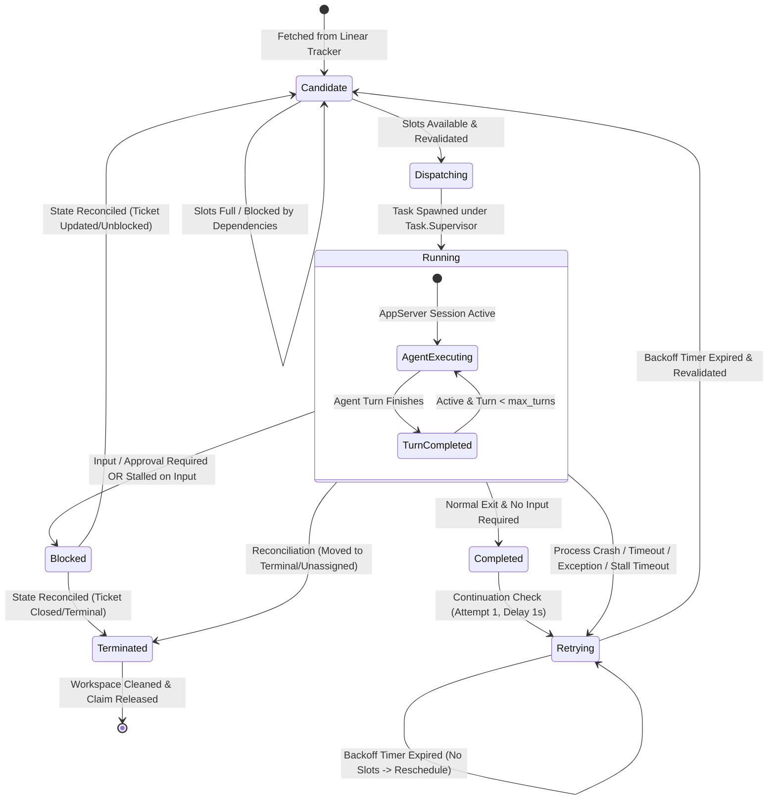

# Core Orchestration Engine Architecture (`SymphonyElixir.Orchestrator`)

## Executive Summary

The **Core Orchestration Engine** (`SymphonyElixir.Orchestrator`) is the central process scheduler and state synchronization brain of Symphony. Implemented as an Elixir `GenServer`, the Orchestrator maintains an in-memory state machine representing all work items, queries issue tracker backends (Linear), enforces global and per-state agent concurrency limits, dispatches coding agent runs to worker processes, monitors session health, handles transient failure retries with exponential backoff, detects stalled sessions, and reconciles state changes when tickets move outside Symphony.

Symphony operates without a persistent database; all scheduling state is transiently maintained in the Orchestrator's `%SymphonyElixir.Orchestrator.State{}` struct and continuously reconciled against the external issue tracker (Linear) and on-disk workspace sandboxes.

---

## 1. OTP Supervision Tree & Process Architecture

The Orchestrator process is started under `SymphonyElixir.Supervisor` as a permanent worker. Agent execution tasks are spawned asynchronously under `Task.Supervisor` (`SymphonyElixir.TaskSupervisor`), ensuring that crashes, timeouts, or exceptions in individual agent sessions do not crash the Orchestrator or impact other parallel sessions.



### Key Process Interfaces & Callbacks

- `start_link/1`: Starts the GenServer registered under `SymphonyElixir.Orchestrator`.
- `init/1`: Bootstraps initial state from `Config.settings!()`, runs terminal workspace cleanup (`run_terminal_workspace_cleanup/0`), and schedules the first poll tick at `0` ms delay.
- `handle_info({:tick, tick_token}, state)`: Handles periodic timer events. Hot-reloads configuration, updates polling state, and triggers an asynchronous poll cycle start (`:run_poll_cycle`).
- `handle_info(:run_poll_cycle, state)`: Executes the main polling tick: refreshes runtime configuration, reconciles running and blocked issues, queries candidate issues, dispatches available work, reschedules the next tick, and notifies observability surfaces.
- `handle_info({:DOWN, ref, :process, pid, reason}, state)`: Monitors agent task completion or failure, updates session token metrics, and routes issues to retry backoff, input-required block, or active-state continuation.
- `handle_info({:codex_worker_update, issue_id, update}, state)`: Receives real-time token metrics, turn counts, rate limits, and status updates from active `AgentRunner` instances.
- `handle_info({:retry_issue, issue_id, retry_token}, state)`: Evaluates pending retry attempts when backoff timers expire.
- `handle_call(:snapshot, _from, state)`: Returns a complete runtime snapshot of all running, retrying, and blocked issues, along with token totals and polling timers.
- `handle_call(:request_refresh, _from, state)`: Triggers an immediate, out-of-band poll cycle (coalescing multiple callers if a poll is already in progress or due).

---

## 2. Orchestrator State Data Model (`%State{}`)

The Orchestrator's internal memory state is represented by the `%SymphonyElixir.Orchestrator.State{}` struct defined in `lib/symphony_elixir/orchestrator.ex`:

```elixir
defmodule SymphonyElixir.Orchestrator.State do
  defstruct [
    :poll_interval_ms,          # Integer: Polling interval in ms (from polling.interval_ms)
    :max_concurrent_agents,      # Integer: Global agent limit (from agent.max_concurrent_agents)
    :next_poll_due_at_ms,        # Integer | nil: Monotonic time (ms) when next tick is due
    :poll_check_in_progress,     # Boolean: Lock flag preventing concurrent poll execution
    :tick_timer_ref,             # reference() | nil: Active Erlang timer reference for ticks
    :tick_token,                 # reference() | nil: Unique token validating tick timer identity
    running: %{},                # Map: issue_id => %{pid, ref, identifier, issue, worker_host, ...}
    completed: MapSet.new(),     # MapSet: Set of completed issue IDs
    claimed: MapSet.new(),       # MapSet: Set of claimed issue IDs (running + blocked + retrying)
    blocked: %{},                # Map: issue_id => %{issue_id, identifier, issue, error, blocked_at, ...}
    retry_attempts: %{},         # Map: issue_id => %{attempt, timer_ref, retry_token, due_at_ms, ...}
    codex_totals: nil,           # Map: %{input_tokens, output_tokens, total_tokens, seconds_running}
    codex_rate_limits: nil       # Map | nil: Latest rate limits reported by Codex AppServer
  ]
end
```

### Map Entry Specifications

#### 1. Running Entry (`running[issue_id]`)
```elixir
%{
  pid: pid(),                           # Task process PID
  ref: reference(),                     # Process monitor reference
  identifier: String.t(),               # Human-readable issue key (e.g. "FEAT-101")
  issue: %SymphonyElixir.Linear.Issue{},# Normalized Linear issue struct
  worker_host: String.t() | nil,        # SSH worker host name (nil for local execution)
  workspace_path: String.t() | nil,     # Absolute workspace path on worker
  session_id: String.t() | nil,         # Codex session ID
  last_codex_message: map() | nil,      # Summary of latest raw Codex update payload
  last_codex_timestamp: DateTime.t(),   # Timestamp of last activity
  last_codex_event: atom() | nil,       # Atom event key (e.g., :turn_completed, :turn_input_required)
  codex_app_server_pid: String.t(),     # AppServer process identifier
  codex_input_tokens: integer(),        # Cumulative input tokens for session
  codex_output_tokens: integer(),       # Cumulative output tokens for session
  codex_total_tokens: integer(),        # Cumulative total tokens for session
  turn_count: integer(),                # Total agent turns executed
  retry_attempt: integer(),             # Current retry attempt number (0 for initial run)
  started_at: DateTime.t()              # UTC timestamp when task was spawned
}
```

#### 2. Blocked Entry (`blocked[issue_id]`)
```elixir
%{
  issue_id: String.t(),                 # Internal issue UUID
  identifier: String.t(),               # Human-readable issue key
  issue: %SymphonyElixir.Linear.Issue{},# Latest issue snapshot
  worker_host: String.t() | nil,        # SSH worker host
  workspace_path: String.t() | nil,     # Workspace path
  session_id: String.t() | nil,         # Session ID
  error: String.t(),                    # Blocker reason string
  blocked_at: DateTime.utc_now(),       # UTC timestamp when blocked
  last_codex_message: map(),            # Latest Codex update payload
  last_codex_event: atom(),             # Latest Codex event atom
  last_codex_timestamp: DateTime.t()    # Activity timestamp
}
```

#### 3. Retry Entry (`retry_attempts[issue_id]`)
```elixir
%{
  attempt: integer(),                   # Next attempt number to execute
  timer_ref: reference(),               # Timer reference for scheduled retry message
  retry_token: reference(),             # Unique reference token verifying timer uniqueness
  due_at_ms: integer(),                 # Monotonic time (ms) when retry will fire
  identifier: String.t(),               # Issue identifier key
  error: String.t() | nil,              # Error message from previous attempt
  worker_host: String.t() | nil,        # Preferred SSH worker host
  workspace_path: String.t() | nil      # Existing workspace directory
}
```

---

## 3. The Polling & Dispatch Loop

The Orchestrator drives issue ingestion through a deterministic timer loop. The loop uses reference-backed tokens (`tick_token`) to prevent race conditions or duplicate timer execution when configuration reloads or ticks are manually rescheduled.



### Polling Tick Mechanics

1. **Tick Scheduling (`schedule_tick/2`)**:
   - Cancels any existing timer (`Process.cancel_timer(state.tick_timer_ref)`).
   - Generates a unique reference token (`make_ref()`).
   - Registers a timer via `Process.send_after(self(), {:tick, tick_token}, delay_ms)`.
   - Records monotonic timestamp `next_poll_due_at_ms = System.monotonic_time(:millisecond) + delay_ms`.

2. **Tick Handler (`handle_info({:tick, tick_token}, ...)`)**:
   - Validates that the received `tick_token` matches `state.tick_token`.
   - Reads latest runtime configuration via `Config.settings!()`.
   - Sets `poll_check_in_progress: true` and `next_poll_due_at_ms: nil`.
   - Sends `:run_poll_cycle` to self after `@poll_transition_render_delay_ms` (20 ms). This brief delay guarantees that terminal/web dashboard views can render the transitional `"checking now..."` state.

3. **Poll Execution (`handle_info(:run_poll_cycle, ...)`)**:
   - Reconciles active running and blocked issues (`reconcile_running_issues/1`, `reconcile_blocked_issues/1`).
   - Fetches candidate issues via `Tracker.fetch_candidate_issues()`.
   - Computes available global concurrency slots (`available_slots/1`).
   - Sorts candidate issues using `sort_issues_for_dispatch/1`.
   - Iterates candidate issues and dispatches tasks if all slot constraints pass.
   - Reschedules next tick for `state.poll_interval_ms`.
   - Resets `poll_check_in_progress: false` and notifies `StatusDashboard`.

### Candidate Prioritization & Sorting Algorithm

When candidate issues are fetched from Linear, `sort_issues_for_dispatch/1` orders them deterministically using a 3-element tuple key `{priority_rank, created_at_microsecond, identifier}`:

```elixir
defp sort_issues_for_dispatch(issues) when is_list(issues) do
  Enum.sort_by(issues, fn
    %Issue{} = issue ->
      {priority_rank(issue.priority), issue_created_at_sort_key(issue), issue.identifier || issue.id || ""}
    _ ->
      {priority_rank(nil), issue_created_at_sort_key(nil), ""}
  end)
end

defp priority_rank(priority) when is_integer(priority) and priority in 1..4, do: priority
defp priority_rank(_priority), do: 5 # Unranked / P0 mapped to lowest priority rank

defp issue_created_at_sort_key(%Issue{created_at: %DateTime{} = created_at}) do
  DateTime.to_unix(created_at, :microsecond)
end
defp issue_created_at_sort_key(_issue), do: 9_223_372_036_854_775_807
```

- **Priority Rank**: Priority levels 1 (Urgent), 2 (High), 3 (Normal), 4 (Low) sort first. Unranked issues (or nil) receive rank `5`.
- **Creation Date**: Older issues (earlier microsecond Unix timestamps) take precedence over newer issues.
- **Identifier**: Textual sorting on identifier strings (e.g. `"FEAT-10"`) breaks remaining ties.

---

## 4. Concurrency Management & Slot Allocation

Symphony enforces multi-tiered concurrency controls across global agent limits, per-state limits, and multi-host SSH capacity.

```mermaid
flowchart TD
    Candidate[Candidate Issue] --> CheckGlobal{Available Global Slots?\nmax_concurrent_agents - map_size(running) > 0}
    CheckGlobal -- No --> Skip[Skip Dispatch]
    CheckGlobal -- Yes --> CheckState{Per-State Limit Available?\nrunning_count(state) < max_concurrent_agents_for_state(state)}
    CheckState -- No --> Skip
    CheckState -- Yes --> CheckClaimed{Already Claimed/Running/Blocked?\nid in claimed OR running OR blocked}
    CheckClaimed -- Yes --> Skip
    CheckClaimed -- No --> CheckBlocker{Todo Issue Blocked?\nstate == 'todo' AND has non-terminal blockers}
    CheckBlocker -- Yes --> Skip
    CheckBlocker -- No --> CheckSSH{SSH Worker Capacity Available?\nselect_worker_host != :no_worker_capacity}
    CheckSSH -- No --> Skip
    CheckSSH -- Yes --> Revalidate{Re-validate against Tracker API?\nrevalidate_issue_for_dispatch}
    Revalidate -- Error / Missing / Stale --> Skip
    Revalidate -- Valid --> Dispatch[Spawn Task under Task.Supervisor]
```

### Concurrency Rules & Formulae

1. **Global Concurrency Ceiling**:
   $$\text{available\_slots} = \max((\text{max\_concurrent\_agents} - |\text{running}|), 0)$$
   Calculated dynamically via `available_slots(state)`. Default limit is `10`.

2. **Per-State Concurrency Limits**:
   Configured in `WORKFLOW.md` under `agent.max_concurrent_agents_by_state` (accessed via `Config.max_concurrent_agents_for_state(state_name)`).
   `state_slots_available?/2` counts active tasks in `state.running` matching normalized state strings (`String.downcase(String.trim(state_name))`).

3. **Multi-Node SSH Worker Capacity**:
   Managed by `select_worker_host/2`:
   - Configured via `worker.ssh_hosts` and `worker.max_concurrent_agents_per_host`.
   - If `ssh_hosts` is empty, dispatch defaults to `nil` (local worker).
   - If `preferred_worker_host` is specified (e.g. on retry continuation) and has free capacity, it is retained.
   - Otherwise, `least_loaded_worker_host/2` selects the host with the lowest number of active agents in `state.running`.
   - If all SSH hosts are at capacity, `select_worker_host/2` returns `:no_worker_capacity`, preventing dispatch.

4. **Dependency Blocker Check**:
   `todo_issue_blocked_by_non_terminal?/2` checks if an issue currently in the `"Todo"` state depends on other Linear issues (`issue.blocked_by`). If any blocker issue is not in a terminal state, dispatch is deferred.

---

## 5. Issue Lifecycle & State Machine

Every issue processed by Symphony transitions through a well-defined lifecycle managed by the Orchestrator state machine.



### State Machine Transition Rules

| Initial State | Event / Trigger | Target State | Action / Side Effects |
|---|---|---|---|
| **Unclaimed** | Poll cycle detects valid candidate issue | **Candidate** | Candidate issue identified and sorted. |
| **Candidate** | Slots available & revalidation succeeds | **Running** | Spawns task (`AgentRunner.run/3`), monitors PID, adds to `running` & `claimed`. |
| **Running** | Process exits with `:normal` (no input required) | **Completed** $\rightarrow$ **Retrying** | Records session token totals, marks `completed`, schedules continuation retry (attempt 1, 1000ms delay). |
| **Running** | Codex requests operator input or approval (`input_required_blocker?`) | **Blocked** | Stops task, creates entry in `state.blocked`, retains claim in `claimed`. |
| **Running** | Process exits with error / crash / non-normal reason | **Retrying** | Computes exponential backoff delay, schedules `{:retry_issue, id, token}`, adds to `retry_attempts`. |
| **Running** | Inactivity duration exceeds `codex.stall_timeout_ms` without input request | **Retrying** | Terminates running task without workspace deletion, schedules retry backoff with error `"stalled for N ms"`. |
| **Running** | Inactivity duration exceeds `codex.stall_timeout_ms` WITH input request | **Blocked** | Stops task, transitions issue into `state.blocked` with error `"stalled for N ms after Codex requested operator input"`. |
| **Running** | State reconciliation detects terminal state in Linear | **Terminated** | Stops task (`stop_running_task`), removes on-disk workspace (`cleanup_issue_workspace`), purges state. |
| **Running** | State reconciliation detects issue unassigned or moved to inactive state | **Terminated** | Stops task (`stop_running_task`), leaves workspace intact for potential reassignment, releases claim. |
| **Blocked** | State reconciliation detects Linear issue moved back to active state | **Candidate** | Releases block entry, clears claim, allowing re-ingestion on next poll tick. |
| **Blocked** | State reconciliation detects Linear issue moved to terminal state | **Terminated** | Deletes workspace, releases claim and block entries. |
| **Retrying** | Timer fires `{:retry_issue, id, token}` and candidate re-validated | **Running** | Dispatches issue to agent runner, increments attempt counter. |
| **Retrying** | Timer fires `{:retry_issue, id, token}` but no slots available | **Retrying** | Reschedules retry with `attempt + 1` and error `"no available orchestrator slots"`. |

---

## 6. Fault Tolerance, Retry Strategy & Stall Detection

### Exponential Backoff Retry Algorithm

Symphony implements a deterministic binary exponential backoff algorithm with an upper bound cap to handle transient network issues, API rate limits, or agent subprocess crashes.

#### Failure Retry Backoff Calculation
The delay duration for a failure retry is computed by `failure_retry_delay/1` in `lib/symphony_elixir/orchestrator.ex`:

$$\text{delay\_ms} = \min\left( \text{@failure\_retry\_base\_ms} \times 2^{\min(\text{attempt} - 1, 10)}, \, \text{agent.max\_retry\_backoff\_ms} \right)$$

- `@failure_retry_base_ms`: `10_000` ms (10 seconds).
- Exponent Bit-Shift: `1 <<< min(attempt - 1, 10)` performs $2^{\text{exponent}}$ in Elixir, capping the exponent multiplier at $2^{10} = 1024$.
- Maximum Backoff Cap: Configured by `agent.max_retry_backoff_ms` (default: `300_000` ms / 5 minutes).

#### Continuation Delay
When an agent session completes normally (`:normal` exit reason without blocker flags), Symphony schedules a continuation check to determine if further issue turns are needed:
- Delay: `@continuation_retry_delay_ms` = `1_000` ms (1 second) for attempt 1.
- Allows immediate re-querying of Linear issue state before continuing session work.

#### Backoff Schedule Table (Default Configuration)

| Attempt Number | Delay Calculation | Delay (Seconds / Minutes) |
|---|---|---|
| **Continuation (Attempt 1)** | Fixed `@continuation_retry_delay_ms` | 1 second |
| **Failure Attempt 1** | $10,000 \times 2^0$ | 10 seconds |
| **Failure Attempt 2** | $10,000 \times 2^1$ | 20 seconds |
| **Failure Attempt 3** | $10,000 \times 2^2$ | 40 seconds |
| **Failure Attempt 4** | $10,000 \times 2^3$ | 80 seconds (1 min 20 sec) |
| **Failure Attempt 5** | $10,000 \times 2^4$ | 160 seconds (2 min 40 sec) |
| **Failure Attempt 6+** | $\min(10,000 \times 2^5, 300,000)$ | 300 seconds (5 minutes MAX) |

### Stall Detection (`reconcile_stalled_running_issues/1`)

To prevent orphaned or unresponsive Codex subprocesses from occupying concurrency slots indefinitely, the Orchestrator periodically evaluates session activity timestamps during poll cycles:

1. **Timeout Threshold**: Configured by `codex.stall_timeout_ms` (default: `300_000` ms / 5 minutes). Disabled if set to `0`.
2. **Activity Timestamp**: Evaluates `last_codex_timestamp` (updated on every incoming Codex notification) with a fallback to task launch time `started_at`.
3. **Elapsed Inactivity Calculation**:
   $$\text{elapsed\_ms} = \text{DateTime.diff}(\text{DateTime.utc\_now}(), \text{timestamp}, :\text{millisecond})$$
4. **Stall Handling**:
   - If `elapsed_ms > stall_timeout_ms` AND `input_required_blocker?(running_entry)` is true:
     Executes `stop_and_block_issue/4`. The agent task is terminated, and the issue is moved to `state.blocked` with error `"stalled for N ms after Codex requested operator input"`.
   - If `elapsed_ms > stall_timeout_ms` AND `input_required_blocker?` is false:
     Executes `terminate_running_issue/3` (without workspace deletion) and schedules an exponential backoff retry with error `"stalled for N ms without codex activity"`.

### Tracker Session Reconciliation

During every poll cycle, the Orchestrator performs active reconciliation against Linear to ensure system state stays in sync with human tracker modifications:

1. **Running Issue Reconciliation (`reconcile_running_issues/1`)**:
   Queries Linear API for all issue IDs currently in `state.running`:
   - **Terminal State**: If Linear reports issue state is in `tracker.terminal_states` (e.g. "Done", "Closed", "Cancelled"), the Orchestrator calls `terminate_running_issue(state, issue_id, true)`. The active agent process is terminated and the workspace directory is deleted.
   - **Unassigned / Non-Routable**: If assignee changed away from Symphony worker, `terminate_running_issue(state, issue_id, false)` terminates the agent process but leaves the workspace intact for potential handover.
   - **Active State Update**: If state changed to another active state (e.g. "In Progress" $\rightarrow$ "In Review"), updates the issue struct snapshot stored in `state.running`.

2. **Blocked Issue Reconciliation (`reconcile_blocked_issues/1`)**:
   Queries Linear API for all issue IDs currently in `state.blocked`:
   - If ticket moved to a terminal state, removes workspace (`cleanup_issue_workspace`) and releases claim.
   - If ticket moved back to an active state or unassigned, releases claim, enabling re-ingestion.

3. **Startup Terminal Workspace Cleanup (`run_terminal_workspace_cleanup/0`)**:
   When the Orchestrator initializes (`init/1`), it queries Linear for all issues currently in `terminal_states` and invokes `Workspace.remove_issue_workspaces/2` for each matching identifier to clean up residual disk clutter from previous runs.

---

## 7. Observability, Snapshots & Telemetry

The Orchestrator acts as the central telemetry aggregator for token accounting and system health status.

### Real-Time Codex Updates (`handle_info({:codex_worker_update, issue_id, update}, state)`)

Active `AgentRunner` instances stream real-time JSON-RPC notifications to the Orchestrator:
- **Token Accounting**: `extract_token_delta/2` calculates differential token usage from raw Codex payloads (`input_tokens`, `output_tokens`, `total_tokens`), applying incremental deltas to `running_entry` and global `state.codex_totals`.
- **Rate Limits**: `extract_rate_limits/1` parses rate limit buckets (`primary`, `secondary`, `credits`) and stores them in `state.codex_rate_limits`.
- **Turn Metrics**: Tracks current turn count for each running session.

### State Snapshots (`SymphonyElixir.Orchestrator.snapshot/2`)

Exposes a thread-safe synchronous call `GenServer.call(server, :snapshot, timeout)` returning a structured snapshot map:

```elixir
%{
  running: [
    %{
      issue_id: "uuid-123",
      identifier: "FEAT-101",
      state: "In Progress",
      worker_host: "worker-1.local",
      workspace_path: "/workspaces/FEAT-101",
      session_id: "sess-abc",
      codex_app_server_pid: "12345",
      codex_input_tokens: 4500,
      codex_output_tokens: 1200,
      codex_total_tokens: 5700,
      turn_count: 3,
      started_at: ~U[2026-07-31 21:00:00Z],
      last_codex_timestamp: ~U[2026-07-31 21:04:30Z],
      last_codex_message: %{event: :turn_completed, ...},
      last_codex_event: :turn_completed,
      runtime_seconds: 270
    }
  ],
  retrying: [
    %{
      issue_id: "uuid-456",
      attempt: 2,
      due_in_ms: 14500,
      identifier: "BUG-202",
      error: "agent exited: :timeout",
      worker_host: nil,
      workspace_path: "/workspaces/BUG-202"
    }
  ],
  blocked: [
    %{
      issue_id: "uuid-789",
      identifier: "FEAT-105",
      state: "In Progress",
      worker_host: nil,
      workspace_path: "/workspaces/FEAT-105",
      session_id: "sess-xyz",
      error: "codex turn requires operator input",
      blocked_at: ~U[2026-07-31 20:30:00Z],
      last_codex_timestamp: ~U[2026-07-31 20:30:00Z],
      last_codex_message: %{...},
      last_codex_event: :turn_input_required
    }
  ],
  codex_totals: %{
    input_tokens: 154000,
    output_tokens: 32000,
    total_tokens: 186000,
    seconds_running: 1420
  },
  rate_limits: %{...},
  polling: %{
    checking?: false,
    next_poll_in_ms: 18200,
    poll_interval_ms: 30000
  }
}
```

This snapshot payload directly powers the Phoenix LiveView dashboard (`SymphonyElixirWeb.DashboardLive`), the REST observability API (`GET /api/v1/state`), and the ANSI CLI terminal UI (`SymphonyElixir.StatusDashboard`).

---

## 8. Summary Matrix & Module Index

| Function / Identifier | Location in Code | Operational Purpose |
|---|---|---|
| `State` struct | `lib/symphony_elixir/orchestrator.ex:24` | Defines runtime state fields for running, retrying, blocked, and metrics. |
| `schedule_tick/2` | `lib/symphony_elixir/orchestrator.ex:1512` | Schedules next tick timer using reference tokens. |
| `handle_info(:run_poll_cycle)` | `lib/symphony_elixir/orchestrator.ex:110` | Main poll loop callback: reconciles state, queries Linear, dispatches tasks. |
| `sort_issues_for_dispatch/1` | `lib/symphony_elixir/orchestrator.ex:766` | Orders candidate issues by priority rank (1..4), creation microsecond, and identifier. |
| `available_slots/1` | `lib/symphony_elixir/orchestrator.ex:1305` | Calculates remaining global agent slots (`max_concurrent_agents - running`). |
| `select_worker_host/2` | `lib/symphony_elixir/orchestrator.ex:1217` | Selects SSH worker node based on capacity limits and least-loaded strategy. |
| `reconcile_running_issues/1` | `lib/symphony_elixir/orchestrator.ex:300` | Re-queries Linear for running issues; cleans up terminal/unassigned tickets. |
| `reconcile_blocked_issues/1` | `lib/symphony_elixir/orchestrator.ex:325` | Re-queries Linear for blocked issues; releases blocks when unblocked. |
| `reconcile_stalled_running_issues/1` | `lib/symphony_elixir/orchestrator.ex:557` | Detects inactive tasks exceeding `stall_timeout_ms`; blocks or retries them. |
| `failure_retry_delay/1` | `lib/symphony_elixir/orchestrator.ex:1180` | Calculates exponential backoff delay `min(10000 * 2^(attempt - 1), max_backoff)`. |
| `snapshot/2` | `lib/symphony_elixir/orchestrator.ex:1328` | Synchronous GenServer call returning full system runtime snapshot. |
