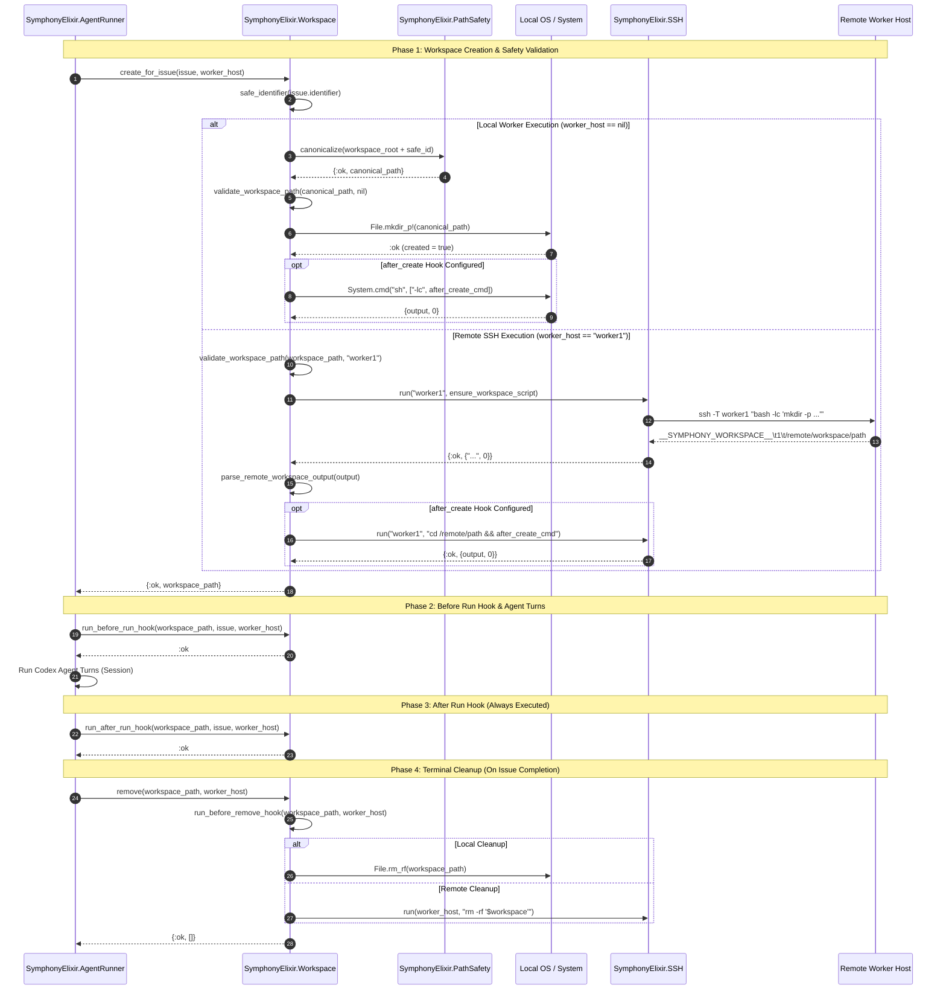
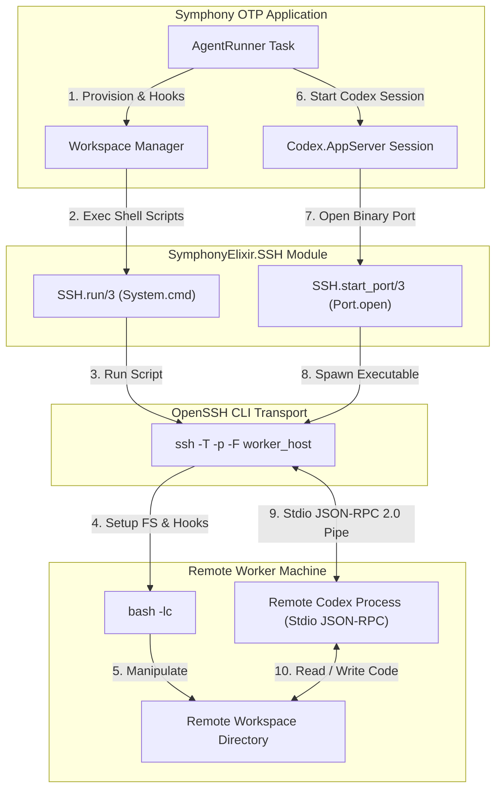

# Workspace Management & Security Architecture

## 1. Overview & Architectural Role

In **Symphony**, per-issue working directory isolation is fundamental to enabling unattended, concurrent execution of AI coding agents (Codex). Each Linear issue processed by the system is allocated a dedicated workspace directory on local or remote disk. This architecture prevents agent collisions, isolates file system modifications, and provides predictable shell environments for build and test tools.

The workspace subsystem comprises four core components:
1. **Workspace Manager (`SymphonyElixir.Workspace`)**: Manages the creation, lookup, lifecycle hook invocation, and cleanup of per-issue working directories across local and SSH-accessible worker hosts.
2. **Path Safety Guardrails (`SymphonyElixir.PathSafety`)**: Enforces strict path canonicalization and directory containment rules to protect against path traversal vulnerabilities, symlink escapes, and accidental file operations outside configured workspace roots.
3. **Workspace Lifecycle Hooks**: Executes shell commands at four critical milestones (`after_create`, `before_run`, `after_run`, `before_remove`) with configurable timeouts and error handling policies.
4. **Remote Worker Execution (`SymphonyElixir.SSH`)**: Provides transparent remote workspace creation, hook execution, and stdio JSON-RPC 2.0 streaming over SSH to distributed worker machines.

---

## 2. Workspace Manager (`SymphonyElixir.Workspace`)

The `SymphonyElixir.Workspace` module acts as the central interface for per-issue directory lifecycle management. It coordinates directory creation, identifier sanitization, path safety verification, lifecycle hook execution, and workspace teardown.

```
                    ┌─────────────────────────┐
                    │ Linear Issue / Context  │
                    └────────────┬────────────┘
                                 │
                                 ▼
                     safe_identifier(id)
                                 │
                                 ▼
                 workspace_path_for_issue/2
                                 │
                        ┌────────┴────────┐
                        │                 │
                  (Local Host)     (Remote Worker Host)
                        │                 │
                        ▼                 ▼
             validate_workspace_path  validate_workspace_path
                        │                 │
                        ▼                 ▼
                  ensure_workspace   ensure_workspace (SSH script)
                        │                 │
                        ▼                 ▼
             maybe_run_after_create  maybe_run_after_create
```

### 2.1 Identifier Sanitization & Path Resolution

To guarantee that workspace directory names are valid across operating systems and shell environments, issue identifiers (e.g. `PROJ-123`) are sanitized via `safe_identifier/1`:

```elixir
defp safe_identifier(identifier) do
  String.replace(identifier || "issue", ~r/[^a-zA-Z0-9._-]/, "_")
end
```

Any character other than letters, numbers, dots (`.`), underscores (`_`), or hyphens (`-`) is converted into an underscore.

For local runs (`worker_host == nil`), the workspace path is resolved by joining the root directory from configuration (`Config.settings!().workspace.root`) with the sanitized identifier, followed by path canonicalization:

```elixir
defp workspace_path_for_issue(safe_id, nil) when is_binary(safe_id) do
  Config.settings!().workspace.root
  |> Path.join(safe_id)
  |> PathSafety.canonicalize()
end
```

For remote workers (`worker_host != nil`), path resolution joins the root path without local filesystem canonicalization, deferring filesystem operations to the remote host over SSH.

### 2.2 Workspace Provisioning Workflow (`create_for_issue/2`)

`SymphonyElixir.Workspace.create_for_issue/2` provides an idempotent workspace initialization pipeline:

```elixir
@spec create_for_issue(map() | String.t() | nil, worker_host()) ::
        {:ok, Path.t()} | {:error, term()}
def create_for_issue(issue_or_identifier, worker_host \\ nil)
```

The provisioning pipeline follows five distinct stages:
1. **Context Extraction**: Normalizes input into an `issue_context` map containing `:issue_id` and `:issue_identifier`.
2. **Path Resolution**: Computes the workspace path using `workspace_path_for_issue/2`.
3. **Safety Validation**: Validates directory containment via `validate_workspace_path/2`.
4. **Directory Provisioning**: Executes `ensure_workspace/2`:
   - If directory exists: Retains existing directory and marks `created? = false`.
   - If a non-directory file exists at path: Deletes file (`File.rm_rf!/1`) and creates directory, setting `created? = true`.
   - If path does not exist: Creates directory (`File.mkdir_p!/1`), setting `created? = true`.
5. **Post-Creation Hook**: Triggers `after_create` hook if `created? == true`.

#### Exception Handling & Failure Isolation
All provisioning steps are wrapped in a `try...rescue` block that catches `ArgumentError`, `ErlangError`, and `File.Error`, logging structured error context with `issue_id`, `issue_identifier`, `worker_host`, and exception message before returning `{:error, error}`.

### 2.3 Workspace Removal (`remove/2` and `remove_issue_workspaces/2`)

When a Linear issue reaches a terminal state (such as `Completed`, `Done`, or `Canceled`), Symphony purges the associated workspace to reclaim disk space and close open resources.

#### Single Workspace Teardown (`remove/2`)
- **Local Removal (`worker_host == nil`)**:
  1. Checks if workspace exists on disk.
  2. Validates workspace path safety via `validate_workspace_path/2`.
  3. Executes `before_remove` hook if directory exists (`maybe_run_before_remove_hook/2`).
  4. Deletes directory recursively using `File.rm_rf/1`.
- **Remote Removal (`worker_host != nil`)**:
  1. Executes remote `before_remove` hook over SSH.
  2. Constructs remote script: `workspace='<escaped_path>'; rm -rf "$workspace"`.
  3. Executes script via `SSH.run/3`.

#### Multi-Host Workspace Cleanup (`remove_issue_workspaces/2`)
If `worker_host` is `nil` and the system is configured with multiple remote SSH hosts (`Config.settings!().worker.ssh_hosts`), `remove_issue_workspaces/2` automatically iterates over all SSH hosts to remove the issue workspace across the entire cluster:

```elixir
def remove_issue_workspaces(identifier, nil) when is_binary(identifier) do
  safe_id = safe_identifier(identifier)

  case Config.settings!().worker.ssh_hosts do
    [] ->
      case workspace_path_for_issue(safe_id, nil) do
        {:ok, workspace} -> remove(workspace, nil)
        {:error, _reason} -> :ok
      end

    worker_hosts ->
      Enum.each(worker_hosts, &remove_issue_workspaces(identifier, &1))
  end

  :ok
end
```

---

## 3. Path Safety Guardrails (`SymphonyElixir.PathSafety`)

To prevent arbitrary file access, directory traversal attacks, or symlink vulnerabilities, Symphony implements rigorous path validation logic in `SymphonyElixir.PathSafety`.

### 3.1 Path Canonicalization Algorithm (`PathSafety.canonicalize/1`)

`PathSafety.canonicalize/1` resolves relative paths and traverses symlink targets segment-by-segment:

```elixir
@spec canonicalize(Path.t()) :: {:ok, Path.t()} | {:error, term()}
```

#### Resolution Algorithm
1. Expands input path via `Path.expand/1`.
2. Splits absolute path into root `/` and individual segments.
3. Iteratively resolves each segment:
   - Evaluates `File.lstat(candidate_path)`.
   - **If Symlink**: Reads link target via `:file.read_link_all/1`, resolves symlink target relative to current parent path, and recursively processes remaining path segments.
   - **If Regular File/Directory**: Appends segment to resolved list and continues.
   - **If Non-Existent (`:enoent`)**: Joins remaining unresolved segments to currently canonicalized prefix and returns success. (This allows canonicalizing paths for directories that have not yet been created on disk).

### 3.2 Directory Containment Validation (`validate_workspace_path/2`)

Before any filesystem read, write, hook execution, or deletion occurs, `validate_workspace_path/2` verifies that the workspace path is strictly contained within `Config.settings!().workspace.root`.

```elixir
defp validate_workspace_path(workspace, nil) when is_binary(workspace) do
  expanded_workspace = Path.expand(workspace)
  expanded_root = Path.expand(Config.settings!().workspace.root)
  expanded_root_prefix = expanded_root <> "/"

  with {:ok, canonical_workspace} <- PathSafety.canonicalize(expanded_workspace),
       {:ok, canonical_root} <- PathSafety.canonicalize(expanded_root) do
    canonical_root_prefix = canonical_root <> "/"

    cond do
      canonical_workspace == canonical_root ->
        {:error, {:workspace_equals_root, canonical_workspace, canonical_root}}

      String.starts_with?(canonical_workspace <> "/", canonical_root_prefix) ->
        :ok

      String.starts_with?(expanded_workspace <> "/", expanded_root_prefix) ->
        {:error, {:workspace_symlink_escape, expanded_workspace, canonical_root}}

      true ->
        {:error, {:workspace_outside_root, canonical_workspace, canonical_root}}
    end
  else
    {:error, {:path_canonicalize_failed, path, reason}} ->
      {:error, {:workspace_path_unreadable, path, reason}}
  end
end
```

#### Security Checks Summary

| Condition / Check | Error Return | Security Rationale |
| --- | --- | --- |
| `canonical_workspace == canonical_root` | `{:error, {:workspace_equals_root, ...}}` | Prevents operating directly on workspace root directory (e.g. deleting workspace root during cleanup). |
| `String.starts_with?(canonical_workspace <> "/", canonical_root_prefix)` | `:ok` | Path is verified to be a sub-directory inside canonical root. |
| Expanded path inside root, but canonical path outside root | `{:error, {:workspace_symlink_escape, ...}}` | Detects symlink traversal attacks escaping workspace root directory. |
| Canonical path outside canonical root | `{:error, {:workspace_outside_root, ...}}` | Rejects relative traversal attempts (e.g. `../../etc`). |
| Unresolvable / invalid path | `{:error, {:workspace_path_unreadable, ...}}` | Handles unreadable paths gracefully. |

#### Remote Path Validation
For remote hosts (`worker_host != nil`), path validation performs sanitization checks to ensure non-empty strings and reject dangerous shell control characters (`\n`, `\r`, `\0`):

```elixir
defp validate_workspace_path(workspace, worker_host)
     when is_binary(workspace) and is_binary(worker_host) do
  cond do
    String.trim(workspace) == "" ->
      {:error, {:workspace_path_unreadable, workspace, :empty}}

    String.contains?(workspace, ["\n", "\r", <<0>>]) ->
      {:error, {:workspace_path_unreadable, workspace, :invalid_characters}}

    true ->
      :ok
  end
end
```

---

## 4. Workspace Lifecycle Hooks

Symphony allows developers to define custom shell commands in `WORKFLOW.md` under the `hooks` section. These lifecycle hooks execute shell scripts at key transitions in the workspace lifecycle.

### 4.1 Supported Lifecycle Hooks

| Hook Name | Invocation Moment | Execution Guarantee & Failure Policy |
| --- | --- | --- |
| `after_create` | Executed immediately after a new workspace directory is created. Skipped if workspace already existed. | Failing hook aborts workspace creation and returns `{:error, {:workspace_hook_failed, "after_create", status, output}}`. |
| `before_run` | Executed prior to launching Codex agent turns for an issue run. | Failing hook aborts agent run and returns `{:error, {:workspace_hook_failed, "before_run", status, output}}`. |
| `after_run` | Executed immediately after Codex agent turns complete. | Wrapped in `try...after` block in `AgentRunner`. Executed guaranteed. Hook failures are logged as warnings and ignored (`ignore_hook_failure/1`). |
| `before_remove` | Executed prior to workspace directory removal (e.g. issue terminal cleanup). | Executed only if workspace directory exists. Failures are logged as warnings and ignored (`ignore_hook_failure/1`). |

### 4.2 Local & Remote Hook Execution Mechanics

#### Local Execution Pipeline
For local workspaces, hooks are executed using `System.cmd("sh", ["-lc", command], cd: workspace, stderr_to_stdout: true)` inside an asynchronous `Task.async`:

```elixir
task = Task.async(fn ->
  System.cmd("sh", ["-lc", command], cd: workspace, stderr_to_stdout: true)
end)

case Task.yield(task, timeout_ms) do
  {:ok, cmd_result} ->
    handle_hook_command_result(cmd_result, workspace, issue_context, hook_name)

  nil ->
    Task.shutdown(task, :brutal_kill)
    Logger.warning("Workspace hook timed out hook=#{hook_name} ...")
    {:error, {:workspace_hook_timeout, hook_name, timeout_ms}}
end
```

#### Timeout Enforcement & Process Reclamation
- Hook execution is bounded by `Config.settings!().hooks.timeout_ms` (configured in `WORKFLOW.md`).
- If a hook execution exceeds `timeout_ms`, `Task.yield/2` returns `nil`. Symphony terminates the process tree with `:brutal_kill` and returns `{:error, {:workspace_hook_timeout, hook_name, timeout_ms}}`.

#### Remote Execution Pipeline
For remote worker hosts, commands are wrapped in directory navigation script blocks and executed via SSH:

```elixir
run_remote_command(worker_host, "cd #{shell_escape(workspace)} && #{command}", timeout_ms)
```

#### Log Sanitization & Truncation
Hook stdout/stderr output is captured and sanitized prior to logging. If output exceeds 2,048 bytes, `sanitize_hook_output_for_log/2` truncates the string to prevent log file bloat:

```elixir
defp sanitize_hook_output_for_log(output, max_bytes \\ 2_048) do
  binary_output = IO.iodata_to_binary(output)

  case byte_size(binary_output) <= max_bytes do
    true -> binary_output
    false -> binary_part(binary_output, 0, max_bytes) <> "... (truncated)"
  end
end
```

### 4.3 GitHub PR Cleanup Task (`Mix.Tasks.Workspace.BeforeRemove`)

Symphony ships with a specialized Mix task (`mix workspace.before_remove`) designed to run as part of the `before_remove` hook:

```yaml
hooks:
  before_remove: "mix workspace.before_remove"
```

#### Functionality
1. Checks for GitHub CLI (`gh`) availability (`System.find_executable("gh")`) and authentication (`gh auth status`).
2. Identifies current Git branch using `git branch --show-current`.
3. Queries open pull requests for the branch using `gh pr list --head <branch> --state open`.
4. Closes matching pull requests using `gh pr close <pr_number>` with closing comment:
   > *"Closing because the Linear issue for branch {branch} entered a terminal state without merge."*

---

## 5. Remote Worker Execution (`SymphonyElixir.SSH`)

When running in distributed environments, Symphony delegates Codex agent execution and workspace management to remote worker hosts over SSH via `SymphonyElixir.SSH`.

### 5.1 Host Specification & Target Parsing (`SSH.parse_target/1`)

Remote hosts are configured in `WORKFLOW.md` under `worker.ssh_hosts`:

```yaml
worker:
  ssh_hosts:
    - "worker1.internal"
    - "deploy@worker2.internal:2222"
    - "[::1]:2222"
```

`SSH.parse_target/1` parses host target strings into destination and port components:
- Supports standard `user@host` strings.
- Parses `host:port` shorthand without requiring `ssh://` URIs.
- Preserves IPv6 bracket notation (`[::1]:2222`).

### 5.2 Command Execution & Stdio Port Streaming

#### Synchronous Execution (`SSH.run/3`)
`SSH.run/3` executes non-interactive commands on a remote worker host using `System.cmd`:

```elixir
@spec run(String.t(), String.t(), keyword()) ::
        {:ok, {String.t(), non_neg_integer()}} | {:error, term()}
```

Constructs SSH arguments:
- `-T`: Disables pseudo-terminal allocation.
- `-p <port>`: Appends custom port if specified.
- `-F <config_path>`: Appends SSH configuration file if `SYMPHONY_SSH_CONFIG` environment variable is set.
- Command wrapper: Wraps remote shell commands using `bash -lc '...'` with single-quote escaping (`shell_escape/1`).

#### Stdio Port Streaming (`SSH.start_port/3`)
For Codex AppServer agent sessions, Symphony establishes binary stdio channels over SSH using Erlang ports:

```elixir
@spec start_port(String.t(), String.t(), keyword()) ::
        {:ok, port()} | {:error, term()}
def start_port(host, command, opts \\ []) when is_binary(host) and is_binary(command) do
  with {:ok, executable} <- ssh_executable() do
    line_bytes = Keyword.get(opts, :line)

    port_opts =
      [
        :binary,
        :exit_status,
        :stderr_to_stdout,
        args: Enum.map(ssh_args(host, command), &String.to_charlist/1)
      ]
      |> maybe_put_line_option(line_bytes)

    {:ok, Port.open({:spawn_executable, String.to_charlist(executable)}, port_opts)}
  end
end
```

This allows `SymphonyElixir.Codex.AppServer` to stream JSON-RPC 2.0 messages directly to a Codex process running on a remote host over SSH standard I/O.

### 5.3 Remote Workspace Protocol & Marker Parsing

When provisioning a workspace on a remote worker host, `Workspace.ensure_workspace/2` executes a bash script that returns structured status data via `@remote_workspace_marker`:

```bash
set -eu
workspace='<escaped_path>'
case "$workspace" in
  '~') workspace="$HOME" ;;
  '~/'*) workspace="$HOME/${workspace#~/}" ;;
esac
if [ -d "$workspace" ]; then
  created=0
elif [ -e "$workspace" ]; then
  rm -rf "$workspace"
  mkdir -p "$workspace"
  created=1
else
  mkdir -p "$workspace"
  created=1
fi
cd "$workspace"
printf '%s\t%s\t%s\n' '__SYMPHONY_WORKSPACE__' "$created" "$(pwd -P)"
```

#### Protocol Output Parsing
`parse_remote_workspace_output/1` splits remote stdout by line and extracts tab-delimited records matching `__SYMPHONY_WORKSPACE__\t<created>\t<path>`:
- Returns `{:ok, canonical_remote_path, created?}` if parsing succeeds.
- Returns `{:error, {:workspace_prepare_failed, :invalid_output, output}}` on parse error.

---

## 6. Architecture & Sequence Diagrams

### 6.1 Workspace Provisioning & Lifecycle Hook Sequence Diagram

The following sequence diagram illustrates the end-to-end flow of workspace provisioning, path safety checks, lifecycle hook execution, and Codex agent session execution during an agent run.



### 6.2 Remote SSH Execution & Stdio Transport Architecture

The flowchart below depicts how `SymphonyElixir.SSH` bridges the local Symphony OTP supervision tree with remote worker processes via SSH stdio streaming.



---

## 7. Summary & Configuration Checklist

To verify workspace security and remote execution setup in a Symphony deployment, ensure the following configuration standards are maintained in `WORKFLOW.md`:

```yaml
workspace:
  root: "./workspaces"      # Absolute or root-relative workspace target directory

hooks:
  timeout_ms: 60000          # Bounded hook execution timeout (e.g. 60s)
  after_create: "git init"   # Optional post-creation command
  before_run: "mix deps.get" # Optional pre-run setup command
  after_run: "git status"    # Optional post-run reporting command
  before_remove: "mix workspace.before_remove" # PR cleanup task

worker:
  ssh_hosts:                 # Remote SSH hosts list (leave empty for local execution)
    - "deploy@worker-1.internal"
    - "deploy@worker-2.internal"
```

By combining strict path canonicalization (`PathSafety`), isolated per-issue working directories (`Workspace`), configurable lifecycle hooks (`hooks`), and transparent OpenSSH stdio tunneling (`SSH`), Symphony provides a secure and scalable foundation for unattended coding agent execution.
