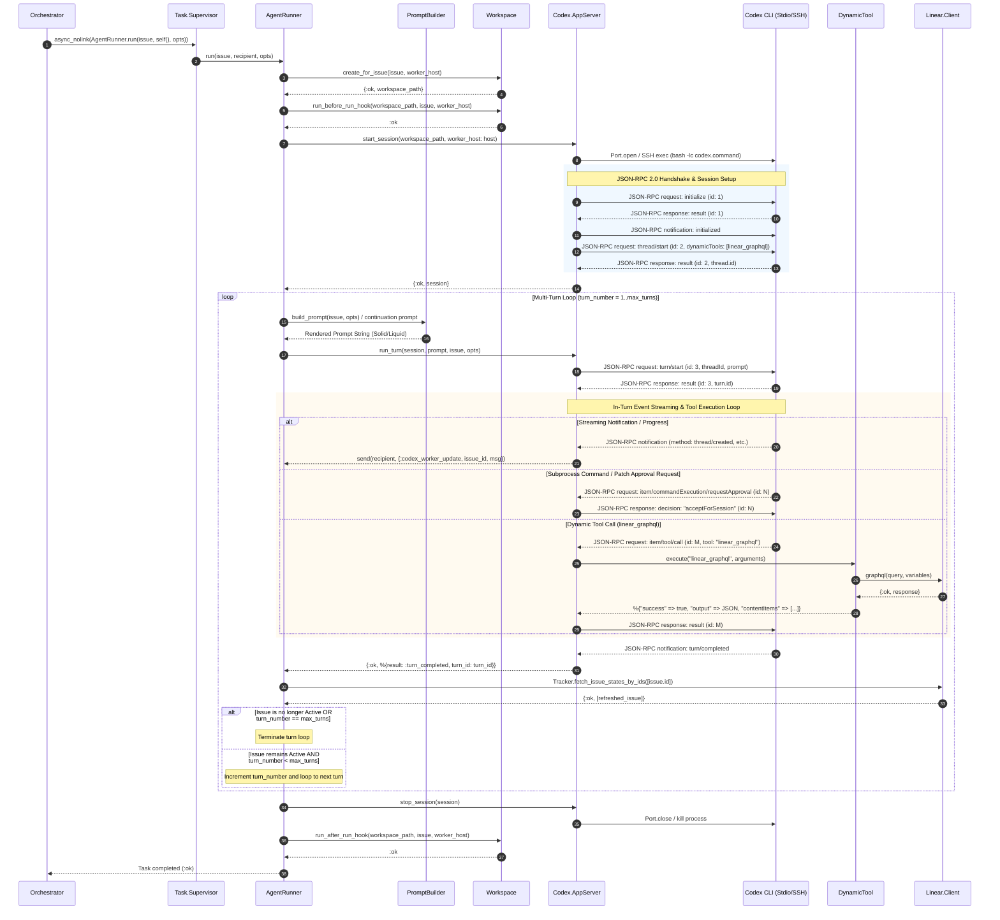

# Agent Execution & Codex App-Server Protocol

## 1. Overview & System Context

In Symphony, **Agent Execution** is the core subsystem responsible for running autonomous coding sessions to resolve issue-tracker work items. Once `SymphonyElixir.Orchestrator` selects an active issue from Linear, it dispatches an asynchronous worker process under `SymphonyElixir.TaskSupervisor`. 

This worker executes `SymphonyElixir.AgentRunner.run/3`, which manages the full lifecycle of an agent run:
1. Workspace directory creation and isolation (locally or on remote SSH hosts).
2. Pre-run and post-run lifecycle hook execution (`before_run` and `after_run`).
3. Liquid prompt template compilation and rendering via `SymphonyElixir.PromptBuilder` (powered by `Solid`).
4. Session initialization, JSON-RPC 2.0 stdio/SSH protocol transport, and turn execution via `SymphonyElixir.Codex.AppServer`.
5. In-turn dynamic tool handling via `SymphonyElixir.Codex.DynamicTool` (such as executing `linear_graphql` queries).
6. Multi-turn continuation loops (`run_codex_turns/5`) with `max_turns` limit enforcement and active issue state re-checking.

---

## 2. Worker Lifecycle & Multi-Turn Loop (`SymphonyElixir.AgentRunner`)

`SymphonyElixir.AgentRunner` manages the execution of a single Linear issue run within an isolated workspace.

### 2.1 Concurrency & Task Supervision

Workers are spawned asynchronously under `Task.Supervisor` (`SymphonyElixir.TaskSupervisor`). The Orchestrator monitors worker task PIDs and maintains state mappings from issue ID to task PID and worker host.

```elixir
# Spawned by Orchestrator:
Task.Supervisor.async_nolink(
  SymphonyElixir.TaskSupervisor,
  fn -> AgentRunner.run(issue, self(), opts) end
)
```

### 2.2 Host Selection & Remote SSH Isolation

`AgentRunner.selected_worker_host/2` determines whether the worker runs locally or over SSH:
- If a preferred worker host is supplied in options, it is used.
- Otherwise, if `Config.settings!().worker.ssh_hosts` is non-empty, the first configured host is selected.
- If no host is configured, `worker_host` is `nil` (local execution).

### 2.3 Pre-run & Post-run Lifecycle Hooks

`AgentRunner.run_on_worker_host/4` wraps the main execution loop in a `try ... after` block to guarantee post-run hook execution:

```elixir
case Workspace.create_for_issue(issue, worker_host) do
  {:ok, workspace} ->
    send_worker_runtime_info(codex_update_recipient, issue, worker_host, workspace)
    try do
      with :ok <- Workspace.run_before_run_hook(workspace, issue, worker_host) do
        run_codex_turns(workspace, issue, codex_update_recipient, opts, worker_host)
      end
    after
      Workspace.run_after_run_hook(workspace, issue, worker_host)
    end
  {:error, reason} -> {:error, reason}
end
```

### 2.4 Multi-Turn Loop & `max_turns` Enforcement

Codex execution occurs over a sequence of discrete **turns**. A single turn sends a prompt input to Codex and awaits turn completion, failure, or approval/tool requests.

The multi-turn execution loop is implemented in `run_codex_turns/5` and `do_run_codex_turns/8`:

1. **Session Lifecycle**: A single Codex app-server session (`AppServer.start_session/2`) spans across multiple turns within a single worker attempt. The session is closed in an `after` block upon completion or error.
2. **Turn 1 Prompt**: Uses `PromptBuilder.build_prompt(issue, opts)` to render the full Liquid workflow prompt template.
3. **Continuation Turns (Turn N > 1)**: Builds a targeted continuation guidance prompt informing Codex that previous turns completed normally, the Linear issue remains active, and it should resume work using workspace state without restarting.
4. **Issue State Refresh**: After each turn completion, `continue_with_issue?/2` invokes `issue_state_fetcher` (defaulting to `Tracker.fetch_issue_states_by_ids/1`) to check the latest state of the issue in Linear.
5. **Loop Termination Conditions**:
   - **Issue Resolved / Inactive**: If the issue state is no longer in `tracker.active_states`, `continue_with_issue?/2` returns `{:done, refreshed_issue}`, terminating the loop.
   - **`max_turns` Reached**: If `turn_number == max_turns` and the issue remains active, `AgentRunner` logs that `max_turns` was reached and cleanly returns `:ok`, handing control back to the Orchestrator for re-queueing or state evaluation.
   - **Turn Error / Cancelled**: Returns `{:error, reason}` immediately.

```
       +-----------------------------------------------+
       |             AgentRunner.run/3                 |
       +-----------------------------------------------+
                               |
                               v
               Workspace.create_for_issue/2
                               |
                               v
                Workspace.run_before_run_hook
                               |
                               v
                 AppServer.start_session/2
                               |
                               v
            +------------------------------------+
            |      do_run_codex_turns/8          | <----+
            +------------------------------------+      |
                               |                        |
            Build turn prompt (Initial / Continuation)  |
                               |                        |
                               v                        |
                     AppServer.run_turn/4               |
                               |                        |
                               v                        |
                   Turn completed normally              |
                               |                        |
                               v                        |
                 Fetch issue state from Linear          |
                               |                        |
             +-----------------+-----------------+      |
             |                                   |      |
      [State Inactive]                     [State Active]
             |                                   |
             v                             +-----+-----+
          {:done}                          |           |
                                    [turn < max]  [turn == max]
                                           |           |
                                           v           v
                                   turn_number + 1   Return :ok
                                   (Loop next turn) (To Orchestrator)
```

---

## 3. Liquid Prompt Engineering (`SymphonyElixir.PromptBuilder`)

`SymphonyElixir.PromptBuilder` compiles and renders Liquid template prompts defined in `WORKFLOW.md` using the `Solid` library.

### 3.1 Workflow Template Parsing & Fallback

`PromptBuilder.build_prompt/2` fetches the active workflow configuration from `SymphonyElixir.Workflow.current()`:
- If a valid `prompt_template` string exists, it is used.
- If `prompt_template` is empty or whitespace, it falls back to `Config.workflow_prompt()`.
- Template parsing uses `Solid.parse!(prompt)` and raises a descriptive `RuntimeError` if template syntax is invalid.

### 3.2 Struct to Solid Map Conversion & Type Formatting

To ensure Liquid tags like `{{ issue.identifier }}` or `{{ issue.title }}` resolve correctly, `PromptBuilder` recursively converts Elixir structs (`%Issue{}`) into string-keyed maps (`to_solid_map/1`) and formats temporal types into ISO8601 strings:
- `%DateTime{}` -> `DateTime.to_iso8601/1`
- `%NaiveDateTime{}` -> `NaiveDateTime.to_iso8601/1`
- `%Date{}` -> `Date.to_iso8601/1`
- `%Time{}` -> `Time.to_iso8601/1`

### 3.3 Strict Template Rendering Options

Templating is executed with strict validation options:
```elixir
@render_opts [strict_variables: true, strict_filters: true]

Solid.render!(
  template,
  %{
    "attempt" => Keyword.get(opts, :attempt),
    "issue" => issue |> Map.from_struct() |> to_solid_map()
  },
  @render_opts
)
```
If an undefined variable or filter is referenced in the Liquid template, rendering immediately fails, preventing agents from running with malformed instructions.

### 3.4 Variable Interpolation Reference

The following variable fields are available in Liquid prompts:

| Variable Path | Type | Description | Example Value |
| --- | --- | --- | --- |
| `{{ issue.id }}` | String | Internal issue ID | `"issue_9921"` |
| `{{ issue.identifier }}` | String | Issue key/identifier | `"ENG-1042"` |
| `{{ issue.title }}` | String | Title of the work item | `"Fix memory leak in HTTP worker"` |
| `{{ issue.description }}` | String | Markdown description of issue | `"Observed high RSS in node..."` |
| `{{ issue.state }}` | String | Current issue state | `"In Progress"` |
| `{{ issue.priority }}` | Integer/String | Priority level | `1` |
| `{{ issue.assignee }}` | Map/String | Assignee information | `"dev@company.com"` |
| `{{ issue.labels }}` | List | Attached labels | `["bug", "backend"]` |
| `{{ attempt }}` | Integer/Nil | Orchestrator attempt counter | `1` |

---

## 4. Codex App-Server JSON-RPC 2.0 Protocol (`SymphonyElixir.Codex.AppServer`)

`SymphonyElixir.Codex.AppServer` implements a low-latency client interface over stdio (or SSH remote execution) to communicate with the Codex CLI binary using the JSON-RPC 2.0 protocol.

### 4.1 Transport & Subprocess Management

Subprocess communication is managed via Erlang Port handles (`Port.open/2`):

- **Local Execution**: Opens executable `bash` running `Config.settings!().codex.command` with working directory set to the issue workspace.
- **Remote SSH Execution**: Launches command over SSH via `SSH.start_port/3`:
  `cd 'workspace_path' && exec <codex_command>`
- **Line Buffering**: Uses `@port_line_bytes` (`1,048,576` bytes / 1MB) line limits to handle high-volume stdio JSON payloads without line fragmentation.

### 4.2 Protocol Handshake & RPC Methods

The app-server lifecycle consists of three primary JSON-RPC steps:

#### 1. Handshake (`initialize` / `initialized`)
Client sends `initialize` method with client capabilities and client info:
```json
{
  "method": "initialize",
  "id": 1,
  "params": {
    "capabilities": { "experimentalApi": true },
    "clientInfo": {
      "name": "symphony-orchestrator",
      "title": "Symphony Orchestrator",
      "version": "0.1.0"
    }
  }
}
```
Upon receiving an `{ "id": 1, "result": ... }` response, the client acknowledges with a notification:
```json
{ "method": "initialized", "params": {} }
```

#### 2. Thread Creation (`thread/start`)
Initializes an agent execution thread bound to the workspace directory and registers dynamic client-side tools:
```json
{
  "method": "thread/start",
  "id": 2,
  "params": {
    "approvalPolicy": "never",
    "sandbox": "dangerously-disable",
    "cwd": "/path/to/workspace",
    "dynamicTools": [
      {
        "name": "linear_graphql",
        "description": "Execute a raw GraphQL query or mutation against Linear...",
        "inputSchema": { ... }
      }
    ]
  }
}
```
Response yields the created thread ID: `{ "id": 2, "result": { "thread": { "id": "thread_abc123" } } }`.

#### 3. Turn Launch (`turn/start`)
Starts an execution turn within the active thread, passing the rendered Liquid prompt:
```json
{
  "method": "turn/start",
  "id": 3,
  "params": {
    "threadId": "thread_abc123",
    "input": [{ "type": "text", "text": "Prompt text here..." }],
    "cwd": "/path/to/workspace",
    "title": "ENG-1042: Fix memory leak in HTTP worker",
    "approvalPolicy": "never",
    "sandboxPolicy": { ... }
  }
}
```
Response yields the created turn ID: `{ "id": 3, "result": { "turn": { "id": "turn_xyz789" } } }`.

### 4.3 Notification Loop & Message Stream Handling

Once `turn/start` succeeds, `AppServer.await_turn_completion/4` enters `receive_loop/6` listening for streaming line inputs from the Port:

| Received Method | Description | Handler Behavior |
| --- | --- | --- |
| `turn/completed` | Turn finished successfully | Emits `:turn_completed` event; returns `{:ok, :turn_completed}` |
| `turn/failed` | Turn failed | Emits `:turn_failed` event; returns `{:error, {:turn_failed, params}}` |
| `turn/cancelled` | Turn was cancelled | Emits `:turn_cancelled` event; returns `{:error, {:turn_cancelled, params}}` |
| `item/commandExecution/requestApproval` | Subprocess command approval | Handled by `approve_or_require/8` |
| `execCommandApproval` | Command execution approval | Handled by `approve_or_require/8` |
| `applyPatchApproval` | Code patch application approval | Handled by `approve_or_require/8` |
| `item/fileChange/requestApproval` | Workspace file edit approval | Handled by `approve_or_require/8` |
| `item/tool/requestUserInput` | Interactive user question | Handled by `maybe_auto_answer_tool_request_user_input/8` |
| `item/tool/call` | In-turn dynamic tool call | Handled by `tool_executor` (`DynamicTool.execute/2`) |

### 4.4 Approval Policies & Non-Interactive Auto-Answering

Symphony operates unattended coding workers. Therefore, human intervention prompts during turn execution are handled automatically based on configuration:

1. **`auto_approve_requests` Flag**: Derived from `session.approval_policy == "never"`. When true, incoming approval requests (`item/commandExecution/requestApproval`, `execCommandApproval`, `applyPatchApproval`, `item/fileChange/requestApproval`) are automatically answered with decision `"acceptForSession"` or `"approved_for_session"`.
2. **User Input Auto-Answering**: When `item/tool/requestUserInput` is received:
   - It searches question options for session approval answers ("Approve this Session", "Approve Once", etc.) and auto-submits them.
   - If no approval option matches, it automatically replies with `@non_interactive_tool_input_answer`:
     `"This is a non-interactive session. Operator input is unavailable."`

---

## 5. Dynamic Tool Execution (`SymphonyElixir.Codex.DynamicTool`)

`SymphonyElixir.Codex.DynamicTool` provides client-side dynamic tool execution capability for tools declared in `thread/start`.

### 5.1 `linear_graphql` Tool Specification

During thread startup, Symphony declares `linear_graphql` to Codex using the following JSON Schema:

```elixir
@linear_graphql_input_schema %{
  "type" => "object",
  "additionalProperties" => false,
  "required" => ["query"],
  "properties" => %{
    "query" => %{
      "type" => "string",
      "description" => "GraphQL query or mutation document to execute against Linear."
    },
    "variables" => %{
      "type" => ["object", "null"],
      "description" => "Optional GraphQL variables object.",
      "additionalProperties" => true
    }
  }
}
```

### 5.2 Dynamic Tool Invocation & Routing

When Codex issues an `item/tool/call` JSON-RPC method request during a turn:
1. `AppServer` extracts the tool name and arguments.
2. `AppServer` invokes `DynamicTool.execute("linear_graphql", arguments, opts)`.
3. `DynamicTool` parses and normalizes arguments (`normalize_linear_graphql_arguments/1`):
   - Accepts either a raw GraphQL query string or a JSON object with `"query"` and optional `"variables"`.
4. `DynamicTool` routes the query to `SymphonyElixir.Linear.Client.graphql(query, variables, [])`.

### 5.3 Response Format Normalization

Dynamic tool execution results must be formatted to match Codex expectations:

```elixir
%{
  "success" => boolean(),
  "output" => String.t(),
  "contentItems" => [
    %{
      "type" => "inputText",
      "text" => String.t()
    }
  ]
}
```

The result JSON is packaged into a JSON-RPC response message matching the original request ID and sent over stdio to Codex:

```json
{
  "id": "tool_req_123",
  "result": {
    "success": true,
    "output": "{\n  \"data\": {\n    \"issue\": {\n      \"id\": \"issue_123\"\n    }\n  }\n}",
    "contentItems": [
      {
        "type": "inputText",
        "text": "{\n  \"data\": {\n    \"issue\": {\n      \"id\": \"issue_123\"\n    }\n  }\n}"
      }
    ]
  }
}
```

---

## 6. Execution Protocol Sequence Diagram

The following Mermaid sequence diagram depicts the end-to-end flow of an agent execution turn, including workspace preparation, Liquid prompt rendering, JSON-RPC protocol handshake, turn execution, dynamic tool calls (`linear_graphql`), and multi-turn continuation checks.



---

## 7. Configuration & Summary Table

The behavior of `AgentRunner`, `PromptBuilder`, `AppServer`, and `DynamicTool` is configured through options set in `WORKFLOW.md` and parsed into `SymphonyElixir.Config`:

| Configuration Path | Key Type | Default Value | Role in Agent Execution |
| --- | --- | --- | --- |
| `agent.max_turns` | Integer | `20` | Maximum number of Codex turn iterations allowed per issue attempt. |
| `codex.command` | String | `"codex app-server"` | Command line executable used to launch Codex process over stdio/SSH. |
| `codex.turn_timeout_ms` | Integer | `3600000` (1h) | Maximum timeout waiting for turn execution completion before raising `:turn_timeout`. |
| `codex.read_timeout_ms` | Integer | `30000` (30s) | Response timeout for sync JSON-RPC requests (`initialize`, `thread/start`, `turn/start`). |
| `tracker.active_states` | List of Strings | `["Todo", "In Progress"]` | List of Linear issue states that keep the multi-turn execution loop active. |
| `worker.ssh_hosts` | List of Strings | `[]` | Remote SSH worker hosts; if populated, workers run over SSH port streams. |
