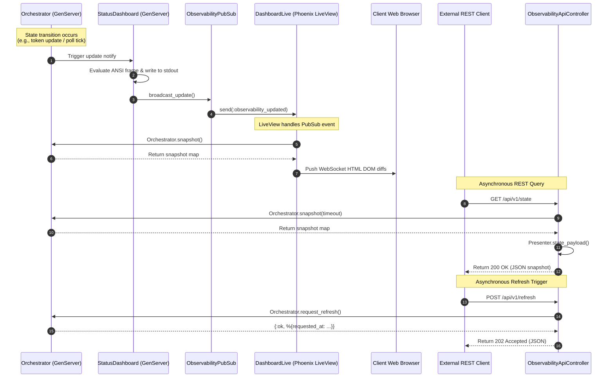

# Symphony Observability & User Interface Architecture

## 1. Overview

Symphony provides dual real-time observability surfaces to monitor agent scheduling, execution status, token usage metrics, backoff queues, and upstream rate limits:

1. **Terminal UI Dashboard (`SymphonyElixir.StatusDashboard`)**: A GenServer-driven ANSI terminal interface that renders live status headers, throughput sparklines, active worker tables, and retry queues directly to stdout.
2. **Phoenix Web Dashboard & REST API (`SymphonyElixirWeb`)**: A lightweight web application running on Bandit that exposes a real-time Phoenix LiveView dashboard (`DashboardLive`) at `/` and programmatic REST endpoints (`ObservabilityApiController`) under `/api/v1/`.

Both observability surfaces consume unified state snapshots from `SymphonyElixir.Orchestrator` and react to live state transitions broadcast via `SymphonyElixirWeb.ObservabilityPubSub`.

```mermaid
flowchart TD
    subgraph Core["Symphony Core Engine"]
        Orch["SymphonyElixir.Orchestrator (GenServer)"]
    end

    subgraph Observability["Observability Infrastructure"]
        PubSub["Phoenix.PubSub (SymphonyElixir.PubSub)"]
        ObsPubSub["SymphonyElixirWeb.ObservabilityPubSub"]
        TermUI["SymphonyElixir.StatusDashboard (GenServer)"]
    end

    subgraph WebSurface["Phoenix Web Stack (SymphonyElixirWeb)"]
        HTTP["SymphonyElixir.HttpServer (Bandit)"]
        Endpoint["SymphonyElixirWeb.Endpoint"]
        Router["SymphonyElixirWeb.Router"]
        LiveView["DashboardLive (Phoenix LiveView)"]
        REST["ObservabilityApiController (REST API)"]
        Static["StaticAssetController"]
    end

    subgraph Clients["Consumers"]
        Terminal["ANSI Terminal (stdout)"]
        Browser["Web Browser (WebSocket/HTTP)"]
        ExternalAPI["Monitoring / Automation Client"]
    end

    Orch -->|state changes & ticks| TermUI
    TermUI -->|notify_update/0| ObsPubSub
    ObsPubSub -->|broadcast "observability:dashboard"| PubSub
    PubSub -->|push :observability_updated| LiveView

    TermUI -->|IO.write ANSI frames| Terminal
    HTTP --> Endpoint --> Router
    Router -->|GET /| LiveView
    Router -->|GET /api/v1/*| REST
    Router -->|GET /dashboard.css| Static

    LiveView -->|HTML / WebSocket deltas| Browser
    REST -->|JSON Payloads| ExternalAPI
```

---

## 2. Terminal UI Dashboard (`SymphonyElixir.StatusDashboard`)

### 2.1 Component Architecture & Lifecycle
`SymphonyElixir.StatusDashboard` is an OTP `GenServer` started under `SymphonyElixir.Supervisor`. It periodically collects snapshot metrics from `SymphonyElixir.Orchestrator` and formats ANSI escape code frames to render an updated status dashboard in the terminal.

- **Module**: `SymphonyElixir.StatusDashboard` (`elixir/lib/symphony_elixir/status_dashboard.ex`)
- **Key Configuration Fields**:
  - `refresh_ms` (default `1_000` ms): Polling tick frequency for re-evaluating dashboard metrics.
  - `render_interval_ms` (default `1_000` ms): Minimum delay between terminal re-renders to prevent flickering.
  - `enabled` (boolean): Controls whether rendering to stdout is enabled (requires `dashboard_enabled: true` and an interactive terminal TTY).

### 2.2 Terminal Screen Layout & Content Breakdown

The rendered status dashboard consists of a top header status section, an active agents table, and a retry backoff queue section.

```
╭─ SYMPHONY STATUS
│ Agents: 2/10
│ Throughput: 142.5 tps
│ Runtime: 14m 32s
│ Tokens: in 150,000 | out 25,000 | total 175,000
│ Rate Limits: %{requests_remaining: 4800, tokens_remaining: 180000}
│ Project: https://linear.app/project/symphony-dev/issues
│ Dashboard: http://127.0.0.1:4000/
│ Next refresh: 4s
├─ Running
│
│   ID       STAGE          PID      AGE / TURN   TOKENS     SESSION        EVENT
│   ───────────────────────────────────────────────────────────────────────────────────────
│ ● SYM-42   In Progress    9842     3m 12s / 3        16,000 th_12345678    codex/event/token_count
│ ● SYM-45   Rework         9849     45s / 1            2,100 th_87654321    turn_completed
│
├─ Backoff queue
│
│  ↻ SYM-43 attempt=2 in 4.500s error=agent exited: :turn_timeout
╰──────────────────────────────────────────────────────────────────────────────────────────
```

#### Screen Sections:
1. **Header Metrics**:
   - `Agents`: Active running sessions count / Maximum allowed concurrent agents.
   - `Throughput`: Moving average calculation of processed tokens per second (`tps`).
   - `Runtime`: Cumulative seconds running across completed and active agent sessions (`Xm Ys`).
   - `Tokens`: Structured token counts formatted with thousand separators (`in`, `out`, `total`).
   - `Rate Limits`: Evaluated upstream API rate limit status map (if reported by Codex / Linear).
   - `Project`: Hyperlink to Linear project issues dashboard.
   - `Dashboard`: Local HTTP URL to the Phoenix web interface (`http://127.0.0.1:<port>/`).
   - `Next refresh`: Countdown seconds until the next automatic issue tracker poll tick (`checking now…` or `Ns`).

2. **Active Running Table**:
   - Displays real-time columns: `ID`, `STAGE`, `PID`, `AGE / TURN`, `TOKENS`, `SESSION`, `EVENT`.
   - Colored status indicator dots (`●`) indicate activity status:
     - Green (`@ansi_green`): Task started (`codex/event/task_started`).
     - Yellow (`@ansi_yellow`): Token count update (`codex/event/token_count`).
     - Magenta (`@ansi_magenta`): Turn completed (`turn_completed`).
     - Red (`@ansi_red`): Error or uninitialized state.
     - Blue (`@ansi_blue`): Generic Codex protocol event.

3. **Retry Backoff Queue**:
   - Displays queued retries awaiting backoff expiration (`↻`).
   - Details: Issue identifier, attempt count, remaining wait time (`in X.YYYs`), and sanitized single-line error summary.

### 2.3 ANSI Palette & Dynamic Width Formatting

- **ANSI Color Constants**:
  - Reset: `IO.ANSI.reset()`
  - Bold: `IO.ANSI.bright()`
  - Dim: `IO.ANSI.faint()`
  - Primary colors: `IO.ANSI.cyan()`, `IO.ANSI.green()`, `IO.ANSI.red()`, `IO.ANSI.yellow()`, `IO.ANSI.magenta()`, `IO.ANSI.light_black()` (gray).
- **Responsive Width Handling**:
  - Evaluates columns using `:io.columns()` or `$COLUMNS` environment variable.
  - Dynamically calculates the `EVENT` column width (`running_event_width`) based on terminal width (default `115` columns).
  - Fixed-width column padding ensures table alignments remain stable across updates.

### 2.4 Token Throughput & Sparkline Window
`StatusDashboard` tracks historical token consumption samples over time to compute rolling throughput rate:
- Maintains a sliding window of `{timestamp_ms, total_tokens}` samples over `@throughput_window_ms` (5,000 ms).
- Calculates tokens per second: `delta_tokens / (elapsed_ms / 1000.0)`.
- Implements throttled update logic to prevent excessive calculation during high-frequency event bursts.

---

## 3. Phoenix Web Interface (`SymphonyElixirWeb`)

### 3.1 HTTP Server Facade (`SymphonyElixir.HttpServer`)
The web interface is hosted using **Bandit** via `SymphonyElixir.HttpServer` (`elixir/lib/symphony_elixir/http_server.ex`).

- **Dynamic Port Selection**: Listens on configured `server.port` (defaults to `4000` or random unassigned port if `0`).
- **Dynamic Host Binding**: Supports `0.0.0.0`, `127.0.0.1`, `::`, or specific IP strings. Parses IP tuples via `:inet.parse_address/1`.
- **Secret Key Base**: Automatically generates a cryptographically secure 48-byte random key base (`Base.encode64(:crypto.strong_rand_bytes(48))`) for session signing.

### 3.2 Phoenix Endpoint (`SymphonyElixirWeb.Endpoint`)
- **Module**: `SymphonyElixirWeb.Endpoint` (`elixir/lib/symphony_elixir_web/endpoint.ex`)
- **Socket Route**: `/live` configured for Phoenix LiveView WebSocket connections with session cookie verification.
- **Plug Pipeline**:
  - `Plug.RequestId`: Generates unique HTTP request IDs.
  - `Plug.Telemetry`: Emits Endpoint performance telemetry.
  - `Plug.Parsers`: URL-encoded, multipart, and JSON body parsing with `Jason`.
  - `Plug.Session`: Cookie-based session storage signed with salt `"symphony-session"`.
  - `Plug.MethodOverride` & `Plug.Head`.
  - `SymphonyElixirWeb.Router`.

### 3.3 Router Architecture (`SymphonyElixirWeb.Router`)
- **Module**: `SymphonyElixirWeb.Router` (`elixir/lib/symphony_elixir_web/router.ex`)

| Route | Verb | Controller / LiveView | Scope & Pipeline | Description |
|---|---|---|---|---|
| `/` | `GET` | `DashboardLive` | Browser (`:browser`) | Interactive LiveView web dashboard |
| `/api/v1/state` | `GET` | `ObservabilityApiController` | API Scope | Orchestrator state snapshot JSON |
| `/api/v1/refresh` | `POST` | `ObservabilityApiController` | API Scope | Triggers immediate polling cycle |
| `/api/v1/:issue_identifier` | `GET` | `ObservabilityApiController` | API Scope | Single issue detail query JSON |
| `/dashboard.css` | `GET` | `StaticAssetController` | Static Scope | Embedded CSS stylesheet |
| `/vendor/phoenix/phoenix.js` | `GET` | `StaticAssetController` | Static Scope | Phoenix JS vendor library |
| `/vendor/phoenix_live_view/phoenix_live_view.js` | `GET` | `StaticAssetController` | Static Scope | Phoenix LiveView client JS |
| `/vendor/phoenix_html/phoenix_html.js` | `GET` | `StaticAssetController` | Static Scope | Phoenix HTML helper JS |

### 3.4 Phoenix LiveView (`SymphonyElixirWeb.DashboardLive`)
- **Module**: `SymphonyElixirWeb.DashboardLive` (`elixir/lib/symphony_elixir_web/live/dashboard_live.ex`)
- **Lifecycle & Timers**:
  - `mount/3`: Assigns initial snapshot payload and current timestamp (`DateTime.utc_now()`). When connected via WebSocket, subscribes to `ObservabilityPubSub` and starts `@runtime_tick_ms` timer (1,000 ms).
  - `handle_info(:runtime_tick, socket)`: Ticks every second to update UI runtime counters (`assign(socket, :now, DateTime.utc_now())`).
  - `handle_info(:observability_updated, socket)`: Receives PubSub updates from orchestrator changes and updates the socket payload (`assign(:payload, load_payload())`).
- **UI Card & Table Components**:
  - **Hero Header**: Displays connection status (`Live` / `Offline`).
  - **Metric Grid Cards**: Total running, retrying, and blocked issues; formatted token breakdown (`format_int/1`); cumulative runtime duration (`format_runtime_seconds/1`).
  - **Rate Limits Panel**: Monospaced Code panel displaying JSON formatted upstream rate limits.
  - **Running Sessions Table**: Issue ID with link to API JSON details, state badge (`state-badge-active`), session ID copy button (`navigator.clipboard.writeText`), turn count, latest event message, and token usage breakdown.
  - **Blocked Sessions Table**: Issues requiring operator input or approval, showing blocked timestamp and error reason.
  - **Retry Queue Table**: Backoff attempt count, due timestamp, and error descriptions.

### 3.5 Static Asset Pipeline (`StaticAssets` & `StaticAssetController`)
Symphony operates as a standalone binary without needing Node.js or external asset compilation tools during runtime:
- **Module**: `SymphonyElixirWeb.StaticAssets` (`elixir/lib/symphony_elixir_web/static_assets.ex`)
- Reads CSS (`priv/static/dashboard.css`) and vendor JavaScript files (`phoenix`, `phoenix_live_view`, `phoenix_html`) at compile-time into module attributes using `File.read!/1` and `@external_resource`.
- `StaticAssetController` serves these pre-compiled assets directly from memory with correct `Content-Type` headers (`text/css` and `application/javascript`).

---

## 4. PubSub Event Broadcasting (`ObservabilityPubSub`)

### 4.1 PubSub Topology & Messaging
`SymphonyElixirWeb.ObservabilityPubSub` abstracts event delivery between state mutation sources and connected web consumers.

- **Module**: `SymphonyElixirWeb.ObservabilityPubSub` (`elixir/lib/symphony_elixir_web/observability_pubsub.ex`)
- **PubSub Process Name**: `SymphonyElixir.PubSub` (started in application supervision tree).
- **Topic**: `"observability:dashboard"`
- **Message Payload**: `:observability_updated`

```elixir
# Subscribing to updates (called by DashboardLive)
SymphonyElixirWeb.ObservabilityPubSub.subscribe()

# Broadcasting updates (called by StatusDashboard.notify_update/1)
SymphonyElixirWeb.ObservabilityPubSub.broadcast_update()
```

### 4.2 Event Trigger Flow
1. `Orchestrator` completes a poll tick, dispatches a worker task, receives a token count update from Codex, or records a retry backoff.
2. `StatusDashboard.notify_update/1` is invoked.
3. `notify_update/1` triggers `ObservabilityPubSub.broadcast_update()`.
4. `Phoenix.PubSub` broadcasts `:observability_updated` to all subscribed `DashboardLive` processes.
5. LiveView mounts re-query `Presenter.state_payload/2` and push DOM updates over WebSocket to connected browsers.

---

## 5. Observability REST API (`ObservabilityApiController`)

### 5.1 Controller Routes & Actions
`SymphonyElixirWeb.ObservabilityApiController` provides structured JSON endpoints for external monitoring scripts or automated tooling.

- **Module**: `SymphonyElixirWeb.ObservabilityApiController` (`elixir/lib/symphony_elixir_web/controllers/observability_api_controller.ex`)
- **Projection Helper**: `SymphonyElixirWeb.Presenter` (`elixir/lib/symphony_elixir_web/presenter.ex`)

### 5.2 Endpoint Specifications & Schemas

#### 1. `GET /api/v1/state`
Returns a full runtime snapshot of active, retrying, and blocked sessions.

- **HTTP Response**: `200 OK`
- **JSON Schema**:
```json
{
  "generated_at": "2026-07-31T21:30:00Z",
  "counts": {
    "running": 2,
    "retrying": 1,
    "blocked": 0
  },
  "running": [
    {
      "issue_id": "issue_123",
      "issue_identifier": "SYM-42",
      "state": "In Progress",
      "worker_host": "local",
      "workspace_path": "/path/to/workspace/SYM-42",
      "session_id": "th_12345678",
      "turn_count": 3,
      "last_event": "codex/event/token_count",
      "last_message": "Turn 3 in progress",
      "started_at": "2026-07-31T21:25:00Z",
      "last_event_at": "2026-07-31T21:29:45Z",
      "tokens": {
        "input_tokens": 14200,
        "output_tokens": 1800,
        "total_tokens": 16000
      }
    }
  ],
  "retrying": [
    {
      "issue_id": "issue_124",
      "issue_identifier": "SYM-43",
      "attempt": 2,
      "due_at": "2026-07-31T21:30:05Z",
      "error": "agent exited: :turn_timeout",
      "worker_host": "local",
      "workspace_path": "/path/to/workspace/SYM-43"
    }
  ],
  "blocked": [],
  "codex_totals": {
    "input_tokens": 150000,
    "output_tokens": 25000,
    "total_tokens": 175000,
    "seconds_running": 1240
  },
  "rate_limits": {
    "requests_remaining": 4800,
    "tokens_remaining": 180000
  }
}
```

#### 2. `POST /api/v1/refresh`
Requests an immediate, asynchronous Orchestrator poll cycle.

- **HTTP Response**: `202 Accepted`
- **JSON Schema**:
```json
{
  "status": "refresh_requested",
  "requested_at": "2026-07-31T21:30:00Z"
}
```
- **Error Response**: `503 Service Unavailable` if Orchestrator process is not running.

#### 3. `GET /api/v1/:issue_identifier`
Queries execution details, workspace paths, retry history, and recent events for a single issue identifier.

- **HTTP Response**: `200 OK`
- **JSON Schema**:
```json
{
  "issue_identifier": "SYM-42",
  "issue_id": "issue_123",
  "status": "running",
  "workspace": {
    "path": "/path/to/workspace/SYM-42",
    "host": "local"
  },
  "attempts": {
    "restart_count": 0,
    "current_retry_attempt": 0
  },
  "running": {
    "worker_host": "local",
    "workspace_path": "/path/to/workspace/SYM-42",
    "session_id": "th_12345678",
    "turn_count": 3,
    "state": "In Progress",
    "started_at": "2026-07-31T21:25:00Z",
    "last_event": "codex/event/token_count",
    "last_message": "Turn 3 in progress",
    "last_event_at": "2026-07-31T21:29:45Z",
    "tokens": {
      "input_tokens": 14200,
      "output_tokens": 1800,
      "total_tokens": 16000
    }
  },
  "retry": null,
  "blocked": null,
  "logs": {
    "codex_session_logs": []
  },
  "recent_events": [
    {
      "at": "2026-07-31T21:29:45Z",
      "event": "codex/event/token_count",
      "message": "Turn 3 in progress"
    }
  ],
  "last_error": null,
  "tracked": {}
}
```
- **Error Response**: `404 Not Found` if issue is not present in active, retrying, or blocked state maps.

---

## 6. End-to-End Observability Sequence Diagram



---

## 7. Verification & Snapshot Testing

The observability subsystem is backed by unit, snapshot, and E2E integration tests:

1. **Terminal UI Snapshot Tests** (`elixir/test/symphony_elixir/status_dashboard_snapshot_test.exs`):
   - Compares rendered ANSI terminal output against golden fixture snapshots stored in `test/fixtures/status_dashboard_snapshots/`:
     - `idle.snapshot.txt`: Idle state with no active agents.
     - `super_busy.snapshot.txt`: Multiple running sessions with high token counts.
     - `backoff_queue.snapshot.txt`: Active backoff retry queue entries.
     - `credits_unlimited.snapshot.txt`: Unlimited rate limit display.
2. **PubSub Unit Tests** (`elixir/test/symphony_elixir/observability_pubsub_test.exs`):
   - Verifies subscription, topic broadcasting on `"observability:dashboard"`, and message delivery.
3. **Live View E2E Integration Tests** (`elixir/test/support/live_e2e_docker/`):
   - Runs headless browser checks against `DashboardLive` in Docker environments.
