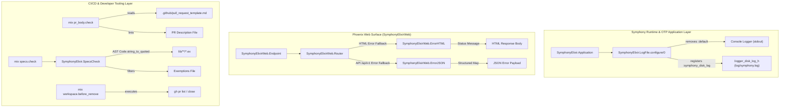
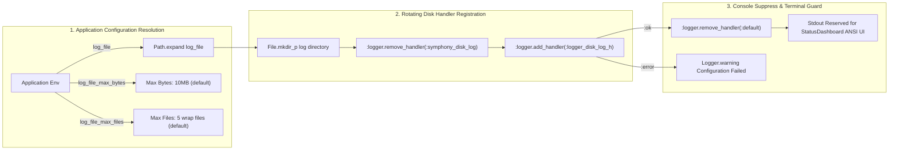
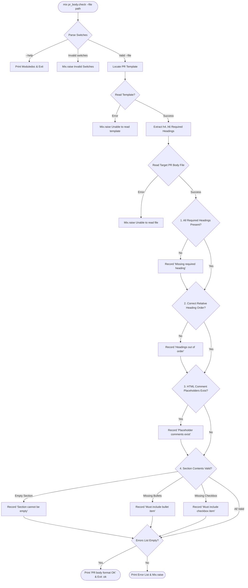

# Utilities & Custom Mix Tasks Architecture

## 1. Overview & Architectural Role

### 1.1 Scope and Subsystem Catalog

Symphony incorporates five dedicated utility and custom Mix task modules within its Elixir implementation (`elixir/lib/`). These modules handle presentation-layer error formatting, application log rotation and terminal UI preservation, pull request description linting, compile-time type specification enforcement, and automated workspace teardown hooks.

The catalog below outlines the architectural role, file path, operational domain, and primary callers for each module:

| Module Name | File Path | Subsystem / Domain | Architectural Responsibilities | Primary Callers / Triggers |
|---|---|---|---|---|
| `SymphonyElixirWeb.ErrorHTML` | `elixir/lib/symphony_elixir_web/error_html.ex` | Web Error Views | HTML error template fallback rendering; maps HTTP status templates (e.g., `"404.html"`) to standard human-readable reason phrases. | `SymphonyElixirWeb.Endpoint` via Phoenix ErrorView |
| `SymphonyElixirWeb.ErrorJSON` | `elixir/lib/symphony_elixir_web/error_json.ex` | Web Error Views | REST API JSON error payload formatting; wraps status reason phrases into standardized `%{error: %{code: "request_failed", message: ...}}` maps. | `SymphonyElixirWeb.Endpoint` via Phoenix ErrorView |
| `SymphonyElixir.LogFile` | `elixir/lib/symphony_elixir/log_file.ex` | Application Logging | Erlang `:logger_disk_log_h` disk log setup with size-bounded wrap rotation; default console logger suppression to protect ANSI terminal UI. | `SymphonyElixir.Application.start/2`, `SymphonyElixir.CLI` |
| `Mix.Tasks.PrBody.Check` | `elixir/lib/mix/tasks/pr_body.check.ex` | CI/CD Quality Gating | PR description markdown linter; enforces structure, heading order, placeholder elimination, bullet items, and checkbox completion against template. | `mix pr_body.check`, GitHub Actions (`pr-description-lint.yml`) |
| `Mix.Tasks.Specs.Check` | `elixir/lib/mix/tasks/specs.check.ex` | CI/CD Quality Gating | Mix task interface for type specification audit; loads path configs and exemptions file, invoking the underlying AST engine. | `mix specs.check`, `make lint`, `make ci` |
| `SymphonyElixir.SpecsCheck` | `elixir/lib/symphony_elixir/specs_check.ex` | AST Analysis Engine | Quoted AST transformation engine; scans Elixir source code, maintaining state across `@spec`, `@impl`, `def`, and `defp` forms to verify specification coverage. | `Mix.Tasks.Specs.Check` |
| `Mix.Tasks.Workspace.BeforeRemove` | `elixir/lib/mix/tasks/workspace.before_remove.ex` | Workspace Maintenance | Workspace teardown lifecycle hook; queries open GitHub PRs for the active Git branch via `gh` CLI and closes them with automated comments. | `mix workspace.before_remove`, workspace cleanup hooks |

### 1.2 Architectural Roles & System Overview Diagram

Symphony divides these utilities across three operational layers:
1. **Runtime & OTP Application Layer**: Intercepts boot events to initialize high-throughput rotating log files on disk while detaching stdout logging to prevent corruption of the interactive terminal user interface (`SymphonyElixir.StatusDashboard`).
2. **Phoenix Web Surface Layer**: Catches unhandled endpoint errors and translates them into format-negotiated HTML or JSON error responses without exposing internal stack traces.
3. **CI/CD & Developer Tooling Layer**: Executes static AST verification and PR body linting inside local development aliases and automated GitHub Actions pipelines.



---

## 2. Web Error Rendering Subsystem

### 2.1 HTML Error Handling (`SymphonyElixirWeb.ErrorHTML`)

The `SymphonyElixirWeb.ErrorHTML` module (`elixir/lib/symphony_elixir_web/error_html.ex`) serves as the HTML presentation fallback view for unhandled web request exceptions and status codes in Phoenix.

#### Specification & Implementation
```elixir
defmodule SymphonyElixirWeb.ErrorHTML do
  @moduledoc false

  @spec render(String.t(), map()) :: String.t()
  def render(template, _assigns) do
    Phoenix.Controller.status_message_from_template(template)
  end
end
```

#### Behavioral Details
- **Template Delegation**: The `render/2` function receives a template binary (such as `"404.html"` or `"500.html"`) and assigns map. It delegates string resolution to `Phoenix.Controller.status_message_from_template/1`.
- **Status Reason Resolution**: Maps template strings to standard HTTP status reason phrases:
  - `"404.html"` $\rightarrow$ `"Not Found"`
  - `"500.html"` $\rightarrow$ `"Internal Server Error"`
  - `"403.html"` $\rightarrow$ `"Forbidden"`
- **Security Isolation**: By returning standard status strings, `ErrorHTML` guarantees that raw exception traces, internal process IDs, or system file paths are never rendered to web browsers.

### 2.2 JSON REST API Error Formatting (`SymphonyElixirWeb.ErrorJSON`)

The `SymphonyElixirWeb.ErrorJSON` module (`elixir/lib/symphony_elixir_web/error_json.ex`) provides structured JSON error serialization for API endpoints under `/api/v1/*`.

#### Specification & Implementation
```elixir
defmodule SymphonyElixirWeb.ErrorJSON do
  @moduledoc false

  @spec render(String.t(), map()) :: map()
  def render(template, _assigns) do
    %{error: %{code: "request_failed", message: Phoenix.Controller.status_message_from_template(template)}}
  end
end
```

#### Payload Schema & API Contract
When Phoenix encounters a REST error, `ErrorJSON.render/2` generates an Elixir map that is serialized by Jason into the following JSON structure:

```json
{
  "error": {
    "code": "request_failed",
    "message": "Not Found"
  }
}
```

- **Error Wrap Contract**: Every API error response contains an `error` key mapping to a structured map with a machine-readable `code` string (`"request_failed"`) and a human-readable `message` string derived from `Phoenix.Controller.status_message_from_template/1`.
- **Uniformity**: Programs consuming Symphony REST APIs can rely on a consistent error schema regardless of whether the error originated from route mismatch, authentication failure, or internal crash.

### 2.3 Phoenix Endpoint & Config Integration

Both error modules are configured in `elixir/config/config.exs` under the `SymphonyElixirWeb.Endpoint` configuration block:

```elixir
config :symphony_elixir, SymphonyElixirWeb.Endpoint,
  render_errors: [
    formats: [html: SymphonyElixirWeb.ErrorHTML, json: SymphonyElixirWeb.ErrorJSON],
    layout: false
  ]
```

#### Test Coverage Exclusion
Because Phoenix dynamic view rendering dispatches `render/2` at runtime without explicit compile-time function calls in application modules, both `ErrorHTML` and `ErrorJSON` are explicitly registered under `ignore_modules` in `mix.exs` under the `test_coverage` configuration. This excludes them from test coverage reporting, as their dispatch-based invocation makes direct unit test coverage impractical.

---

## 3. Application Logging Infrastructure (`SymphonyElixir.LogFile`)

### 3.1 OTP Logger Disk Rotation Architecture

The `SymphonyElixir.LogFile` module (`elixir/lib/symphony_elixir/log_file.ex`) configures Erlang/OTP's built-in rotating disk log handler (`:logger_disk_log_h`) for persistent log capture.

#### Key Module Constants
- `@handler_id`: `:symphony_disk_log`
- `@default_log_relative_path`: `"log/symphony.log"`
- `@default_max_bytes`: `10 * 1024 * 1024` (10 MB = 10,485,760 bytes)
- `@default_max_files`: `5`

#### Disk Handler Configuration Structure
When initializing the disk log handler via `:logger.add_handler/3`, `LogFile` constructs the following Erlang specification map:

```elixir
%{
  level: :all,
  formatter: {:logger_formatter, %{single_line: true}},
  config: %{
    file: String.to_charlist(expanded_path),
    type: :wrap,
    max_no_bytes: max_bytes,
    max_no_files: max_files
  }
}
```

- **Charlist Conversion Requirement**: Erlang's `:logger_disk_log_h` driver requires the `file:` parameter as an Erlang charlist (`String.to_charlist(path)`). Passing an Elixir binary string causes an Erlang driver crash.
- **Wrap File Rotation**: Setting `type: :wrap` enables rolling log files (`symphony.log.1`, `symphony.log.2`, ... up to `max_no_files`). Once all log files reach `max_no_bytes`, the oldest log segment is overwritten.
- **Single-Line Formatting**: Log messages are formatted with `:single_line: true` to simplify parsing by external log aggregators.

### 3.2 Configuration Parameters & Defaults

`LogFile.configure/0` inspects the `:symphony_elixir` application environment to resolve operational parameters:

| Config Key | Function Parameter | Default Value | Description |
|---|---|---|---|
| `:log_file` | `log_file` | `Path.join(File.cwd!(), "log/symphony.log")` | Absolute or relative path to target log file |
| `:log_file_max_bytes` | `max_bytes` | `10_485_760` (10 MB) | Maximum byte threshold per log file segment |
| `:log_file_max_files` | `max_files` | `5` | Maximum number of wrapped log file segments |

#### Lifecycle Boot Sequence
1. **Application Start**: `SymphonyElixir.Application.start/2` invokes `LogFile.configure/0` before spawning the root supervisor tree.
2. **Path Expansion & Directory Creation**: `LogFile` expands the target log path via `Path.expand/1` and ensures parent directories exist via `File.mkdir_p/1`.
3. **CLI Log Root Override**: When running under `SymphonyElixir.CLI`, passing `--logs-root <dir>` invokes `SymphonyElixir.CLI.set_logs_root/1`, updating application configuration and triggering re-configuration of `LogFile`.

### 3.3 Console Logger Suppression Mechanics

Symphony features an ANSI terminal user interface (`SymphonyElixir.StatusDashboard`) that updates the screen at up to 60 frames per second using terminal escape codes. If the default Erlang/OTP console logger (`:default`) writes log messages to `stdout` concurrently, terminal lines become corrupted, flickering occurs, and visual layout breaks.

To prevent terminal corruption, `LogFile` automatically unregisters the default console handler upon successful disk logger registration:

```elixir
defp remove_default_console_handler do
  case :logger.remove_handler(:default) do
    :ok -> :ok
    {:error, {:not_found, :default}} -> :ok
    {:error, _reason} -> :ok
  end
end
```



---

## 4. CI/CD Quality Enforcement & Mix Tasks

### 4.1 Pull Request Body Validator (`mix pr_body.check`)

The `Mix.Tasks.PrBody.Check` task (`elixir/lib/mix/tasks/pr_body.check.ex`) validates PR description markdown files against the repository PR template.

#### CLI Command Interface
```bash
mix pr_body.check --file /path/to/pr_body.md
mix pr_body.check --help
```

- **Option Parser Specs**: `strict: [file: :string, help: :boolean]`, `aliases: [h: :help]`.
- **Template Path Resolution**: Searches `@template_paths`:
  1. `".github/pull_request_template.md"`
  2. `"../.github/pull_request_template.md"`

#### Heading Extraction & Matching Engine
- **Heading Regex**: `~r/^\#{4,6}\s+.+$/m` (matches Markdown headings level H4 `####`, H5 `#####`, and H6 `######`).
- **Position Tracking**: Uses `:binary.match(body, heading)` to calculate byte offsets of headings within PR text.

#### Validation Pipeline Rules (`lint/3`)
The task pipelines target PR body text through four validation steps:

1. `check_required_headings/3`: Filters required headings extracted from the template. Any heading missing from the body generates `"Missing required heading: <heading>"`.
2. `check_order/3`: Collects byte offsets of matched headings and verifies `positions == Enum.sort(positions)`. Out-of-order headings generate `"Required headings are out of order."`.
3. `check_no_placeholders/2`: Checks `String.contains?(body, "<!--")`. If true, returns `"PR description still contains template placeholder comments (<!-- ... -->)."`.
4. `check_sections_from_template/4`: Slices text between adjacent headings and enforces section expectations:
   - **Non-Empty Content**: Slices must not trim to `""` (`"Section cannot be empty: <heading>"`).
   - **Bullet Requirements**: If template section contains bullet item pattern `~r/^- /m`, body section must contain `~r/^- /m` (`"Section must include at least one bullet item: <heading>"`).
   - **Checkbox Requirements**: If template section contains empty checkbox pattern `~r/^- \[ \] /m`, body section must contain checked or unchecked checkbox pattern `~r/^- \[[ xX]\] /m` (`"Section must include at least one checkbox item: <heading>"`).

#### CI Integration & Execution Flow
Executed in GitHub Actions workflow `.github/workflows/pr-description-lint.yml`. If any error is detected, `Mix.Tasks.PrBody.Check` logs errors via `Mix.shell().error/1` and raises `Mix.raise/1` with non-zero exit status.



### 4.2 Code Spec Compliance Checker (`mix specs.check` & `SymphonyElixir.SpecsCheck`)

The specification checker consists of a Mix task wrapper (`Mix.Tasks.Specs.Check` in `elixir/lib/mix/tasks/specs.check.ex`) and an AST analysis engine (`SymphonyElixir.SpecsCheck` in `elixir/lib/symphony_elixir/specs_check.ex`).

#### CLI Interface & Switches
```bash
mix specs.check
mix specs.check --paths lib/symphony_elixir --exemptions-file .specs_exemptions
```

- **Switches**: `@switches [paths: :keep, exemptions_file: :string]`
- **Default Paths**: `@default_paths ["lib"]`
- **Exemptions File Parsing**: `load_exemptions/1` reads text files line-by-line, stripping whitespace and discarding blank lines or lines starting with `#`.

#### Finding Data Structure
```elixir
@type finding :: %{
        file: String.t(),
        module: String.t(),
        name: atom(),
        arity: non_neg_integer(),
        line: pos_integer()
      }
```

- `finding_identifier/1` formats findings into standard module notation: `"SymphonyElixir.LogFile.configure/0"`.

#### AST Parsing & Form Reducer State Machine
The core engine reads Elixir source files and parses AST nodes using `Code.string_to_quoted(source, columns: true, file: file)`. It extracts module definitions via `Macro.prewalk/3` searching `{:defmodule, _meta, [module_ast, [do: body]]}`.

Module body forms are normalized (`normalize_block/1`) and reduced using `initial_state/0`:

```elixir
%{pending_specs: MapSet.new(), pending_impl: false, seen_defs: MapSet.new(), findings: []}
```

#### State Machine Transition Rules (`consume_form/5`)
1. **`@spec` Form**: `consume_form({:@, _, [{:spec, _, spec_nodes}]}, ...)`
   - Extracts `{name, arity}` spec identifiers (handling plain specs and `when` guards).
   - Merges identifiers into `pending_specs`.
2. **`@impl` Form**: `consume_form({:@, _, [{:impl, _, _}]}, ...)`
   - Sets `pending_impl: true`.
3. **`def` Form**: `consume_form({:def, meta, [head_ast, _]}, ...)`
   - Resolves function `{name, arity}`.
   - **Multi-clause Handling**: If `{name, arity}` is already in `seen_defs`, resets `pending_specs` to empty and `pending_impl` to `false` without generating a finding (multi-clause heads share the initial `@spec`).
   - **Compliance Evaluation (`compliant?/3`)**: Function is compliant if `{name, arity}` is in `pending_specs`, OR `pending_impl` is `true`, OR `finding_identifier` is in `exemptions`.
   - If non-compliant, appends `finding` to `findings`.
   - Adds `{name, arity}` to `seen_defs`, resets `pending_specs` to empty and `pending_impl` to `false`.
4. **Generic `@` Attribute**: `consume_form({:@, _, _}, state, ...), do: state`
   - **Pass-through**: Non-spec, non-impl `@` attributes (e.g., `@doc`, `@moduledoc`) are silently ignored without resetting state. This means `@doc` placed between `@spec` and `def` does **not** break spec adjacency.
5. **`defp` or Other Form**: `consume_form(form, ...)`
   - Resets `pending_specs` to empty and `pending_impl` to `false`.
   - **Strict Adjacency Guarantee**: Any intervening private function or non-attribute form breaks spec adjacency, forcing subsequent public `def` definitions to require an explicit `@spec`.

```mermaid
flowchart TD
    Start(["mix specs.check"]) --> Collect["Collect target .ex files in lib/"]
    Collect --> Parse["Parse AST: Code.string_to_quoted"]
    Parse --> ModNodes["Extract defmodule nodes"]
    ModNodes --> WalkBlock["Traverse module block forms"]

    WalkBlock --> FormCheck{"Form Type?"}
    FormCheck -->|@spec| AddSpec["Add {name, arity} to pending_specs"]
    FormCheck -->|@impl| SetImpl["Set pending_impl = true"]
    FormCheck -->|def| CheckDef{"Check Function Head"}
    FormCheck -->|defp / other| ResetState["Reset pending_specs & pending_impl"]

    CheckDef --> SeenBefore{"In seen_defs?"}
    SeenBefore -->|Yes| SkipClause["Ignore multi-clause head"]
    SeenBefore -->|No| EvalCompliant{"Compliant?"}

    EvalCompliant -->|pending_spec or pending_impl or exemption| PassDef["Add {name, arity} to seen_defs"]
    EvalCompliant -->|No| FailDef["Add finding map to results"]

    AddSpec --> NextForm["Process Next Form"]
    SetImpl --> NextForm
    ResetState --> NextForm
    SkipClause --> NextForm
    PassDef --> NextForm
    FailDef --> NextForm

    NextForm --> WalkBlock
    WalkBlock -->|Done| Results{"Findings empty?"}
    Results -->|Yes| OK(["Print 'specs.check: OK' & Return :ok"])
    Results -->|No| Error(["Print missing specs & Mix.raise"])
```

### 4.3 Workspace Teardown Helper (`mix workspace.before_remove`)

The `Mix.Tasks.Workspace.BeforeRemove` task (`elixir/lib/mix/tasks/workspace.before_remove.ex`) provides an automated cleanup hook before ephemeral workspaces are deleted.

#### CLI Command & Options
```bash
mix workspace.before_remove
mix workspace.before_remove --branch feature/issue-102 --repo openai/symphony
```

- **Options**: `[branch: :string, help: :boolean, repo: :string]`
- **Default Repository**: `@default_repo "openai/symphony"`
- **Branch Resolution**: Resolves target branch from `--branch` flag, falling back to `git branch --show-current`.

#### GitHub CLI (`gh`) Integration Workflow
1. **Pre-flight Executable Checks**:
   - `gh_available?`: Confirms executable `gh` exists via `System.find_executable("gh")`.
   - `gh_authenticated?`: Runs `gh auth status` via `System.cmd/3` to ensure valid credentials.
2. **Open PR Discovery**:
   - Queries open pull requests for target branch:
     ```bash
     gh pr list --repo <repo> --head <branch> --state open --json number --jq .[].number
     ```
3. **Automated Pull Request Closure**:
   - For each open PR number, issues close command with automated rationale:
     ```bash
     gh pr close <pr_number> --repo <repo> --comment "Closing because the Linear issue for branch <branch> entered a terminal state without merge."
     ```
4. **Fault-Tolerant Execution**: If `gh` is missing, unauthenticated, or fails, the task logs formatted error messages without raising exceptions, allowing workspace teardown to complete smoothly.

---

## 5. Integration Summary & Verification Matrix

### 5.1 Component Capability & Trigger Matrix

The matrix below summarizes the operational capabilities, triggers, inputs, outputs, and failure modes across all documented utility modules:

| Subsystem / Module | Operational Domain | Trigger / Invocation Point | Input Data / Config | Primary Output / Action | Failure Mode & Exit Behavior |
|---|---|---|---|---|---|
| `SymphonyElixirWeb.ErrorHTML` | Presentation | Phoenix HTML error dispatch | Template string (e.g. `"404.html"`) | Status string (`"Not Found"`) | Returns `"Internal Server Error"` fallback |
| `SymphonyElixirWeb.ErrorJSON` | Presentation | Phoenix REST API error dispatch | Template string (e.g. `"500.html"`) | Structured error map `%{error: %{code: ..., message: ...}}` | Returns `"request_failed"` JSON error map |
| `SymphonyElixir.LogFile` | Infrastructure | Application boot (`start/2`), CLI flag `--logs-root` | App env `:log_file`, `:log_file_max_bytes`, `:log_file_max_files` | Registers `:logger_disk_log_h`, removes `:default` console logger | Logs `Logger.warning`, leaves console logger active |
| `Mix.Tasks.PrBody.Check` | Quality Gating | `mix pr_body.check`, GitHub Actions CI | PR description file path, `.github/pull_request_template.md` | Info log `"PR body format OK"` | Prints error list via `Mix.shell().error/1`, raises `Mix.Error` |
| `Mix.Tasks.Specs.Check` | Quality Gating | `mix specs.check`, `make lint`, `make ci` | CLI `--paths`, `--exemptions-file` | Info log `"specs.check: all public functions have @spec..."` | Prints missing specs list, raises `Mix.Error` with count |
| `SymphonyElixir.SpecsCheck` | AST Analysis | Invoked by `Mix.Tasks.Specs.Check` | List of target directories/files, exemptions `MapSet` | Sorted list of `finding` maps | Raises `Mix.Error` on source read or AST parse failure |
| `Mix.Tasks.Workspace.BeforeRemove` | Maintenance | `mix workspace.before_remove`, workspace hook | CLI `--branch`, `--repo`, `git branch --show-current` | Executes `gh pr close` for open branch PRs | Logs error output, returns `:ok` without crashing teardown |

### 5.2 Verification Commands

To independently verify the implementation and behavior of all five utility modules and their corresponding test suites, execute the following commands within the `elixir/` workspace:

#### Source Code File Existence Verification
```bash
test -f /home/will/Projects/symphony/elixir/lib/symphony_elixir_web/error_html.ex
test -f /home/will/Projects/symphony/elixir/lib/symphony_elixir_web/error_json.ex
test -f /home/will/Projects/symphony/elixir/lib/symphony_elixir/log_file.ex
test -f /home/will/Projects/symphony/elixir/lib/mix/tasks/pr_body.check.ex
test -f /home/will/Projects/symphony/elixir/lib/mix/tasks/specs.check.ex
test -f /home/will/Projects/symphony/elixir/lib/symphony_elixir/specs_check.ex
test -f /home/will/Projects/symphony/elixir/lib/mix/tasks/workspace.before_remove.ex
```

#### Mix Task Execution Verification
```bash
cd /home/will/Projects/symphony/elixir

# Verify public function specification compliance checker
mix specs.check

# Verify PR body validator help output
mix pr_body.check --help

# Verify workspace before_remove task help output
mix workspace.before_remove --help
```

#### ExUnit Test Suite Verification
```bash
cd /home/will/Projects/symphony/elixir

# Run unit tests for LogFile, PrBody.Check, Specs.Check, SpecsCheck, and Workspace.BeforeRemove
mix test test/symphony_elixir/log_file_test.exs \
         test/mix/tasks/pr_body_check_test.exs \
         test/mix/tasks/specs_check_task_test.exs \
         test/symphony_elixir/specs_check_test.exs \
         test/mix/tasks/workspace_before_remove_test.exs
```
